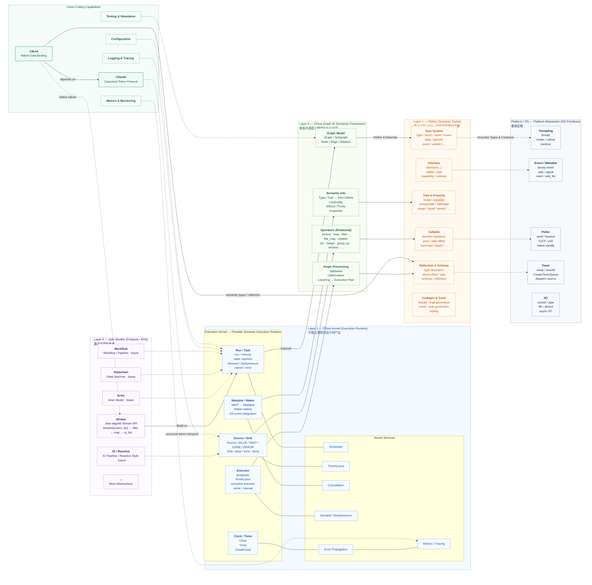
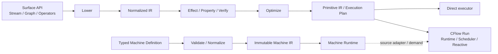

# Rocida Canonical Architecture

日期：2026-08-24  
状态：Canonical repository architecture

本文定义 Rocida 当前仓库级模块边界、public target ownership、依赖方向，以及与
TurboParser 的集成边界。专项 API、错误语义、ABI 和阶段能力仍以公开头文件、测试及
`docs/superpowers/specs/` 中的专项设计为事实源；本文不重复低层契约。

> 主图采用客户文稿视角，表达产品、语义 IR、CMeta 与 Platform/OS 的分层关系；右侧
> `Cross-Cutting Capabilities` 表达跨层能力归属，不等价于 CMake target 的层级包含关系。
> 实际 public/private target 依赖仍以第 5 节 dependency matrix 为准。

## 1. Layered canonical architecture



这张图描述的是**分层产品模型**：Stream 是当前首要用户产品；Actor、Statechart、Workflow、
IO/Reactive 是可在同一 Kernel 上构建的后续 façade/model，不表示当前已经存在独立 public
runtime target。Layer 2/3 共同属于 CFlow；Layer 1 是 CMeta 语义工具层；Platform/OS 提供
底层执行原语。

`CSerde` 与 `CBind` 在客户视角中属于 `Cross-Cutting Capabilities`：它们横跨 parser、native
value、Stream/Graph 等使用场景，但这不改变模块依赖事实。当前 target 仍然是
`CBind -> CMeta + CSerde`，`CSerde` 不依赖 CFlow/CMeta，CBind 也不依赖 CFlow、Rocida STL、
Core 或 TurboParser。

`tinytest/`、vendor、build tools 与 Lean/formal generation 属于测试、构建或验证平面，
不进入上面的 runtime ownership 图。设备采集与串口子系统由 TurboParser 所有，
Rocida 不再导出对应 targets。

## 2. Single sources of truth

### CMeta — type and semantic truth

`Rocida::CMeta` 是整个体系最底层的类型与语义事实源，负责：

- type identity、type traits、Enum/Struct reflection；
- callable / relation / interface / contract 元数据；
- semantic data descriptors；
- generic/declared type 与 container descriptor；
- Range、Collector 等跨容器协议。

CMeta 不实现容器算法、不解析具体数据格式，也不拥有 CFlow runtime。

### CSerde — canonical data-event truth

`Rocida::CSerde` 定义 format-neutral canonical token、reader/writer contract 和 view
lifetime 语义。它当前没有 Rocida public target 依赖，也不拥有 JSON/YAML/XML/CSV
parser。

具体格式由 parser/codec adapter 将 native syntax/events 投影为 CSerde，而不是在 CSerde
内部建立第二套 parser。

### CBind — native binding truth

`Rocida::CBind` 只依赖 `Rocida::CMeta + Rocida::CSerde`。它负责依据 CMeta
semantic shape 在 canonical CSerde values 与 native C storage 之间绑定。

因此 CBind 是 parser-independent kernel：数据库、IPC、自定义 binary source 或测试
provider 只要实现 CSerde contract，也可以直接复用 CBind。CBind 不直接依赖
TurboParser、Rocida STL、CFlow 或 Core。

### CFlow — execution truth

`Rocida::CFlow` 是 typed structured graph/dataflow compiler and runtime。其 public
依赖为 CMeta 与 Platform；公开 readiness API 直接暴露 Platform 类型。Concurrency 是
private execution substrate。

CFlow 不拥有容器算法、不解析 serialization format，也不把 raw `cserde_token` 当作可
任意 `filter/map` 的业务 `Stream<T>`。Parser/CBind/CFlow 的组合边界位于完整
semantic/native value 上。

### Rocida STL — container truth

`Rocida::STL` 是标准容器算法和实例 metadata 的事实源，并通过 CMeta container
contract 暴露类型、Range、Collector 与 construction 能力。

CFlow 本身不依赖 Rocida STL。`Rocida::STLStream` 是显式 INTERFACE composition target，
只把 `Rocida::STL + Rocida::CFlow` 组合给需要 container stream API 的使用者。

### Platform / Concurrency — execution substrate

`Rocida::Platform` 提供最底层 platform abstraction，并公开依赖 CMake 的
`Threads::Threads`。`Rocida::Concurrency` 在其上提供 thread pool、Disruptor 等并发
基础能力，并公开依赖 Platform。

CFlow 通过公开 readiness API 消费 Platform，并私有消费 Concurrency。因此 CFlow 的 public
target dependency 是 `CFlow -> CMeta + Platform`；执行语义仍由 CFlow 自身拥有，而不是由
Platform 定义。

### Core — general utility layer

`Rocida::Core` 保留字符串、文件、日志、正则、进程、内存及其他通用工具。它公开依赖
CMeta、Platform、Concurrency，并私有消费 STL/CFlow；Core 不应重新成为 container、
metadata、data binding 或 execution semantics 的第二事实源。

## 3. CFlow internal architecture

CFlow 当前存在两个互补入口：dataflow graph/stream pipeline 与 typed Machine pipeline。
两者共享 CMeta semantics 和 CFlow runtime，但 Machine 不是从 Normalized Graph 派生的
第二种表示。



等价职责流：

```text
Surface Graph / Stream / Operators
        ↓ lower
Normalized semantic IR
        ↓ analyze / verify / optimize
Primitive IR / compiled execution plan
        ├── direct execution
        └── runtime / scheduler / reactive execution

Typed Machine definition
        ↓ transactional normalize / validate
Immutable Machine IR
        ↓ instance / Event mailbox / executor
Machine Runtime
        ↓ optional Source adapter / Run demand
CFlow Run
```

CMeta 为这些层提供 type/callable/relation/interface semantics；CFlow 负责 execution
semantics。两者不复制彼此的事实源。

## 4. Data and parser integration

Canonical data path 固定为：

```text
native format syntax
        ↓
TurboParser parser/event model
        ↓ format projection
CSerde canonical values
        ↓
CBind + CMeta semantic shape
        ↓
native C value
        ↓ optional composition
CFlow Stream<T> / Graph / Machine
```

反方向写出遵守同一分层：native value 由 CBind/CMeta 映射到 canonical writer contract，
具体 serializer 再把 canonical events 转成目标 syntax/wire。

关键禁止项：

- `CBind -> TurboParser`；
- `CBind -> Rocida STL`；
- `CBind -> CFlow`；
- `CFlow -> Rocida STL`；
- `CSerde -> concrete parser`；
- 把 `Stream<cserde_token>` 暴露为可任意 `filter/map` 的业务 stream；
- 在 DataBind/TBE/CFlow 中维护第二套通用 type/semantic/binding truth。

TurboParser 是独立 package，其公共 parser runtime 以 `Rocida::Core` 和独立 parser
component targets 为基础依赖，不依赖 CSerde 或 CBind。具体 parser 与 CSerde 的组合只能位于
显式 adapter target；例如 `Rocida::JsonCSerdeAdapter` 组合
`Rocida::JsonParser` 与 `Rocida::CSerde`，而不会把 CSerde 传播给 JsonParser 或
TurboParser。

## 5. Public target dependency matrix

| Target | Public dependencies | Private / composition dependencies | Canonical ownership |
| --- | --- | --- | --- |
| `Rocida::CMeta` | none | none | type / semantic metadata |
| `Rocida::CSerde` | none | none | canonical token protocol |
| `Rocida::CBind` | `CMeta`, `CSerde` | none | native data binding |
| `Rocida::Platform` | `Threads::Threads` | platform implementation | platform abstraction |
| `Rocida::Concurrency` | `Platform` | none | concurrency substrate |
| `Rocida::CFlow` | `CMeta`, `Platform` | `Concurrency` | graph/dataflow execution |
| `Rocida::STL` | `CMeta` | none | container algorithms |
| `Rocida::STLStream` | `STL`, `CFlow` | INTERFACE composition | container stream integration |
| `Rocida::Core` | `CMeta`, `Platform`, `Concurrency` | `STL`, `CFlow` plus utility vendors | general utilities |

该表只描述 canonical Rocida public/runtime target graph；具体第三方 vendor 与 build/test
target 不属于此表的 ownership 语义。

## 6. Architectural invariants

1. **依赖只向基础事实源收敛。** CMeta/CSerde 不因上层使用场景反向依赖 CBind、CFlow、
   Rocida STL 或 TurboParser。
2. **同一语义只保留一个 truth。** 类型与 semantic shape 属于 CMeta；canonical events
   属于 CSerde；native binding 属于 CBind；execution 属于 CFlow；container algorithms
   属于 Rocida STL。
3. **repo ownership 与 link dependency 分离。** CBind/CSerde 属于 Rocida；TurboParser
   不消费或重新导出它们，具体格式组合通过独立 adapter target 显式表达。
4. **组合能力位于 adapter/composition layer。** Parser + CBind、CBind + CFlow、STL + CFlow
   不通过反向依赖污染底层 kernel。
5. **raw structural transport 不是业务 stream。** CSerde token grammar 必须完整保留；CFlow
   pipeline 从完整 semantic/native value 边界开始。
6. **PUBLIC 与 PRIVATE dependency 不混淆。** 公开头若暴露 Platform 类型，则 Platform 必须是
   public target dependency；仅供 execution implementation 使用的 Concurrency 保持 private，
   且 target 可见性不改变各模块的 semantic ownership。
7. **canonical 边界不得静默漂移。** 如果 public target ownership 或依赖方向改变，先更新
   本文，并在对应专项 spec 中明确 migration 与验证方式。

## 7. Detailed design references

以下文档保留各专项的详细 reasoning。若历史描述与当前公开 target/CMake/test 不一致，
以当前公开接口、测试和本文的 repo-level ownership 为准：

- `cflow/README.md` — CFlow public surface、lower/IR/runtime/Machine；
- `docs/superpowers/specs/2026-08-21-container-cmeta-cflow-design.md` — Rocida STL/CMeta/CFlow 分层来源；
- `docs/superpowers/specs/2026-08-22-cmeta-cflow-calculus-v1-design.md` — CMeta/CFlow calculus 与 operator policy；
- `docs/superpowers/specs/2026-08-22-cflow-execution-foundation-design.md` — execution substrate；
- `docs/superpowers/specs/2026-08-23-serialization-data-binding-design.md` — CMeta/CSerde/CBind/TurboParser data architecture；
- `docs/superpowers/specs/2026-08-24-cflow-machine-runtime-design.md` — typed Machine runtime。
