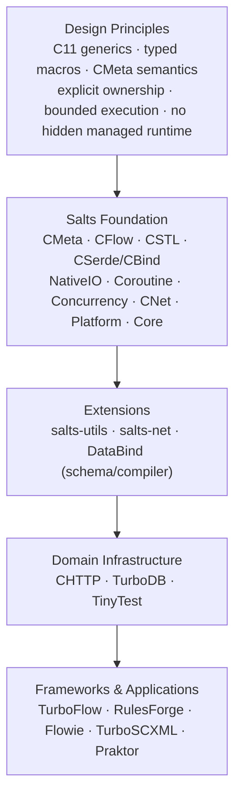

# Salts

**Modern typed systems programming in C11.**

Salts brings programming models usually associated with higher-level languages to C while preserving explicit ownership, predictable execution, native data layouts, and ordinary C deployment.

It uses strict C11 techniques such as generic selection (`_Generic`) where appropriate, finite typed macros, compile-time specialization, and CMeta metadata to provide typed containers, reflection-like metadata, interfaces and contracts, streams, reactive pipelines, actors, state machines, statecharts, coroutines, and asynchronous I/O.

These abstractions are designed to compile down to ordinary C data structures and function calls. Salts does not require a managed runtime or garbage collector, and it does not hide ownership, capacity, backpressure, errors, or lifecycle behind unbounded implicit state.

**Tags:** C11 · generic-programming · systems-programming · typed-metadata · dataflow · reactive-streams · actor-model · state-machine · async-io · containers

## Why Salts?

Salts is built around a small set of shared semantics instead of independent framework-specific runtimes:

- **CMeta** defines type identity, metadata, traits, interfaces, contracts, ranges, and finite generic specialization.
- **CSTL** provides typed C11 containers and algorithms backed by compiled native C implementations.
- **CFlow** lifts the same type model into Graph, Stream, Reactive, Actor, Machine, and Statechart execution.
- **NativeIO / Coroutine / Concurrency** provide bounded asynchronous execution over native platform facilities.
- **CNet** provides transport/session primitives while keeping progress, ownership, and shutdown explicit.
- **CSerde / CBind** provide format-neutral token and native binding primitives.

The result is a modern programming model without replacing C's underlying execution model.

## Ecosystem

Salts is the foundation for a growing family of C/C++ projects. Higher layers reuse the same type, ownership, async-I/O, lifecycle, and error semantics instead of creating independent runtimes.



### Foundation

| Module | CMake target | Responsibility |
| --- | --- | --- |
| [CMeta](cmeta/README.md) | `Salts::CMeta` | Type identity, Enum/Struct metadata, traits, typed callables, interfaces, contracts, ranges, and finite compile-time specialization |
| [CFlow](cflow/README.md) | `Salts::CFlow` | Typed Graph, Stream, Reactive, Actor, Machine, Statechart, interpretation, and compiled execution |
| [CSTL](cstl/README.md) | `Salts::CSTL` / `Salts::CSTLStream` | Typed C11 containers, algorithms, ranges, and Stream facade |
| CSerde / [CBind](cbind/README.md) | `Salts::CSerde` / `Salts::CBind` | Format-neutral token contracts and native C binding primitives |
| Platform / Concurrency | `Salts::Platform` / `Salts::Concurrency` | Cross-platform primitives, executors, thread pools, synchronization, and scheduling foundations |
| [Coroutine](coroutine/README.md) / [NativeIO](native-io/README.md) | `Salts::Coroutine` / `Salts::NativeIO` | Bounded coroutine execution and native asynchronous I/O |
| [CNet](cnet/README.md) | `Salts::CNet` | Transport, TLS, WebSocket/session primitives, explicit progress and shutdown |
| Core | `Salts::Core` | Strings, files, logging, regex, process primitives, memory, and common utilities |
| [TinyTest](tinytest/README.md) | `Salts::TinyTest` | Lightweight C/C++ BDD/TDD testing with strict-C11 generic assertions |

The canonical module boundaries and dependency direction are documented in [ARCHITECTURE.md](ARCHITECTURE.md).

### Extension layer

- [salts-utils](https://github.com/qigao/salts-utils) — parsers, QueryVM, crypto, filesystem/process adapters, templates, Unicode, media helpers, and other higher-level utilities.
- [salts-net](https://github.com/qigao/salts-net) — protocol and network tooling built on CNet/CMeta, including ICE/STUN/TURN, SNMP, LDAP, email, proxying, and related adapters.
- **DataBind** — schema/compiler/native-dynamic binding infrastructure. It is currently hosted under salts-utils while its package/repository boundary is being separated from general utilities.

### Domain infrastructure

- [CHTTP](https://github.com/qigao/chttp) — HTTP client/server, RPC, S3, WebSocket, and OpenAPI-oriented infrastructure built on the Salts networking/runtime model.
- [TurboDB](https://github.com/qigao/turbodb) — storage/database infrastructure that reuses Salts typed and bounded execution primitives.
- **TinyTest** — the lightweight testing framework shipped with Salts and used across the ecosystem.

### Frameworks and applications

- [TurboFlow](https://github.com/qigao/turbo-flow) — graph/workflow and durable execution infrastructure.
- [RulesForge](https://github.com/qigao/RulesForge) — rule/execution infrastructure.
- [Flowie](https://github.com/qigao/flowie) — MQTT server/client infrastructure.
- [TurboSCXML](https://github.com/qigao/turbo-scxml) — W3C SCXML compiled to CFlow Statechart execution.
- **Praktor** — Actor-model application/runtime work built on CFlow Actor semantics.

The intended dependency direction is downward only: higher-level projects may reuse Salts foundations, while Salts itself does not depend on those applications or domain frameworks.

## Design principles

### Modern abstractions, native C semantics

Salts intentionally uses C11's compile-time facilities to make strongly typed APIs practical without introducing a second managed language runtime.

For example:

```c
Struct(User,
    (int, id),
    (double, score)
);

typed(Vec, UserVec, User);
typed(Option, MaybeUser, User);
```

Typed containers remain thin generated facades over compiled C algorithms, and CMeta descriptors describe semantics without changing the native object representation.

### Explicit ownership and bounded state

Public APIs favor explicit ownership transfer, borrowing rules, capacities, backpressure, cancellation, and failure semantics. Long-lived execution should not silently allocate unbounded state or introduce hidden fallback behavior.

### One semantic model across layers

CMeta supplies the shared type/trait vocabulary. CFlow, CSTL, serializers, bindings, networking adapters, and downstream projects reuse that vocabulary instead of maintaining parallel type systems.

### No hidden managed runtime

Salts uses ordinary native libraries and platform primitives. Runtime machinery is explicit in the API surface: scheduler, executor, subscription, actor, statechart instance, I/O owner, and similar state has a concrete lifetime and owner.

## Build and test

Requirements:

- CMake 3.20+
- a C11/C++17-capable compiler
- vcpkg
- Ninja or another supported CMake generator

Repository presets use `VCPKG_ROOT` to locate vcpkg and `PROJECT_ROOT` to derive shared build/package locations.

### Windows Release

```powershell
cmake --preset win-release-user
cmake --build --preset win-release-user
ctest --preset win-release-user
cmake --build --preset install-win-release-user
```

### Linux Release

```sh
cmake --preset linux-release-user
cmake --build --preset linux-release-user
ctest --preset linux-release-user
cmake --build --preset install-linux-release-user
```

The installed CMake package is placed under `<prefix>/lib/cmake/Salts`.

## Using Salts from CMake

```cmake
find_package(Salts CONFIG REQUIRED)

target_link_libraries(my_target PRIVATE
  Salts::CMeta
  Salts::CFlow
  Salts::CSTL)
```

Use the narrowest targets that match the program's actual requirements.

## Package and API conventions

Salts is the CMake project, installed package, and exported target namespace:

- use `find_package(Salts CONFIG REQUIRED)`;
- link `Salts::*` targets explicitly;
- package metadata is installed under `lib/cmake/Salts`;
- repository presets use `SALTS_ROOT` for the installed SDK root.

CSTL is the container subsystem inside Salts. Its public headers use `<cstl/...>` plus the aggregate `<cstl.h>`. Native C identifiers such as `salts_*` and `cstl_*` remain explicit and stable at their owning module boundary.

Higher-level parsers, QueryVM, crypto, filesystem/process adapters, and related utilities are maintained by salts-utils. HTTP/RPC/S3 infrastructure is maintained by CHTTP. Protocol-oriented network tooling is maintained by salts-net. Salts remains the lower-level foundation and does not depend on those repositories.

## Further reading

- [Canonical architecture](ARCHITECTURE.md)
- [CMeta language and semantics](cmeta/LANGUAGE_REFERENCE.md)
- [CFlow examples](cflow/examples/README.md)
- [CSTL typed containers and Stream](cstl/README.md)
- [NativeIO](native-io/README.md)
- [CNet](cnet/README.md)

---

**Small modules. Strong semantics. A more capable C.**
