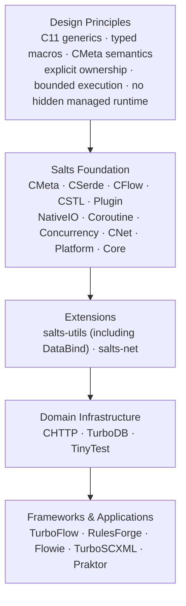

# Salts

**Modern typed systems programming in C11.**

Salts brings programming models usually associated with higher-level languages to C while preserving explicit ownership, predictable execution, native data layouts, and ordinary C deployment.

It uses strict C11 techniques such as generic selection (`_Generic`) where appropriate, finite typed macros, compile-time specialization, and CMeta metadata to provide typed containers, reflection-like metadata, interfaces and contracts, streams, reactive pipelines, actors, state machines, statecharts, coroutines, and asynchronous I/O.

These abstractions are designed to compile down to ordinary C data structures and function calls. Salts does not require a managed runtime or garbage collector, and it does not hide ownership, capacity, backpressure, errors, or lifecycle behind unbounded implicit state.

**Tags:** C11 · generic-programming · systems-programming · typed-metadata · dataflow · reactive-streams · actor-model · state-machine · async-io · containers

## Why Salts?

Salts is built around a small set of shared semantics instead of independent framework-specific runtimes:

- **CMeta** defines type identity, metadata, traits, interfaces, contracts, ranges, and finite generic specialization.
- **CSTL** provides typed C11 containers and algorithms backed by compiled native C implementations.
- **CFlow** lifts the same type model into Graph, Stream, Reactive, Actor, Machine, and Statechart execution.
- **NativeIO / Coroutine / Concurrency** provide bounded asynchronous execution over native platform facilities.
- **CNet** provides transport/session primitives while keeping progress, ownership, and shutdown explicit.
- **CSerde** provides the canonical format-neutral token protocol; native binding is owned by SaltsUtils DataBind.

The result is a modern programming model without replacing C's underlying execution model.

## Ecosystem

Salts is the foundation for a growing family of C/C++ projects. Higher layers reuse the same type, ownership, async-I/O, lifecycle, and error semantics instead of creating independent runtimes.


```mermaid
flowchart TB
    A["Frameworks & Applications<br/>TurboFlow · RulesForge · Flowie · TurboSCXML · Praktor"]
    D["Domain Infrastructure<br/>CHTTP · TurboDB · TinyTest"]
    E["Extensions<br/>salts-utils (including DataBind) · salts-net"]
    S["Salts Foundation<br/>CMeta · CSerde · CFlow · CSTL · Plugin<br/>NativeIO · Coroutine · Concurrency · CNet · Platform · Core"]
    P["Design Principles<br/>C11 generics · typed macros · CMeta semantics<br/>explicit ownership · bounded execution · no hidden managed runtime"]

    P --> S
    S --> E
    E --> D
    D --> A
```

### Foundation

| Module | CMake target | Responsibility |
| --- | --- | --- |
| [CMeta](cmeta/README.md) | `Salts::CMeta` | Type identity, Enum/Struct metadata, traits, typed callables, interfaces, contracts, ranges, and finite compile-time specialization |
| [CFlow](cflow/README.md) | `Salts::CFlow` | Typed Graph, Stream, Reactive, Actor, Machine, Statechart, interpretation, and compiled execution |
| [CSTL](cstl/README.md) | `Salts::CSTL` / `Salts::CSTLStream` | Typed C11 containers, algorithms, ranges, and Stream facade |
| CSerde | `Salts::CSerde` | Canonical format-neutral token reader/writer contract |\n| Plugin | `Salts::PluginABI` / `Salts::Plugin` | Dynamic module publication, loading, registry, lease, and quiescent unload |
| Platform / Concurrency | `Salts::Platform` / `Salts::Concurrency` | Cross-platform primitives, executors, thread pools, synchronization, and scheduling foundations |
| [Coroutine](coroutine/README.md) / [NativeIO](native-io/README.md) | `Salts::Coroutine` / `Salts::NativeIO` | Bounded coroutine execution and native asynchronous I/O |
| [CNet](cnet/README.md) | `Salts::CNet` | Transport, TLS, WebSocket/session primitives, explicit progress and shutdown |
| Core | `Salts::Core` | Strings, files, logging, regex, process primitives, memory, and common utilities |
| [TinyTest](tinytest/README.md) | `Salts::TinyTest` | Lightweight C/C++ BDD/TDD testing with strict-C11 generic assertions |

The canonical module boundaries and dependency direction are documented in [ARCHITECTURE.md](ARCHITECTURE.md).

### Extension layer

- [salts-utils](https://github.com/qigao/salts-utils) — DataBind schema/compiler/native-dynamic binding, parsers, QueryVM, crypto, filesystem/process adapters, templates, Unicode, media helpers, and other higher-level utilities.
- [salts-net](https://github.com/qigao/salts-net) — protocol and network tooling built on CNet/CMeta, including ICE/STUN/TURN, SNMP, LDAP, email, proxying, and related adapters.

### Domain infrastructure

- [CHTTP](https://github.com/qigao/chttp) — HTTP client/server, RPC, S3, WebSocket, and OpenAPI-oriented infrastructure built on the Salts networking/runtime model.
- [TurboDB](https://github.com/qigao/turbodb) — storage/database infrastructure that reuses Salts typed and bounded execution primitives.
- **TinyTest** — the lightweight testing framework shipped with Salts and used across the ecosystem.

### Frameworks and applications

- [TurboFlow](https://github.com/qigao/turbo-flow) — graph/workflow and durable execution infrastructure.
- [RulesForge](https://github.com/qigao/RulesForge) — rule/execution infrastructure.
- [Flowie](https://github.com/qigao/flowie) — MQTT server/client infrastructure.
- [TurboSCXML](https://github.com/qigao/turbo-scxml) — W3C SCXML compiled to CFlow Statechart execution.
- **Praktor** — Actor-model application/runtime work built on CFlow Actor semantics.

The intended dependency direction is downward only: higher-level projects may reuse Salts foundations, while Salts itself does not depend on those applications or domain frameworks.

## Design principles

### Modern abstractions, native C semantics

Salts intentionally uses C11's compile-time facilities to make strongly typed APIs practical without introducing a second managed language runtime.

For example:

```c
cmeta_struct(User,
    cmeta_field(int, id),
    cmeta_field(double, score)
);

cmeta_type(Vec, UserVec, User);
cmeta_type(Option, MaybeUser, User);
```

Typed containers remain thin generated facades over compiled C algorithms, and CMeta descriptors describe semantics without changing the native object representation.

### Explicit ownership and bounded state

Public APIs favor explicit ownership transfer, borrowing rules, capacities, backpressure, cancellation, and failure semantics. Long-lived execution should not silently allocate unbounded state or introduce hidden fallback behavior.

### One semantic model across layers

CMeta supplies the shared type/trait vocabulary. CFlow, CSTL, serializers, bindings, networking adapters, and downstream projects reuse that vocabulary instead of maintaining parallel type systems.

### No hidden managed runtime

Salts uses ordinary native libraries and platform primitives. Runtime machinery is explicit in the API surface: scheduler, executor, subscription, actor, statechart instance, I/O owner, and similar state has a concrete lifetime and owner.

## Build and test

Requirements:

- CMake 3.20+
- a C11/C++17-capable compiler
- vcpkg
- Ninja or another supported CMake generator

Repository presets use `VCPKG_ROOT` to locate vcpkg and `PROJECT_ROOT` to derive shared build/package locations.

All user presets consume the shared [qigao/vcpkg-cache](https://github.com/qigao/vcpkg-cache)
binary feed in read-only mode through `cmake/vcpkg-cache.nuget.config`, alongside
the default local binary cache. Export `GITHUB_TOKEN` with
`read:packages` access before configuring; the config references this environment
variable and contains no token. The platform presets select
`cmake/QigaoVcpkgToolchain.cmake` directly from a checkout at these fixed locations:

| Host platform | vcpkg-cache checkout |
| --- | --- |
| Windows (including Android cross builds) | `%LOCALAPPDATA%/qigao/vcpkg-cache` |
| Linux (including Android cross builds) | `$HOME/.cache/qigao/vcpkg-cache` |
| macOS | `$HOME/Library/Caches/qigao/vcpkg-cache` |

Clone the shared cache repository into the matching directory before configuring.
Linux also requires Mono for NuGet binary restore. Local presets do not read
`VCPKG_CACHE_REPOSITORY_ROOT` from the parent environment or load `.env` files.
Windows presets require `VCPKG_WINDOWS_TRIPLET` to select the target libraries;
use `x64-windows` for a standard local MSVC toolchain.
`VCPKG_HOST_TRIPLET` is fixed in the presets and requires no user environment variable:

| Host profile | Host triplet |
| --- | --- |
| Windows x64 (MSVC, Clang, Android cross builds) | `x64-windows` |
| Linux x64 (GCC, Android cross builds) | `x64-linux` |
| Linux ARM64 (`linux-arm64-release-user`, native GCC) | `arm64-linux` |
| macOS Intel (`mac-x64-release-user`) | `x64-osx` |
| macOS Apple Silicon (`mac-arm64-release-user`) | `arm64-osx` |

Host triplets select tools that run during the build; Android target triplets
continue to select libraries for the requested Android ABI.
The macOS presets are native host profiles: select the one matching your machine.
They replace `mac-release-user`, fix the matching target triplet and
`CMAKE_OSX_ARCHITECTURES`, and provide configure/build/test plus
`install-mac-x64-release-user` / `install-mac-arm64-release-user` build presets.
Their build directories are `build/mac-x64-clang-release` and
`build/mac-arm64-clang-release`; installation roots are
`$PKG_ROOT/salts-macos-x64/release` and `$PKG_ROOT/salts-macos-arm64/release`.

Cache configuration belongs to the hidden presets in `CMakeUserPresets.json`.
Configure, build, test and install presets inherit the matching environment;
no `.env` loader or shell wrapper is required. Run Windows commands in a
Visual Studio developer environment.

CI uses the `win-release-ci`, `win-clang-release-ci`, `linux-dev-ci`, `linux-release-ci`,
`mac-arm64-release-ci` and `android-arm64-v8a-release-ci` presets. An Intel macOS
runner uses `mac-x64-release-ci`. These replace `mac-release-ci` and preserve
the cache action's `VCPKG_CACHE_REPOSITORY_ROOT` and `VCPKG_BINARY_SOURCES`
instead of using local paths. Workflows call the upstream
[re2c setup](https://github.com/qigao/vcpkg-cache/tree/master/.github/actions/setup-re2c-tools)
and [vcpkg cache setup](https://github.com/qigao/vcpkg-cache/tree/master/.github/actions/setup-vcpkg-cache)
actions directly, with the shared cache in read mode. Cache keys and package
metadata consume the upstream outputs directly. The local `setup-build-host`
action only installs platform build prerequisites and maps the upstream Windows
target triplet to `VCPKG_WINDOWS_TRIPLET` for Salts presets. Explicit toolchain
arguments use the upstream `QIGAO_VCPKG_TOOLCHAIN_FILE` environment variable.

Native Linux ARM64 uses `linux-arm64-release-user`, with both host and target
triplets fixed to `arm64-linux`. Its build directory is `build/linux-arm64-release`
and its installation root is `$PKG_ROOT/salts-linux-arm64/release`. Use the same
name for configure/build/test, and `install-linux-arm64-release-user` to install.
This is a native ARM64 profile, not an x64-to-ARM64 cross toolchain.
The ARM64 release job uses `linux-arm64-release-ci` and `linux-arm64-test-ci` on
an ARM64 runner, with manifest mode enabled and cache-only dependency restore.
SDK installation still targets `stage/sdk/linux-arm64` and strips the binaries
through `install-strip-linux-arm64-release-ci`.

### Windows Release

```powershell
cmake --preset win-release-user
cmake --build --preset win-release-user
ctest --preset win-release-user
cmake --build --preset install-win-release-user
```

### Linux Release

```sh
cmake --preset linux-release-user
cmake --build --preset linux-release-user
ctest --preset linux-release-user
cmake --build --preset install-linux-release-user
```

The installed CMake package is placed under `<prefix>/lib/cmake/Salts`.

## CI scope and job responsibilities

`Salts CI` (`.github/workflows/ci.yml`) is the entry point for pull requests,
pushes to `master`, and manual validation. It cancels superseded runs on the
same PR/ref and calls the CMeta, Plugin, and benchmark reusable workflows only
when selected by `cmake/ci/select-ci-scope.ps1`. Path classification has one
owner; the reusable workflows own their platform matrices and test execution.
The SDK release workflow runs only through its explicit manual release inputs.
Neither ordinary pushes nor `v*` tag pushes start SDK builds or publication.
To publish, run `Salts native SDK release` from Actions with the existing `tag`
and its exact `release_sha`; the workflow verifies the tag, commit and package
versions before starting the release jobs. A manual `Salts CI` run performs
validation only and does not invoke the release workflow.

| Change | Checks |
| --- | --- |
| Only Markdown/reStructuredText documentation | Scope and final result only |
| CMeta/runtime dependencies | Affected native, execution, projection and Plugin suites |
| CSTL tests | Execution suite |
| Lean package or checked-in generated formal outputs | Lean checks (plus native consumers for generated headers) |
| NativeIO/CNet/Coroutine runtime or benchmarks | Affected benchmark families and native dependants |
| Shared CMake, presets, vcpkg, vendor or CI dispatcher | Native suites and benchmarks |
| Manual `Salts CI` run | All suites and benchmark families |

PR classification uses the merge-base-to-head diff, not the last commit;
a documentation follow-up on a PR containing code still validates that code.
Push classification uses the delivered `before..sha` range. A missing or
unreadable comparison base fails scope selection instead of skipping checks.
Benchmark family selection also applies to pushes; the existing reduced PR
and full push/manual workload sizes are preserved. Documentation-only changes
still report the stable `CI result` check without starting native builds.

Native CI builds all modules supported by the selected platform. With
`BUILD_TESTS=ON`, it also builds every module's tests; CTest name/label filters
select what each validation job runs. For example, in a Visual Studio developer
shell:

```powershell
cmake --preset win-release-user -DBUILD_TESTS=ON -DBUILD_EXAMPLES=OFF -DBUILD_BENCHMARKS=OFF
cmake --build --preset win-release-user
ctest --preset win-release-user --output-on-failure -R "^(salts_plugin_|cmeta_(pp|const|flags|layout)_.*)"
```

CI builds the complete configured graph without selecting individual build
targets or restricting test modules. Configure options separate tests,
benchmarks and SDK packaging according to each job's purpose. Lean jobs build
and validate the formal package; release jobs build all supported SDK modules
and install/package the results.

This replaces three independent event/path filters with one dispatcher rather
than extending duplicated filters. It trades a small scope/result job on each
event for consistent dependency coverage and fewer heavy builds. Manual runs
now use `Salts CI`; callers of the former individual workflow dispatch endpoints
must migrate. If required checks are configured, use the new `CI result` name.
To roll back, restore the dispatcher, classification script, reusable workflow
triggers together; no source API or package format
changes are involved. Validate updates with `actionlint` and the relevant
configure/build/CTest presets; Linux/macOS and runner behavior need CI execution.

## Using Salts from CMake

```cmake
find_package(Salts CONFIG REQUIRED)

target_link_libraries(my_target PRIVATE
  Salts::CMeta
  Salts::CFlow
  Salts::CSTL)
```

Use the narrowest targets that match the program's actual requirements.

## Package and API conventions

Salts is the CMake project, installed package, and exported target namespace:

- use `find_package(Salts CONFIG REQUIRED)`;
- link `Salts::*` targets explicitly;
- package metadata is installed under `lib/cmake/Salts`;
- repository presets use `SALTS_ROOT` for the installed SDK root.

CSTL is the container subsystem inside Salts. Its public headers use `<cstl/...>` plus the aggregate `<cstl.h>`. Native C identifiers such as `salts_*` and `cstl_*` remain explicit and stable at their owning module boundary.

Higher-level parsers, QueryVM, crypto, filesystem/process adapters, and related utilities are maintained by salts-utils. HTTP/RPC/S3 infrastructure is maintained by CHTTP. Protocol-oriented network tooling is maintained by salts-net. Salts remains the lower-level foundation and does not depend on those repositories.

## Further reading

- [Canonical architecture](ARCHITECTURE.md)
- [CMeta language and semantics](cmeta/LANGUAGE_REFERENCE.md)
- [CFlow examples](cflow/examples/README.md)
- [CSTL typed containers and Stream](cstl/README.md)
- [NativeIO](native-io/README.md)
- [CNet](cnet/README.md)

---

**Small modules. Strong semantics. A more capable C.**

## License

Salts first-party code is licensed under the Apache License 2.0. See
[LICENSE](LICENSE). Bundled third-party components retain their upstream
licenses; see [THIRD_PARTY_NOTICES.md](THIRD_PARTY_NOTICES.md).
