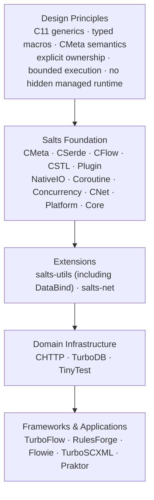

# Salts

**Modern typed systems programming in C11.**

Salts brings programming models usually associated with higher-level languages to C while preserving explicit ownership, predictable execution, native data layouts, and ordinary C deployment.

It uses strict C11 techniques such as generic selection (`_Generic`) where appropriate, finite typed macros, compile-time specialization, and CMeta metadata to provide typed containers, reflection-like metadata, interfaces and contracts, streams, reactive pipelines, actors, state machines, statecharts, coroutines, and asynchronous I/O.

These abstractions are designed to compile down to ordinary C data structures and function calls. Salts does not require a managed runtime or garbage collector, and it does not hide ownership, capacity, backpressure, errors, or lifecycle behind unbounded implicit state.

**Tags:** C11 · generic-programming · systems-programming · typed-metadata · dataflow · reactive-streams · actor-model · state-machine · async-io · containers

## API namespace migration

一方 API 的小写前缀统一为 `cmeta_`，包括平台、并发、Core 工具和 Plugin；对应文件名、
内部 CMake target 和动态查询符号同步迁移。模块职责保持不变，`Salts::Core`、
`Salts::Platform` 等导入目标、项目名和 `SALTS_*` 宏仍沿用现有名称。

这是源码与二进制兼容性变更，不提供旧符号别名。消费端需要更新 include 与调用，
并用同一版本重新构建库、宿主和插件。部署时使用完整的新 SDK；不要混用旧头文件、
旧静态库或旧插件。数据布局与错误码没有因前缀迁移改变。

## Why Salts?

Salts is built around a small set of shared semantics instead of independent framework-specific runtimes:

- **CMeta** defines type identity, metadata, traits, interfaces, contracts, ranges, and finite generic specialization.
- **CSTL** provides typed C11 containers and algorithms backed by compiled native C implementations.
- **CFlow** lifts the same type model into Graph, Stream, Reactive, Actor, Machine, and Statechart execution.
- **NativeIO / Coroutine / Concurrency** provide bounded asynchronous execution over native platform facilities.
- **CNet** provides transport/session primitives while keeping progress, ownership, and shutdown explicit.
- **CSerde** provides the canonical format-neutral token protocol; native binding is owned by SaltsUtils DataBind.

The result is a modern programming model without replacing C's underlying execution model.

## Ecosystem

Salts is the foundation for a growing family of C/C++ projects. Higher layers reuse the same type, ownership, async-I/O, lifecycle, and error semantics instead of creating independent runtimes.


```mermaid
flowchart TB
    A["Frameworks & Applications<br/>TurboFlow · RulesForge · Flowie · TurboSCXML · Praktor"]
    D["Domain Infrastructure<br/>CHTTP · TurboDB · TinyTest"]
    E["Extensions<br/>salts-utils (including DataBind) · salts-net"]
    S["Salts Foundation<br/>CMeta · CSerde · CFlow · CSTL · Plugin<br/>NativeIO · Coroutine · Concurrency · CNet · Platform · Core"]
    P["Design Principles<br/>C11 generics · typed macros · CMeta semantics<br/>explicit ownership · bounded execution · no hidden managed runtime"]

    P --> S
    S --> E
    E --> D
    D --> A
```

### Foundation

| Module | CMake target | Responsibility |
| --- | --- | --- |
| [CMeta](cmeta/README.md) | `Salts::CMeta` | Type identity, Enum/Struct metadata, traits, typed callables, interfaces, contracts, ranges, and finite compile-time specialization |
| [CFlow](cflow/README.md) | `Salts::CFlow` | Typed Graph, Stream, Reactive, Actor, Machine, Statechart, interpretation, and compiled execution |
| [CSTL](cstl/README.md) | `Salts::CSTL` / `Salts::CSTLStream` | Typed C11 containers, algorithms, ranges, and Stream facade |
| CSerde | `Salts::CSerde` | Canonical format-neutral token reader/writer contract |\n| Plugin | `Salts::PluginABI` / `Salts::Plugin` | Dynamic module publication, loading, registry, lease, and quiescent unload |
| Platform / Concurrency | `Salts::Platform` / `Salts::Concurrency` | Cross-platform primitives, executors, thread pools, synchronization, and scheduling foundations |
| [Coroutine](coroutine/README.md) / [NativeIO](native-io/README.md) | `Salts::Coroutine` / `Salts::NativeIO` | Bounded coroutine execution and native asynchronous I/O |
| [CNet](cnet/README.md) | `Salts::CNet` | Transport, TLS, WebSocket/session primitives, explicit progress and shutdown |
| Core | `Salts::Core` | Strings, files, logging, regex, process primitives, memory, and common utilities |
| [TinyTest](tinytest/README.md) | `Salts::TinyTest` | Lightweight C/C++ BDD/TDD testing with strict-C11 generic assertions |

The canonical module boundaries and dependency direction are documented in [ARCHITECTURE.md](ARCHITECTURE.md).

### Extension layer

- [salts-utils](https://github.com/qigao/salts-utils) — DataBind schema/compiler/native-dynamic binding, parsers, QueryVM, crypto, filesystem/process adapters, templates, Unicode, media helpers, and other higher-level utilities.
- [salts-net](https://github.com/qigao/salts-net) — protocol and network tooling built on CNet/CMeta, including ICE/STUN/TURN, SNMP, LDAP, email, proxying, and related adapters.

### Domain infrastructure

- [CHTTP](https://github.com/qigao/chttp) — HTTP client/server, RPC, S3, WebSocket, and OpenAPI-oriented infrastructure built on the Salts networking/runtime model.
- [TurboDB](https://github.com/qigao/turbodb) — storage/database infrastructure that reuses Salts typed and bounded execution primitives.
- **TinyTest** — the lightweight testing framework shipped with Salts and used across the ecosystem.

### Frameworks and applications

- [TurboFlow](https://github.com/qigao/turbo-flow) — graph/workflow and durable execution infrastructure.
- [RulesForge](https://github.com/qigao/RulesForge) — rule/execution infrastructure.
- [Flowie](https://github.com/qigao/flowie) — MQTT server/client infrastructure.
- [TurboSCXML](https://github.com/qigao/turbo-scxml) — W3C SCXML compiled to CFlow Statechart execution.
- **Praktor** — Actor-model application/runtime work built on CFlow Actor semantics.

The intended dependency direction is downward only: higher-level projects may reuse Salts foundations, while Salts itself does not depend on those applications or domain frameworks.

## Design principles

### Modern abstractions, native C semantics

Salts intentionally uses C11's compile-time facilities to make strongly typed APIs practical without introducing a second managed language runtime.

For example:

```c
cmeta_struct(User,
    cmeta_field(int, id),
    cmeta_field(double, score)
);

cmeta_type(Vec, UserVec, User);
cmeta_type(Option, MaybeUser, User);
```

Typed containers remain thin generated facades over compiled C algorithms, and CMeta descriptors describe semantics without changing the native object representation.

### Explicit ownership and bounded state

Public APIs favor explicit ownership transfer, borrowing rules, capacities, backpressure, cancellation, and failure semantics. Long-lived execution should not silently allocate unbounded state or introduce hidden fallback behavior.

### One semantic model across layers

CMeta supplies the shared type/trait vocabulary. CFlow, CSTL, serializers, bindings, networking adapters, and downstream projects reuse that vocabulary instead of maintaining parallel type systems.

### No hidden managed runtime

Salts uses ordinary native libraries and platform primitives. Runtime machinery is explicit in the API surface: scheduler, executor, subscription, actor, statechart instance, I/O owner, and similar state has a concrete lifetime and owner.

## Build and test

Requirements:

- CMake 3.20+
- a C11/C++17-capable compiler
- vcpkg
- Ninja or another supported CMake generator

Repository presets use `VCPKG_ROOT` to locate vcpkg and `PROJECT_ROOT` to derive shared build/package locations.

All user presets consume the shared [qigao/vcpkg-cache](https://github.com/qigao/vcpkg-cache)
binary feed in read-only mode through `cmake/vcpkg-cache.nuget.config`, alongside
the default local binary cache. Export `GITHUB_TOKEN` with
`read:packages` access before configuring; the config references this environment
variable and contains no token. The platform presets select
`cmake/QigaoVcpkgToolchain.cmake` directly from a checkout at these fixed locations:

| Host platform | vcpkg-cache checkout |
| --- | --- |
| Windows (including Android cross builds) | `%LOCALAPPDATA%/qigao/vcpkg-cache` |
| Linux (including Android cross builds) | `$HOME/.cache/qigao/vcpkg-cache` |
| macOS | `$HOME/Library/Caches/qigao/vcpkg-cache` |

Clone the shared cache repository into the matching directory before configuring.
Linux also requires Mono for NuGet binary restore. Local presets do not read
`VCPKG_CACHE_REPOSITORY_ROOT` from the parent environment or load `.env` files.
Local Windows presets fix the target triplet to `x64-windows`; no
`VCPKG_WINDOWS_TRIPLET` environment variable is required. The Windows CI preset
explicitly consumes the triplet supplied by the shared cache setup action.
`VCPKG_HOST_TRIPLET` is fixed in the presets and requires no user environment variable:

| Host profile | Host triplet |
| --- | --- |
| Windows x64 (MSVC, Android cross builds) | `x64-windows` |
| Linux x64 (GCC, Android cross builds) | `x64-linux` |
| Linux ARM64 (`linux-arm64-release-user`, native GCC) | `arm64-linux` |
| macOS Intel (`mac-x64-release-user`) | `x64-osx` |
| macOS Apple Silicon (`mac-arm64-release-user`) | `arm64-osx` |

Host triplets select tools that run during the build; Android target triplets
continue to select libraries for the requested Android ABI.
The macOS presets are native host profiles: select the one matching your machine.
They replace `mac-release-user`, fix the matching target triplet and
`CMAKE_OSX_ARCHITECTURES`, and provide configure/build/test plus
`install-mac-x64-release-user` / `install-mac-arm64-release-user` build presets.
Their build directories are `build/mac-x64-gcc-release` and
`build/mac-arm64-gcc-release`; installation roots are
`$PKG_ROOT/salts-macos-x64/release` and `$PKG_ROOT/salts-macos-arm64/release`.

Cache configuration belongs to the hidden presets in `CMakeUserPresets.json`.
Configure, build, test and install presets inherit the matching environment;
no `.env` loader or shell wrapper is required. Run Windows commands in a
Visual Studio developer environment.

CI uses the `win-release-ci`, `linux-dev-ci`, `linux-release-ci`,
`linux-clang-release-ci`, `mac-arm64-release-ci`, `mac-arm64-clang-release-ci`
and `android-arm64-v8a-release-ci` presets. An Intel macOS
runner uses `mac-x64-release-ci`. These replace `mac-release-ci` and preserve
the cache action's `VCPKG_CACHE_REPOSITORY_ROOT` and `VCPKG_BINARY_SOURCES`
instead of using local paths. Workflows call the upstream
[re2c setup](https://github.com/qigao/vcpkg-cache/tree/master/.github/actions/setup-re2c-tools)
and [vcpkg cache setup](https://github.com/qigao/vcpkg-cache/tree/master/.github/actions/setup-vcpkg-cache)
actions directly, with the shared cache in read mode. Cache keys and package
metadata consume the upstream outputs directly. The local `setup-build-host`
action only installs platform build prerequisites and maps the upstream Windows
target triplet to `VCPKG_WINDOWS_TRIPLET` for Salts presets. Explicit toolchain
arguments use the upstream `QIGAO_VCPKG_TOOLCHAIN_FILE` environment variable.

The supported project compiler profiles are:

| Target platform | Compiler |
|---|---|
| Windows | MSVC |
| Linux | GCC; Clang with `linux-clang-release-ci` |
| macOS Intel / Apple Silicon | Homebrew GCC 15 (`gcc-15` / `g++-15`) |
| macOS Apple Silicon | Xcode AppleClang with `mac-arm64-clang-release-ci` |
| Android | NDK Clang |
| iOS device / Simulator | Xcode AppleClang |

Android and iOS retain their SDK compilers. Linux Clang jobs install the Ubuntu
`clang` package in both build and test jobs; macOS Clang jobs use Xcode's compiler.
For a macOS GCC profile, install [Homebrew `gcc@15`](https://formulae.brew.sh/formula/gcc@15)
and expose its versioned executables before invoking the preset:

```sh
brew install gcc@15
export PATH="$(brew --prefix gcc@15)/bin:$PATH"
```

The versioned compiler names avoid macOS's system `gcc` alias for AppleClang.
CI installs the same GNU compiler/runtime in build and test jobs, and the GNU
runtime in benchmark jobs. iOS presets explicitly select AppleClang before
inheriting the shared macOS host/cache configuration.

Native Linux ARM64 uses `linux-arm64-release-user`, with both host and target
triplets fixed to `arm64-linux`. Its build directory is `build/linux-arm64-release`
and its installation root is `$PKG_ROOT/salts-linux-arm64/release`. Use the same
name for configure/build/test, and `install-linux-arm64-release-user` to install.
This is a native ARM64 profile, not an x64-to-ARM64 cross toolchain.
The ARM64 SDK job uses `linux-arm64-release-ci` on an ARM64 runner, enables
tests in the same build, and uses manifest mode with cache-only dependency restore.
SDK installation still targets `stage/sdk/linux-arm64` and strips the binaries
through `install-strip-linux-arm64-release-ci`.

### Windows Release

```powershell
cmake --preset win-release-user
cmake --build --preset win-release-user
ctest --preset win-release-user
cmake --build --preset install-win-release-user
```

### Linux Release

```sh
cmake --preset linux-release-user
cmake --build --preset linux-release-user
ctest --preset linux-release-user
cmake --build --preset install-linux-release-user
```

The installed CMake package is placed under `<prefix>/lib/cmake/Salts`.

Windows SDK DLLs include a `VERSIONINFO` resource generated by
`cmake/SaltsVersion.cmake` and `cmake/SaltsVersion.rc.in`. File Explorer displays
the target's `VERSION` as the file version and the Salts project version as the
product version, each padded to four components. CFlow retains its independent
file version. Resource filenames follow the actual target output names; Debug
resources carry the debug flag. Static libraries and other platforms do not
receive this resource.

### Shared CMake helpers

`cmake/CmakeUtils.cmake` contains project-independent operations. Target versions,
source directories and host code-generation tools belong to the calling project.
`cmake_config_target()` only changes explicitly supplied attributes, including
`VERSION` and `SOVERSION` (zero is valid). Salts library declarations explicitly
pass the project version to preserve the existing library version contract.

`cmake_add_source()` requires `DIRS`; relative directories and `EXCLUDES` resolve
against the calling source directory. Existing glob-based lists use
`CONFIGURE_DEPENDS` to track added and removed files; prefer explicit source lists
for new targets. Lexer calls to `cmake_add_grammar()` must pass an absolute host
`RE2C_EXECUTABLE`. Parser calls must pass `LEMON_TARGET` (a host executable target)
and `LEMON_TEMPLATE`. Tools and templates participate in generation dependencies.
See the lexer call in [`uri/CMakeLists.txt`](uri/CMakeLists.txt) and the library
attributes in [`utils/CMakeLists.txt`](utils/CMakeLists.txt) for in-tree examples.

Unknown arguments and missing values fail configuration. Executable, test and
benchmark helpers share target creation; only `cmake_add_test()` registers CTest
automatically. Benchmark registration and runtime properties remain at call sites.
Projects reusing an older copy must migrate these arguments with the helper;
reverting the migration requires restoring both the helper and its callers.

## CI builds, checks and release artifacts

`Salts CI` (`.github/workflows/ci.yml`) is the entry point for PRs, pushes to
`master`, and manual validation. `cmake/ci/select-ci-scope.ps1` owns change
classification and emits both selected checks and a deduplicated build matrix.
Documentation-only changes run scope/result jobs. PRs use the full
merge-base-to-head diff; a documentation follow-up still validates preceding
code changes. Invalid comparison bases fail explicitly.

`native-build.yml` owns compilation and the selected CTest suites. Each host
configuration builds all platform-supported modules and tests once, then runs
its selected native/Plugin, execution, projection or ARM header suites as steps
in the same job. A platform starts testing immediately after its own build,
without waiting for other platforms, another runner or an artifact transfer.
After a successful build, a failed suite does not skip the remaining selected
suites; the job still fails and does not install or upload SDKs. Cancellation
stops further suites. Android/iOS keep their existing SDK-only configure profiles
because no device/emulator test runner is configured. Production Release
configurations also compile the NativeIO/CNet/Coroutine benchmarks. CNet
fault-injection tests use a separate private static library, so enabling tests
does not change benchmark instrumentation or the installed shared library.
No workflow selects individual module build targets.

A configuration includes platform, architecture, compiler, build type,
sanitizer and native-fastpath setting; incompatible configurations cannot share
binaries. The selected CI matrix uses Release profiles. With all checks selected,
it contains five host configurations (Linux GCC/Clang, Windows MSVC and macOS
GCC/AppleClang) and two mobile configurations (Android ARM64 and iOS ARM64).
Release preparation adds Linux ARM64 and enables native
thunks in the Linux x64 and Windows profiles selected by the scope script.

Linux Clang and macOS AppleClang each run the selected native/Plugin, execution
and projection suites against their own build trees. These compiler profiles
do not produce additional release packages. Plugin suites run
on both macOS compiler profiles, including cross-TU Mach-O aggregation and lease
cleanup. Interface arity, ObjectRef/Invokable operations and lowering rejection
tests participate in the execution/native suites across compilers.

Mobile configurations participate in ordinary PR/push CI when native modules
or shared build inputs change, and in every manual validation run. Documentation
or Lean-only changes do not trigger them. They use the existing Android/iOS
presets and upload SDK artifacts in the build stage, independently of
`prepare_release`. The package workflow consumes those artifacts without
compiling platform modules.

Only profiles selected for benchmark execution archive the complete build tree,
matching vcpkg dependencies and source snapshot for downstream jobs. Tests use
the existing workspace directly; SDK artifacts remain separate. Linux epoll
and io_uring consume the same `native-linux-release`
artifact. Benchmark execution is eligible only when the PR/push diff contains
non-documentation changes under `native-io/` or `cnet/`; shared build files and
other modules alone do not trigger it. Manual validation has no change range
and does not run benchmarks. Archives preserve source timestamps, executable
permissions and symlinks. Consumers require the same commit, workspace path
and runner image because generated build files contain absolute paths and
compiler locations. They do not reconfigure or rebuild the candidate modules.
Compiler-rejection CTest cases still invoke the compiler on intentionally
invalid test sources in the build job, reusing its compiler and dependencies.
The PR-base CNet comparison compiles the different base commit in the producer
and includes its isolated DSO runtime in the same Windows artifact.
Benchmark executables are registered with CTest under the `benchmark` label;
ordinary test presets exclude that label. Benchmark consumers use exact CTest
name filters on the restored build tree. TLS workload arguments and comparison
DSO paths are read at CTest execution time, without regenerating the build.
Tracing is launched by CTest around the benchmark process only, so CTest's own
output handling does not duplicate measurement markers in the syscall traces.
Artifacts cost upload/download time and storage; missing/expired artifacts
fail instead of silently starting another build. Lean remains an independent
formal build in `cmeta-cflow-calculus.yml`.

Release preparation and publication are separate:

1. Run **Salts CI** on the default branch with `prepare_release=true`.
   This runs native and formal checks, installs the existing Linux x64/Windows/macOS Release
   builds, adds Linux ARM64 to the same build/test matrix, and packages
   the six SDK variants uploaded by that matrix as `salts-native-nuget`.
   Linux ARM64 header tests and SDK installation use one module build and job.
2. Wait for the entire CI run to succeed. Create the matching immutable
   version tag, then manually run **Salts native SDK release** with `ci_run_id`,
   exact `release_sha`, and `tag`.
3. Publication validates that the source is a successful manual `Salts CI`
   run from this repository's default branch and the exact release commit.
   It downloads that run's package, verifies SDK commit/version/profile
   manifests, and publishes the unchanged package. It does not compile or pack.

Ordinary pushes, tag pushes, and manual CI with `prepare_release=false` never
publish. Manual CI with `prepare_release=false` includes the two mobile builds
but skips Linux ARM64 release preparation and NuGet packaging. Existing
release callers must supply the new `ci_run_id`; runs without the prepared
package cannot be promoted. Release preparation has its own concurrency group
so subsequent ordinary pushes do not cancel it. `CI result` remains the stable
aggregate check; selecting checks affects execution, not module compilation.

The workflows own artifact production and validation; only the manual release
workflow owns publication permissions. Compilation, tests or qualification
failure leaves an unpublishable CI run. Package formats and installed APIs are
unchanged. To roll back the build/test consolidation, restore the dispatcher,
native build/test workflows and scope selector together. Validate with
`actionlint`, CMake presets, full builds and related CTest selections;
runner-specific execution still requires CI.

## Using Salts from CMake

```cmake
find_package(Salts CONFIG REQUIRED)

target_link_libraries(my_target PRIVATE
  Salts::CMeta
  Salts::CFlow
  Salts::CSTL)
```

Use the narrowest targets that match the program's actual requirements.

## Package and API conventions

Salts is the CMake project, installed package, and exported target namespace:

- use `find_package(Salts CONFIG REQUIRED)`;
- link `Salts::*` targets explicitly;
- package metadata is installed under `lib/cmake/Salts`;
- repository presets use `SALTS_ROOT` for the installed SDK root.

CSTL is the container subsystem inside Salts. Its public headers use `<cstl/...>` plus the aggregate `<cstl.h>`. Native C identifiers such as `cmeta_*` and `cstl_*` remain explicit and stable at their owning module boundary.

Higher-level parsers, QueryVM, crypto, filesystem/process adapters, and related utilities are maintained by salts-utils. HTTP/RPC/S3 infrastructure is maintained by CHTTP. Protocol-oriented network tooling is maintained by salts-net. Salts remains the lower-level foundation and does not depend on those repositories.

## Further reading

- [Canonical architecture](ARCHITECTURE.md)
- [CMeta language and semantics](cmeta/LANGUAGE_REFERENCE.md)
- [CFlow examples](cflow/examples/README.md)
- [CSTL typed containers and Stream](cstl/README.md)
- [NativeIO](native-io/README.md)
- [CNet](cnet/README.md)

---

**Small modules. Strong semantics. A more capable C.**

## License

Salts first-party code is licensed under the Apache License 2.0. See
[LICENSE](LICENSE). Bundled third-party components retain their upstream
licenses; see [THIRD_PARTY_NOTICES.md](THIRD_PARTY_NOTICES.md).
