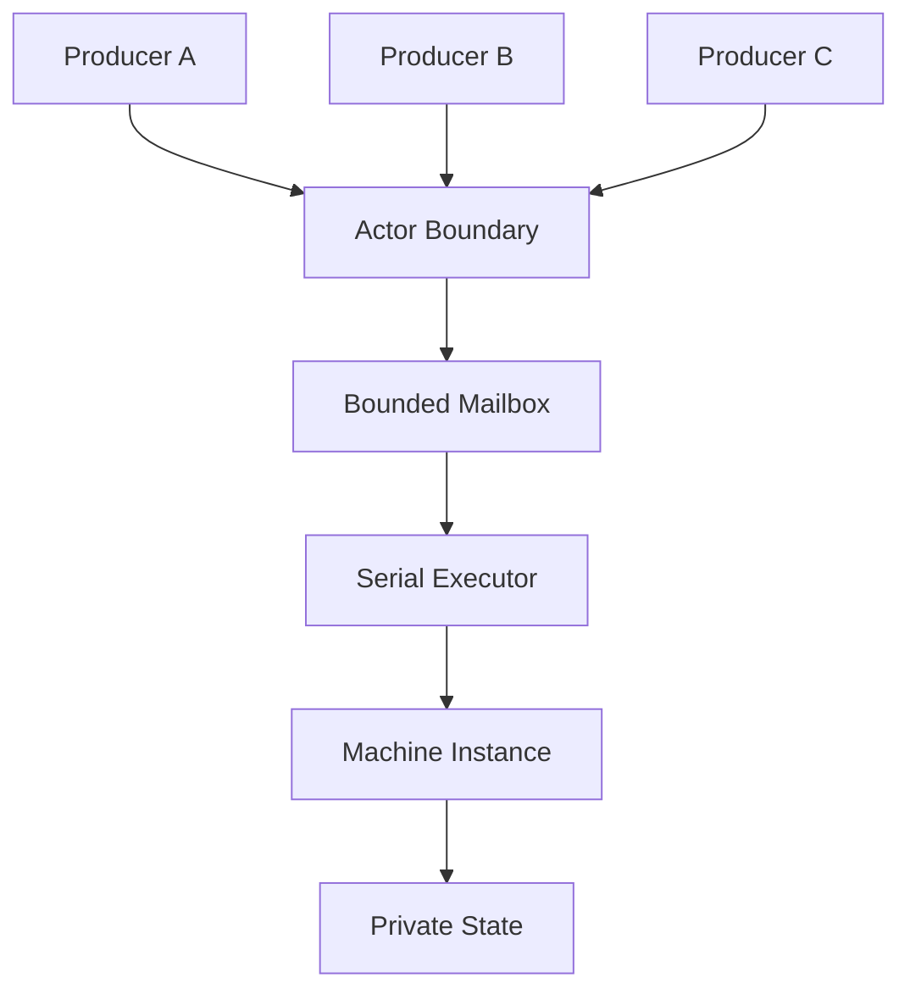
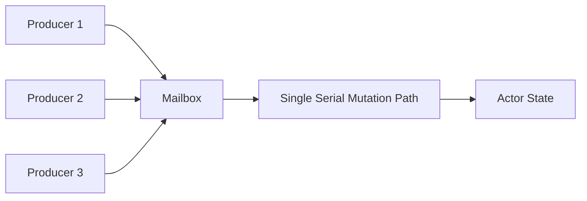
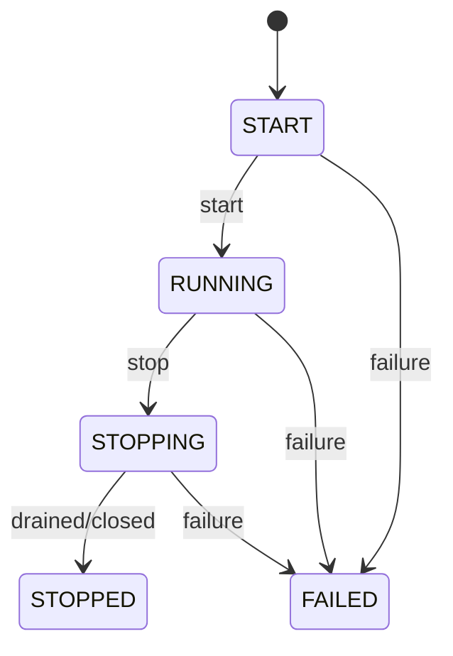
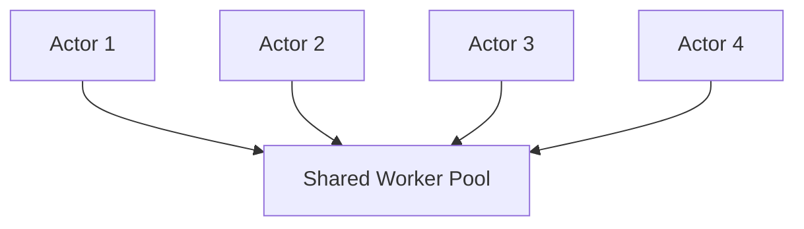
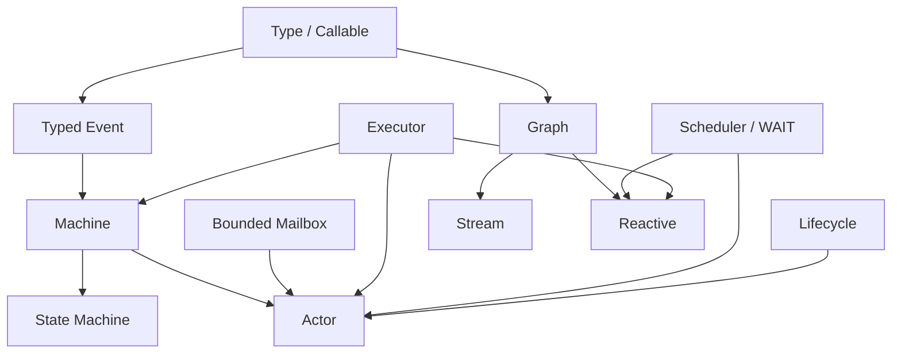
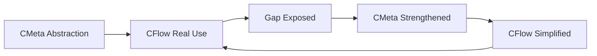

# 第九章：从 State Machine 到 Actor——用 Mailbox、串行执行与生命周期组合并发对象

上一章做到 State Machine 以后，我们已经拥有一个很完整的有状态执行模型：

```text
Typed State
+
Typed Event
+
Guard
+
Action
+
Transition
+
Serial Executor
```

Machine Instance 拥有自己的：

```text
Current State
```

外部通过：

```text
Event
```

驱动它变化。

与此同时，前面已经解决了几个非常关键的问题：

```text
Executor
    负责执行

Serial Executor
    保证单一 mutation owner

Bounded Mailbox
    负责有界 admission

Scheduler
    负责时间与异步推进

WAIT / Wake
    负责暂停与恢复
```

做到这里以后，一个新的发现其实已经非常明显。

如果一个 Machine：

```text
拥有私有 State
```

外部不能直接修改它；

所有输入都通过：

```text
Message / Event
```

进入；

多个线程可以同时发送消息；

但真正修改 State 的 Transition 始终：

```text
Serialized
```

那么它实际上已经非常接近：

# Actor

所以 Actor 并不是在这个阶段突然决定重新设计的一套并发框架。

更自然的发展路径是：

```text
Machine
+
Mailbox
+
Serial Execution
+
Concurrent Producers
+
Lifecycle
    ↓
Actor
```

---

# 1. Actor 真正重要的并不是“线程”

很多人第一次接触 Actor Model 时，很容易把它理解成：

```text
一个 Actor
=
一个对象
+
一个 Mailbox
+
一个线程
```

但真正重要的语义其实不是：

```text
Thread
```

而是：

> **Actor 的私有状态只能通过自己的消息处理序列进行修改。**

也就是：

```text
Private State
+
Message Passing
+
Serialized State Mutation
```

至于：

```text
谁真正执行这些消息
```

是另外一层问题。

这正好是前面：

```text
Machine
```

和：

```text
Executor
```

分离以后已经解决的问题。

因此 Actor 完全没有必要：

```text
一个 Actor 创建一个 OS Thread
```

它只需要拥有：

```text
逻辑上的串行执行权
```

---

# 2. 为什么 State Machine 已经提供了 Actor 最核心的东西

一个 Machine Instance 本身已经拥有：

```text
Private Mutable State
```

例如：

```text
AccountState
ConnectionState
SessionState
WorkerState
```

外部不能直接：

```text
state->field = ...
```

而是通过：

```text
Event
```

触发：

```text
Transition
```

例如：

```text
BalanceState
+
DepositEvent
    ↓
Transition
    ↓
New BalanceState
```

这已经符合 Actor 中最重要的一条原则：

> **状态变化由消息驱动，而不是由外部线程直接共享修改。**

如果再允许：

```text
多个 Producer
```

并发发送 Event，就几乎完成了 Actor 的主要执行语义。

---

# 3. Actor 可以看成 Machine 的一个 Lifecycle / Admission Boundary

因此更准确的定义不是：

```text
Actor = another runtime
```

而是：

```text
Actor
    =
Machine Instance
+
Bounded Mailbox
+
Serial Execution
+
Producer References
+
Lifecycle
+
Failure Boundary
```

当前 CFlow 的 Actor 设计就是沿这个方向建立：Actor 本身是一个 lifecycle/admission boundary，内部可以组合 Machine Instance 或 Statechart Instance，并拥有 identity Graph 与单一 Subscription，而不是另外建立一套 actor-specific state-machine runtime。

可以表示成：



Actor 真正新增的是外围边界。

不是重新发明 Transition。

---

# 4. Message 和 Event 可以使用同一个类型模型

Actor 文献里通常说：

```text
Message
```

State Machine 中则通常说：

```text
Event
```

但在这里二者没有必要形成两套基础设施。

一个 Message 本质上可以是：

```text
Typed Event
```

例如：

```text
Deposit {
    amount : Money
}

Withdraw {
    amount : Money
}

CloseAccount {
    reason : CloseReason
}
```

所以 Actor mailbox 里存储的并不是：

```text
void *
```

而可以明确知道：

```text
Event ID
Payload Type
Payload Value
```

这样 Machine 在真正处理之前就可以检查：

```text
这个 Actor 是否接受这种消息？
Payload 类型是否正确？
```

---

# 5. Send 的第一阶段应该只是 Admission

假设：

```c
actor_send(actor, event);
```

最简单的实现方式是：

```text
直接执行 Event
```

但这会产生很多问题。

例如调用者可能来自：

```text
网络线程
UI 线程
Worker 线程
Timer Callback
其他 Actor
```

如果 `send()` 直接进入 Transition：

```text
Producer Thread
    ↓
Guard
    ↓
Action
    ↓
State Mutation
```

那么 Actor 的执行上下文就变得不可预测。

更合理的是把：

```text
send
```

拆成：

```text
Admission
```

和：

```text
Execution
```

两个阶段。

```text
Producer
   ↓
send(message)
   ↓
Mailbox Admission
   ↓
return
```

真正执行：

```text
Mailbox
   ↓
Serial Executor
   ↓
Machine Transition
```

这样消息发送者与消息执行者完全解耦。

---

# 6. Send 应该是 Bounded、Non-blocking 的

如果 Actor 的 Mailbox 可以：

```text
无限增长
```

那么 Actor 本身其实没有真正的资源边界。

假设：

```text
Producer
    1,000,000 messages/s

Actor
    10,000 messages/s
```

无限 Mailbox 最终只会把速度不匹配转成：

```text
Memory Growth
```

所以 Mailbox 应该：

```text
fixed capacity
```

或至少：

```text
明确 bounded
```

然后：

```text
send()
```

可以返回：

```text
ACCEPTED
FULL
```

当前 Actor send contract 正是有界、非阻塞的：不会在 send 内部 retry、wait、resize、overwrite 或隐式丢弃消息，而是显式返回 admission status。

这与前面的：

```text
Executor FULL
Reactive Demand
```

其实属于完全相同的资源哲学。

---

# 7. 为什么底层绝不能替用户偷偷 Drop Message

当 Mailbox 满了时，有很多可能 policy：

```text
drop newest
drop oldest
retry
block caller
disconnect producer
coalesce
route elsewhere
fail system
```

没有一种是所有 Actor 都正确的默认选择。

例如：

```text
UI repaint
```

也许可以合并。

```text
Telemetry
```

也许可以丢低优先级消息。

但：

```text
Payment
```

绝不能静默丢弃。

所以 Actor mechanism 最合理的行为仍然只是：

```text
FULL
```

把事实暴露给调用方。

然后由更高层 policy 决定：

```text
怎么办
```

这再次体现：

```text
Mechanism
≠
Policy
```

---

# 8. 多 Producer 不意味着多 State Owner

Actor 最重要的并发结构可以画成：



这里：

```text
Producer Side
```

可以是并发的。

但：

```text
State Side
```

仍然只有一个逻辑 owner。

因此我们获得：

```text
Concurrent Admission
+
Serialized Mutation
```

而不是：

```text
Concurrent Shared-State Mutation
```

这是一种非常重要的复杂度转换。

---

# 9. Actor 的价值之一，就是把 Locking 问题变成 Queueing 问题

传统共享对象可能写成：

```c
mutex_lock(&account->lock);

account->balance += amount;

mutex_unlock(&account->lock);
```

随着逻辑复杂，可能继续出现：

```text
多个 mutex
lock ordering
condition variable
nested lock
reader/writer lock
```

Actor 则可以把它转换成：

```text
Deposit(amount)
    ↓
Mailbox
    ↓
Serialized Transition
```

这里并不是：

```text
没有同步
```

而是同步边界变得更明确。

从：

```text
很多代码任意 acquire lock
```

变成：

```text
所有 mutation 都通过 mailbox admission
```

这通常更容易推理。

---

# 10. 但 Actor 并不意味着所有问题都应该消息化

这一点也非常重要。

如果一个数据结构只是：

```text
局部变量
```

或者：

```text
短生命周期的 Vec
```

显然没有必要包成 Actor。

Actor 更适合：

```text
长生命周期
拥有私有 mutable state
需要并发访问
事件驱动
存在清晰 ownership boundary
```

例如：

```text
Connection
Session
Device
Game Entity
Workflow Instance
Service Coordinator
```

所以 Actor 仍然只是上层组合模型。

不是新的默认对象模型。

---

# 11. Actor Lifecycle 为什么必须显式存在

普通函数调用的生命周期非常简单：

```text
enter
execute
return
```

Actor 则可能活很久。

所以必须回答：

```text
什么时候可以 send？
什么时候开始执行？
什么时候停止接受消息？
什么时候彻底停止？
失败以后还能不能恢复？
```

因此 Actor 需要显式 lifecycle。

例如：

```text
START
RUNNING
STOPPING
STOPPED
FAILED
```

当前实现中 Actor lifecycle 就明确区分这些状态。

可以表示成：



---

# 12. Lifecycle 直接影响 Admission

Lifecycle 不应该只是：

```text
一个 debug 字段
```

它应该直接影响：

```text
send()
```

例如：

```text
START
    → NOT_STARTED

RUNNING
    → ACCEPTED / FULL

STOPPING
    → STOPPING

STOPPED
    → STOPPED

FAILED
    → FAILED
```

也就是说：

```text
Lifecycle
```

是 Actor protocol 的组成部分。

这使发送方能够精确知道：

```text
消息为什么没有被接受
```

而不是只得到：

```text
false
```

---

# 13. STOPPING 和 STOPPED 必须区分

这是一个很容易被忽略的区别。

```text
STOPPING
```

通常表示：

```text
不再接受新的普通工作
但已经接受的工作可能还在 drain
```

而：

```text
STOPPED
```

表示：

```text
执行已经彻底结束
```

如果二者混成一个状态，就很难表达：

```text
优雅关闭
```

例如：

```text
RUNNING
    ↓ stop requested

STOPPING
    ↓
drain accepted mailbox
    ↓
STOPPED
```

与：

```text
立即 cancel
```

显然不是同一个语义。

---

# 14. Actor Owner 和 Producer Reference 应该分开

如果任何持有：

```text
Actor *
```

的人都可以：

```text
destroy(actor)
```

那么并发 Producer 很容易产生生命周期 race。

更清楚的模型是：

```text
Actor Owner
```

负责：

```text
start
stop
destroy
```

而外部发送者只拿到：

```text
Producer Reference
```

它只能：

```text
send
```

不能：

```text
destroy actor
```

可以理解为：

```text
Owner
    = lifecycle authority

Producer Ref
    = admission capability
```

这其实是一种非常轻量的：

```text
Capability-based ownership
```

设计。

---

# 15. 为什么需要 STALE

Actor 被销毁以后，某些其他线程可能仍然持有旧 Producer Reference。

如果旧引用只是一个裸：

```text
Actor *
```

那么：

```text
send()
```

可能变成：

```text
use-after-free
```

一种更安全的协议是：

```text
旧 reference
    ↓
发现 identity / generation 已失效
    ↓
STALE
```

当前 Actor producer ref 就明确支持 `STALE` 结果：owner 被销毁后，旧 producer reference 不能重新把消息送入新的或已经不存在的 actor instance。

这使生命周期错误从：

```text
memory corruption
```

变成：

```text
protocol error
```

---

# 16. Identity 因此不是可有可无的名字

Actor Identity 不只是：

```text
用于日志打印的 ID
```

它还可以帮助区分：

```text
同一个内存地址
在不同生命周期中的两个 Actor instance
```

例如：

```text
Actor generation 42
```

销毁以后，内存被复用：

```text
Actor generation 43
```

旧 Producer Ref 不能因为：

```text
地址碰巧相同
```

就认为：

```text
还是同一个 Actor
```

这和前面：

```text
descriptor pointer
≠
semantic type identity
```

其实是同一种思想。

> **地址不是语义身份。**

---

# 17. Actor 不需要自己的线程

这一点现在就可以更严格地说明。

假设有：

```text
100,000 Actors
```

如果：

```text
1 Actor
=
1 Thread
```

则需要：

```text
100,000 OS Threads
```

这通常完全不可接受。

但如果 Actor 只是：

```text
Mailbox
+
Machine Instance
+
Logical Serial Execution
```

那么多个 Actor 可以共享：

```text
N Worker Threads
```

例如：



真正需要保证的只是：

```text
Actor 1 的两个 transition
不能同时执行
```

但：

```text
Actor 1
```

和：

```text
Actor 2
```

完全可以并行。

---

# 18. Concurrency 与 Parallelism 在这里彻底分开

Actor 系统可以是高度：

```text
Concurrent
```

因为：

```text
很多 Actor
很多 Producer
很多 Message
```

都可以同时存在。

但是单个 Actor 内部：

```text
State Mutation
```

仍然：

```text
Serial
```

不同 Actor 之间则可以：

```text
Parallel
```

所以：

```text
Concurrency
```

描述：

> 有多少独立 computation 正在推进。

而：

```text
Parallelism
```

描述：

> 某个时刻到底有多少 computation 真正在 CPU 上同时执行。

Actor 并不要求二者一一对应。

---

# 19. Scheduler 在 Actor 中解决的是“何时获得执行机会”

当 Actor Mailbox 从：

```text
empty
```

变成：

```text
non-empty
```

时，需要安排一次：

```text
Drain Task
```

但 `send()` 本身不应该直接执行整个 actor。

所以典型过程可以是：

```text
send(message)
    ↓
message accepted
    ↓
actor becomes runnable
    ↓
Scheduler
    ↓
Executor
    ↓
drain / step mailbox
```

这样发送者与执行者继续解耦。

---

# 20. 为什么 Actor 可以复用 Reactive 的 Subscription

这一点非常有意思。

前面的 Reactive 已经有：

```text
Subscription
```

负责：

```text
一次 computation instance
```

包括：

```text
wake
cancel
terminal
scheduling
```

Actor 也需要：

```text
start
schedule
run
stop
cancel
terminal
```

如果再设计：

```text
ActorSubscription
```

很可能会重复大量 runtime logic。

所以更好的方法是：

> **让 Actor 组合已有 Subscription，而不是创建第二套 execution lifecycle。**

当前 CFlow Actor 就包含自己的 identity Graph/Subscription，并借用 Scheduler 和 Serial Executor；Machine-backed 与 Statechart-backed facade 共用这一 lifecycle shell，而不是建立独立 actor runtime。

这再次说明：

```text
Reactive
```

和：

```text
Actor
```

表面差异很大，但底层 execution primitive 可以共享。

---

# 21. Actor 可以通过一个 Identity Graph 接入已有执行框架

如果 Actor 核心行为已经在：

```text
Machine
```

中，那么外围 Subscription 并不需要再表达复杂数据转换。

它可以只是一个极薄的：

```text
identity execution path
```

负责把：

```text
Mailbox Event
```

推进到：

```text
Machine
```

这样 Actor 可以直接复用已有：

```text
Subscription
Scheduler
Terminal
Wake
```

协议。

这种设计的价值不是：

```text
Graph 一定要参与所有事情
```

而是：

> **尽量避免为新模型复制已有 execution lifecycle。**

---

# 22. Actor 的 Failure 应该成为生命周期状态

如果某次 Machine Transition 返回：

```text
ERROR
```

不能只：

```text
打印日志然后继续
```

因为这可能意味着：

```text
Actor State 已经无法保证继续满足 invariant
```

所以一种明确做法是：

```text
RUNNING
    ↓ unrecoverable transition failure
FAILED
```

以后：

```text
send()
```

直接返回：

```text
FAILED
```

直到 owner 显式处理。

这样 Failure 不再只是：

```text
某个 callback 返回 false
```

而成为：

```text
Actor lifecycle fact
```

---

# 23. Actor 也应该避免隐式 Restart Policy

一些 Actor Framework 会自动提供：

```text
restart
supervision
retry
```

这些功能很有价值。

但它们不应该偷偷进入最底层 Actor mechanism。

因为：

```text
restart
```

到底意味着什么？

```text
清空 Mailbox？
恢复 Initial State？
恢复 Snapshot？
重新处理失败 Message？
保留 Producer Identity？
```

这些都是非常强的 policy。

因此核心 Actor 更合理的边界是：

```text
FAILED
```

然后由更高层：

```text
Supervisor / Application
```

决定：

```text
restart
replace
stop
escalate
```

---

# 24. 这为未来的 Supervisor 提供了很自然的基础

如果以后需要 supervision，可以建立在：

```text
Actor Lifecycle
+
Actor Identity
+
Failure Event
```

之上。

例如：

```text
Child Actor
    ↓ FAILED
Supervisor
    ↓
Policy
    ↓
Restart / Replace / Stop
```

而不必把：

```text
Supervisor
```

硬编码进每一个 Actor 内部。

这仍然符合：

```text
小 primitive
+
显式组合
```

的设计方向。

---

# 25. Actor Message 本身也可以拥有 Effects / Contracts

因为消息最终对应：

```text
Machine Transition
```

所以可以进一步分析：

```text
这个 Message 会不会触发 IO？
是否可能失败？
是否改变 external resource？
```

例如：

```text
GetStatus
```

可能是：

```text
read-only
```

而：

```text
Persist
```

可能具有：

```text
IO | MAY_FAIL
```

这为以后更高层的：

```text
Scheduling
Observability
Testing
Formal Analysis
```

提供语义信息。

但这些仍然来自：

```text
Callable / Action Metadata
```

而不是 Actor 再造一套 property system。

---

# 26. Actor 和传统 Object 的区别开始变得很清楚

普通 Object API 通常是：

```c
account_deposit(account, amount);
account_withdraw(account, amount);
```

调用者：

```text
直接进入对象代码
```

并可能：

```text
直接等待调用结束
```

Actor API 更接近：

```text
send(actor, Deposit(amount));
```

调用者表达的是：

```text
一个事实/意图
```

而不是：

```text
立即同步进入对象内部执行
```

这让：

```text
Temporal Decoupling
```

成为可能。

即：

```text
发送时间
≠
执行时间
```

这也是 Actor 适合异步系统的关键原因之一。

---

# 27. Actor 和 Reactive 其实共享了很多结构

现在回头看 Reactive：

```text
Publisher
 ↓
WAIT
 ↓
Wake
 ↓
Scheduler
 ↓
Subscription
```

Actor：

```text
Mailbox
 ↓
Message Arrival
 ↓
Scheduler
 ↓
Subscription
 ↓
Machine
```

两者都存在：

```text
外部事件
    ↓
computation becomes ready
    ↓
scheduler
    ↓
resume/run
```

差别主要是：

```text
Reactive
    关注 Value Flow

Actor
    关注 Private State + Message
```

底层：

```text
Scheduling
Lifecycle
Wakeup
Bounded Resources
```

则高度相似。

---

# 28. Stream、Reactive、Machine、Actor 开始显露出共同结构

到这里，可以重新审视前面的几个高级模型。

### Stream

```text
Graph
+
Borrowed Range / Array Input
```

### Reactive

```text
Graph
+
Publisher
+
Subscription
+
WAIT / Wake
+
Demand
+
Scheduler
```

### State Machine

```text
State
+
Typed Event
+
Transition
+
Serial Executor
```

### Actor

```text
Machine
+
Bounded Mailbox
+
Serial Executor
+
Subscription
+
Scheduler
+
Lifecycle
```

可以画成：



这时一个非常重要的结论开始出现：

> **这些并不是四套独立 Runtime。**

它们只是：

> **同一批更小 execution primitive 的不同组合。**

---

# 29. 这可能是 CFlow 过程中最重要的发现之一

如果按照传统 framework 思路，可能分别设计：

```text
CStream
CReactive
CStateMachine
CActor
```

每个都有：

```text
自己的 scheduler
自己的 callback
自己的 lifecycle
自己的 queue
自己的 type system
```

最后整个项目会迅速膨胀。

但真正逐层实现以后发现：

```text
Type
Callable
Graph
Executor
Scheduler
Event
Machine
Subscription
Mailbox
```

已经足以组合出这些高级模型。

所以 CFlow 的价值开始从：

```text
实现很多高级 feature
```

转变成：

> **寻找这些高级模型共同的最小执行语言。**

---

# 30. Actor 再次反向验证 CMeta

Actor 也继续给底层提出新的压力。

例如：

### Producer Reference

要求：

```text
Identity
Lifetime
Stale Detection
```

### Typed Message

要求：

```text
Type Metadata
```

### Machine Action

要求：

```text
Callable
Effects
Properties
```

### Runtime Boundary

要求：

```text
Interface
```

### Mailbox

要求：

```text
Value Lifecycle / Copy / Move / Destroy
```

也就是说：

```text
CFlow Real Requirement
    ↓
暴露 CMeta abstraction 的不足
    ↓
强化 CMeta
```

然后强化后的 CMeta 又反过来让：

```text
CFlow implementation
```

更简单。

这形成一个非常重要的设计循环：



所以 CFlow 一直不仅是：

```text
CMeta 的用户
```

还是：

```text
CMeta 的压力测试
```

---

# 31. Actor 之后，继续增加大型模型反而不再是最重要的事

到这一阶段已经能够组合：

```text
Stream
Reactive
Machine
Actor
```

继续列举：

```text
Workflow
Event Bus
Command Bus
Service Runtime
```

当然都可以。

但更重要的问题已经改变了。

现在真正需要回答的是：

> **这些高级抽象最终会不会让 C 的运行时越来越重？**

因为目前已经拥有：

```text
Type Metadata
Callable
Graph
Optimizer
Subscription
Executor
Scheduler
Machine
Actor
```

如果每一个 abstraction 最终都留在 hot path，那么整个设计就会背离最开始的目标：

```text
简单
快速
显式
```

因此下一阶段的核心不应该再是：

```text
还能做什么 framework？
```

而应该是：

> **怎样让这些复杂信息主要存在于编译期、构建期和 admission/control plane，而让真正执行路径重新变回简单 C？**

---

# 32. 从这里开始进入另一个核心主题：Rich Control Plane，Simple Execution Plane

例如：

```text
Stream API
    ↓
Graph
    ↓
Type Validation
    ↓
Optimization
    ↓
Plan
    ↓
Execution
```

理想情况是：

```text
Graph 查询
Type 推导
Signature 匹配
Effect 分析
Topology 分析
```

都发生在：

```text
执行之前
```

而真正处理每一个 Value 时只剩：

```text
load
call
branch
store
```

同样：

```text
Machine
```

也可以在 build 时完成：

```text
Transition normalization
Type validation
Reachability analysis
```

运行时只做：

```text
lookup accepted event
guard
action
commit
```

这将成为整个设计是否真正适合 Modern C 的关键。

---

# 小结：Actor 不是新的 Runtime，而是已有执行原语的组合

从 State Machine 向 Actor 的发展并没有增加一个新的基础世界。

真正增加的主要是：

```text
Mailbox
Producer Reference
Lifecycle
Identity
Failure Boundary
```

而底层继续复用：

```text
Type
Callable
Machine / Statechart Instance
Serial Executor
Scheduler
Subscription
```

所以 Actor 可以总结为：

```text
Actor
=
Private Typed State
+
Typed Messages
+
Bounded Mailbox
+
Serialized Mutation
+
Concurrent Producers
+
Explicit Lifecycle
```

最关键的是：

```text
Serialized Mutation
≠
One OS Thread Per Actor
```

大量 Actor 可以共享少量执行资源，同时仍然保持每个 Actor 私有状态的串行语义。

做到这里，CFlow 已经从最早的：

```text
“能不能用 Graph 表达复杂计算？”
```

一路自然扩展到了：

```text
Data Transformation
Stream
Reactive
Event
State Machine
Actor
```

而真正值得注意的结果并不是功能数量。

而是我们逐渐发现：

> **这些看起来完全不同的高级编程模型，可以由少量正交 primitive 组合出来。**

这意味着下一阶段应该反过来重新审视整个执行体系：

```text
Type / Callable / Graph / Machine
        ↓
这些丰富信息到底应该什么时候使用？
        ↓
哪些必须留在 runtime？
哪些可以在执行前彻底消掉？
```

下一章将进入这个问题：**为什么高级 Meta 和 Graph 并不意味着更重的运行时——如何通过 Control Plane、Direct Execution、Compiled Plan 和静态优化，把复杂性提前，把 hot path 重新降低成普通 C。**
