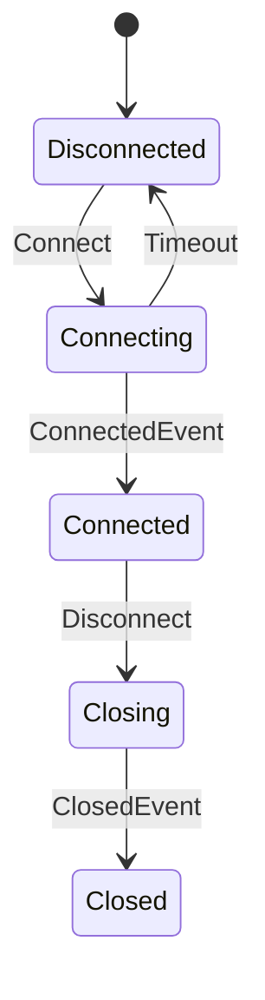
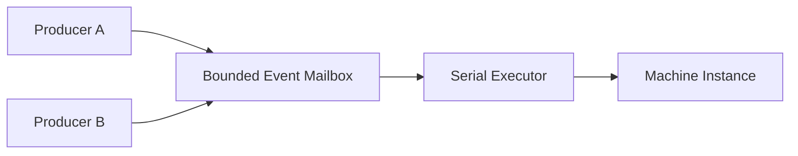
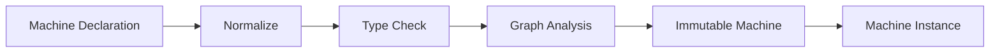
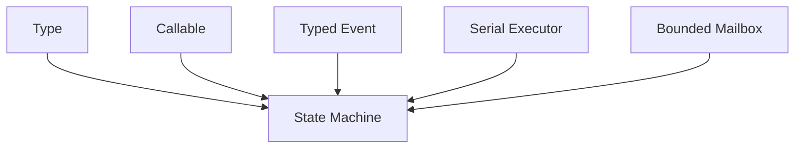

# 第八章：从 Event 到 State Machine——把状态变化变成可验证的执行模型

上一章得到 Executor 以后，执行系统已经开始拥有一个非常稳定的基础：

```text
Task
  ↓
Executor
```

Executor 并不关心 Task 来自哪里。

它可以来自：

```text
Graph
Reactive Subscription
Timer
State Transition
Actor
```

这时候，一个新的共同对象开始变得明显：

# Event

因为很多系统真正处理的，并不是连续的数据流，而是：

```text
某件事情发生了
```

例如：

```text
Login
Logout
Timeout
Connected
Disconnected
OrderCreated
PaymentSucceeded
ButtonClicked
```

这些对象和前面的普通 Value 很像。

它们都有：

```text
Type
Payload
Identity
```

不同的是，它们表达的是：

> **一次离散发生的事实。**

一旦 Event 进入执行系统，再加入：

```text
State
```

问题就自然变成：

> 当前处于某个状态时，收到某种 Event，系统应该变成什么状态？

这就是 State Machine。

但因为前面已经拥有：

```text
Type
Callable
Graph
Executor
```

所以这里不需要重新发明一个传统的 callback table。

我们可以尝试把 State Machine 本身也提升成：

> **一个有类型、可以验证、可以分析的程序数据结构。**

---

## 1. Event 首先应该是 Typed Value

传统事件系统很常见的一种写法是：

```c
enum event_type {
    EVENT_LOGIN,
    EVENT_LOGOUT,
    EVENT_TIMEOUT
};

struct event {
    int type;
    void *payload;
};
```

这种方式非常简单。

但问题也很明显。

例如：

```text
EVENT_LOGIN
```

对应的 payload 可能应该是：

```text
LoginRequest
```

而：

```text
EVENT_TIMEOUT
```

可能根本没有 payload。

如果统一使用：

```c
void *
```

那么：

```text
Event ID
```

和：

```text
Payload Type
```

之间的关系只存在于程序员约定中。

例如：

```c
if (event.type == EVENT_LOGIN) {
    LoginRequest *r = event.payload;
}
```

编译器无法证明：

```text
EVENT_LOGIN
```

真的携带：

```text
LoginRequest
```

所以既然已经有 Type Metadata，就可以进一步让 Event 变成：

```text
Typed Event
    =
Event Identity
+
Payload Type
+
Payload
```

例如：

```text
LoginEvent
    payload : LoginRequest

TimeoutEvent
    payload : TimeoutInfo

StopEvent
    payload : void
```

这样 Event 不再只是：

```text
tag + void *
```

而成为真正的：

```text
typed message
```

---

## 2. 为什么 Event Type 和 Payload Type 应该分开

例如：

```text
DataReceived
```

和：

```text
ConfigLoaded
```

可能都携带：

```text
Buffer
```

但它们显然不是同一种 Event。

所以：

```text
Event Identity
```

不能简单等于：

```text
Payload Type
```

更合理的是：

```text
Event {
    id
    payload_type
    payload
}
```

也就是说：

```text
事件是什么
```

和：

```text
事件携带什么
```

是两个不同维度。

这和函数中的：

```text
Operator
```

与：

```text
Callable Signature
```

非常类似。

---

## 3. 有了 Event 以后，State Machine 几乎自然出现

假设一个连接对象有：

```text
Disconnected
Connecting
Connected
Closing
Closed
```

几个状态。

然后有：

```text
Connect
ConnectedEvent
Disconnect
Timeout
```

几个事件。

它们之间存在：

```text
Disconnected + Connect
    -> Connecting

Connecting + ConnectedEvent
    -> Connected

Connecting + Timeout
    -> Disconnected

Connected + Disconnect
    -> Closing
```

可以画成：



这已经不只是：

```text
一堆 callback
```

而是一个明确的：

```text
Transition Graph
```

所以很自然地再次使用：

```text
IR
```

思想。

---

## 4. State Machine 本身也应该先成为数据

传统状态机常见写法：

```c
switch (state) {
case DISCONNECTED:
    if (event == CONNECT)
        ...
    break;

case CONNECTING:
    if (event == CONNECTED)
        ...
    else if (event == TIMEOUT)
        ...
    break;
}
```

这种代码对于小状态机非常好。

但随着状态越来越多：

```text
State × Event
```

组合会快速膨胀。

而且很多信息被分散在：

```text
switch
if
callback
assignment
```

里面。

如果状态机先表示成：

```text
Machine IR
```

那么就可以保存：

```text
States
Events
Transitions
Guards
Actions
Initial State
Terminal State
```

也就是说：

```text
Program
    ↓
Machine Description
    ↓
Validate
    ↓
Execute
```

这和前面 Graph 的发展路线完全一致。

---

## 5. Transition 应该具有真正的类型

一个 Transition 最简单可以表示：

```text
Source State
+
Event
+
Target State
```

但如果要真正做到 typed machine，还应该包括：

```text
Guard
Action
```

例如：

```text
(SourceState, Event)
        ↓
      Guard
        ↓
      Action
        ↓
   TargetState
```

其中 Guard 可以具有：

```text
State × Event -> bool
```

Action 可以具有：

```text
State × Event -> NewState
```

或者更一般地：

```text
State × Event
    ->
State + Output
```

因此每条 Transition 都可以在构建阶段检查：

```text
Source State Type

Event Payload Type

Guard Signature

Action Signature

Target State Type
```

当前 CFlow `Machine` IR 就明确保存 State、Event、Guard、Action、Transition，并让 Guard/Action 同样携带 type、effects 和 properties 信息。

---

## 6. Guard 为什么也应该是 Callable

传统 State Machine 里经常会写：

```c
if (balance >= amount) {
    ...
}
```

或者：

```c
if (retry_count < 3) {
    ...
}
```

这些条件本质上就是：

```text
Predicate
```

例如：

```text
can_retry :
    State × ErrorEvent -> bool
```

既然前面已经建立 Callable，就没有理由为 State Machine 再重新发明：

```text
Guard Callback Type
```

它应该直接复用：

```text
Typed Callable
```

这样 Guard 自动拥有：

```text
Signature
Effects
Properties
```

例如一个 Guard 理论上通常应该是：

```text
PURE
DETERMINISTIC
```

如果某个 Guard 被声明成：

```text
IO
STATEFUL
```

系统甚至可以进一步决定：

```text
是否允许
是否警告
是否影响优化/证明
```

---

## 7. Action 同样不需要新函数系统

Action 也是一样。

例如：

```text
on_connect
on_timeout
on_close
```

本质上仍然只是：

```text
Callable
```

区别只在于它承担：

```text
Transition Side Effect
```

所以 Action 可以继续使用：

```text
Effects
Properties
```

描述：

```text
是否 IO
是否 Stateful
是否可能失败
是否产生输出
```

这样 Machine 不需要自己再维护一套：

```text
callback metadata
```

而是直接建立在前面的 Callable 模型上。

这再次验证了一件事情：

> **如果基础 primitive 设计正确，上层功能应该更多是组合，而不是重新实现。**

---

## 8. Machine Build 可以提前发现大量错误

一旦整个状态机已经成为数据，就可以在真正运行之前检查：

```text
未知 State
未知 Event
重复 ID
类型不匹配
无效 Guard Signature
无效 Action Signature
重复 Transition
不可达 State
未使用 Event
Terminal State 仍存在 outgoing edge
歧义 Transition
```

当前 Machine 构建过程就是在发布 immutable Machine 之前完成 normalization 和 validation，并拒绝 duplicate/unknown ID、类型不匹配、歧义、不可达状态、terminal outgoing transition 等非法结构。

这和 Graph 的原则完全一致：

> **越早发现错误越好。**

---

## 9. Ambiguous Transition 是一个非常重要的问题

例如：

```text
State = Connected
Event = Data
```

同时存在：

```text
Transition A:
    guard = x > 0

Transition B:
    guard = x < 10
```

当：

```text
x = 5
```

时：

```text
A = true
B = true
```

应该走哪个 Transition？

如果 Machine 没有明确 coordination semantics：

```text
程序行为就依赖 transition registration order
```

这非常危险。

所以 Machine Build 阶段应该尽可能拒绝：

```text
静态可确认的 ambiguity
```

或者要求显式规定：

```text
priority
first-match
exclusive
```

而不是偷偷选择：

```text
第一个 callback
```

---

## 10. Terminal State 也应该成为结构属性

例如：

```text
Done
Failed
Closed
```

这种状态通常表示：

```text
Machine 已经终止
```

如果它仍然存在：

```text
Done -> Running
```

这样的 outgoing transition，就会造成语义矛盾。

因此：

```text
terminal
```

不应该只是：

```text
状态名字里叫 Done
```

而应该成为：

```text
Machine Metadata
```

然后 Build 阶段验证：

```text
terminal state
    must not have outgoing transitions
```

这使生命周期规则开始进入 IR。

---

## 11. 为什么 Machine 应该 Immutable

Machine 描述的是：

```text
状态机规则
```

而不是：

```text
某一次运行的当前状态
```

例如：

```text
ConnectionMachine
```

可以同时有：

```text
connection A
connection B
connection C
```

三个 instance。

如果 Machine 本身保存：

```text
current_state
```

那么它就不能安全复用。

更合理的是：

```text
Machine
    = immutable definition

Machine Instance
    = mutable execution state
```

也就是：

```text
Definition
≠
Instance
```

这和上一章的：

```text
Graph
≠
Subscription
```

完全相同。

---

## 12. Machine Instance 才拥有真正的状态

例如：

```text
Machine Definition:

Disconnected
Connecting
Connected
Closed
```

而：

```text
Instance A:
    current = Connected

Instance B:
    current = Connecting
```

两个 Instance 共享：

```text
同一个 immutable Machine
```

却拥有自己的：

```text
State Value
Mailbox
Lifecycle
Scratch Storage
```

当前 CFlow 的 Machine runtime 也采用这种划分：Machine 是 immutable IR，而 instance 拥有 initial/current state、bounded Event mailbox 以及执行所需 storage。

---

## 13. State 不一定只是一个 enum

传统 FSM 经常把 State 写成：

```c
enum State {
    IDLE,
    RUNNING,
    DONE
};
```

这对很多问题足够。

但真正复杂的状态往往是：

```text
State ID
+
State Data
```

例如：

```text
Downloading {
    url
    received_bytes
    total_bytes
}
```

或者：

```text
Authenticated {
    user
    token
}
```

因此：

```text
State
```

也可以成为 typed value。

例如：

```text
State ID = AUTHENTICATED
State Type = AuthenticatedState
```

这样 Transition 不只是：

```text
enum -> enum
```

而可以成为真正的：

```text
typed state transformation
```

---

## 14. Event 和 State 都有 Type 后，Transition 才真正安全

例如：

```text
State:
    ConnectingState

Event:
    ConnectedEvent

Action:
    ConnectingState × ConnectedEvent
        ->
    ConnectedState
```

如果错误地把：

```text
TimeoutEvent
```

传进只接受：

```text
ConnectedEvent
```

的 Action，应该在：

```text
Machine Build
```

阶段直接失败。

这与前面 Graph 中：

```text
A.output_type
!=
B.input_type
```

时拒绝 Edge 的思想完全一致。

---

# 15. State Machine 可以看成另一种 Typed Graph

做到这里以后，会发现 Machine 和前面的 Dataflow Graph 有很多相似之处。

Dataflow Graph：

```text
Value
    ↓
Operator
    ↓
Value
```

State Machine：

```text
State + Event
    ↓
Transition
    ↓
New State
```

可以抽象成：

```text
Typed Input
    ↓
Semantic Relation
    ↓
Typed Output
```

两者的重点不同：

```text
Graph
    强调 Data Transformation

Machine
    强调 State Transition
```

但底层：

```text
Type
Callable
Effect
Property
Validation
```

大量能力可以共享。

---

## 16. 为什么 State Machine 不应该直接在 send() 中执行

假设：

```text
Thread A
    send(EventA)

Thread B
    send(EventB)
```

如果：

```text
send()
```

直接执行 Transition，就可能出现：

```text
两个线程同时修改 State
```

于是必须大量加锁。

而前面已经有：

```text
Serial Executor
```

所以一个更简单的模型是：

```text
Producer
   ↓
Event Mailbox
   ↓
Serial Executor
   ↓
Machine Transition
```

即：



这样 Producer 可以并发。

但：

```text
State Mutation
```

只有一个串行 owner。

---

## 17. Serial Executor 在这里第一次成为“状态隔离边界”

这其实比：

```text
少写 mutex
```

更重要。

因为它建立了一个明确 invariant：

> **任何时刻只有一个 Transition 可以拥有并修改 committed state。**

这意味着 Guard、Action、State Commit 可以形成：

```text
deterministic transition boundary
```

而不是：

```text
任意多个线程
    ↓
共同修改 State
```

因此：

```text
Serial Executor
```

不仅是性能策略。

它开始具有：

```text
Concurrency Semantics
```

---

## 18. 为什么 Mailbox 必须 Bounded

和 Executor Queue 一样，Event Mailbox 如果：

```text
永远接受
```

那么 Producer 比 Machine 快时：

```text
内存就会无限增长
```

例如：

```text
Producer:
    1,000,000 Event/s

Machine:
    10,000 Event/s
```

系统必须明确：

```text
capacity
```

并在满时返回：

```text
FULL
```

而不是：

```text
自动无限扩容
```

这样上层才能决定：

```text
retry
drop
coalesce
backpressure
fail
```

所以：

```text
Bounded Mailbox
```

其实和：

```text
Reactive Demand
Bounded Executor
```

是同一个资源哲学的不同表现。

---

## 19. Event Admission 和 Event Execution 必须分开

发送 Event 时，可以分成两个阶段：

```text
Admission
    ↓
Execution
```

例如：

```text
send(event)
```

首先只决定：

```text
能不能进入 Mailbox
```

返回：

```text
ACCEPTED
FULL
CLOSED
INVALID
TYPE_MISMATCH
```

真正执行：

```text
Guard
Action
Transition
```

发生在 Serial Executor 中。

这样：

```text
Producer Latency
```

不会被整个 Transition 的执行时间绑死。

也不会让：

```text
Producer Thread
```

突然承担 Machine callback。

---

## 20. State Commit 应该具有明确边界

假设 Action：

```text
OldState + Event -> NewState
```

执行过程中发生错误。

那么：

```text
Current State
```

应该是什么？

如果 Action 一边执行一边直接修改 committed state，很容易留下：

```text
half-mutated state
```

更可靠的模式是：

```text
Current State
    ↓
Scratch / Candidate State
    ↓
Guard / Action
    ↓
成功
    ↓
Atomic Commit
```

也就是说：

> **State Transition 应该尽量表现成 transaction-like commit。**

即使底层并不是真正数据库 transaction，这种结构也能大幅减少异常路径的复杂性。

---

## 21. Observation 和 Mutation 也可以分开

一个 Transition 可能需要：

```text
改变 State
```

同时还需要：

```text
通知外部
输出 Event
记录日志
```

如果这些全部混在：

```text
Action
```

里面，很难区分：

```text
核心 State Change
```

和：

```text
External Observation
```

因此复杂 Machine 可以进一步区分：

```text
Transition Logic
State Commit
Observation
```

让：

```text
State Correctness
```

和：

```text
外部 Side Effect
```

拥有更清楚的边界。

当前 Machine action metadata 也已经能够描述 observation/effect 等执行属性。

---

# 22. Machine Build 很像一个小型 Compiler Front-end

回头看 Machine 的构建过程：

```text
Declarations
    ↓
Normalize
    ↓
Validate IDs
    ↓
Validate Types
    ↓
Validate Transition Rules
    ↓
Reachability Analysis
    ↓
Publish Immutable Machine
```

它已经非常接近：

```text
Compiler Front-end
```

只是它编译的不是：

```text
C source
```

而是：

```text
State Machine Schema
```

可以表示成：



这与 CFlow Graph 的：

```text
Surface Graph
 ↓
Normalize
 ↓
Analyze
```

是一致的。

## 22.1 当前实现中的 Machine 与 Statechart 不是同一个层次

本章前半描述的 `cflow_machine` 是平面 typed transition IR：State、Event、Guard、Action 和 Transition 都是显式 row。`cflow_machine_build()` 复制并排序这些声明，检查 ID、type contract、歧义、不可达状态、terminal outgoing transition 和未使用声明，再原子发布 immutable Machine。

层次化控制模型由 `cflow_statechart` 单独承载。它进一步表达：

```text
compound / parallel state
initial / final / shallow-history / deep-history pseudo state
event / eventless / completion trigger
state entry/exit action
transition action 与多 target
document order 与 transition domain
```

`cflow_statechart_build()` 同样先复制、归一化和验证，再发布只读 definition；它不会在 build 期间启动线程或执行用户 action。`cflow_statechart_instance` 才拥有活动 configuration、extended state、external/internal event queue、completion queue、timer 和 microstep progress。

Instance 的资源边界是公开配置的一部分：external/internal event capacity、completion capacity 与 microstep limit 必须为正；guard 和 executable 只在 borrowed Serial Executor 上运行；Clock 与 timer capacity 要么同时提供，要么同时省略。这样事件风暴、eventless loop、timer 和 shutdown 都有可计算的上限与终态。

Machine 与 Statechart 最终都可以投影成 Publisher，并由 Actor facade 承载。`cflow_actor_init()` 组合 Machine Instance，`cflow_statechart_actor_init()` 组合 Statechart Instance；二者共享 Actor 的 bounded admission、Subscription、Scheduler、producer reference 与 lifecycle shell，但不共享同一份内部 transition 算法。

---

## 23. State Machine 让 Graph 思想扩展到“控制状态”

前面的 Graph 主要处理：

```text
Value Transformation
```

例如：

```text
User
 ↓
String
 ↓
Result
```

Machine 则处理：

```text
Control State Transformation
```

例如：

```text
Idle
 ↓ Start
Running
 ↓ Stop
Stopped
```

于是 CFlow 的“Flow”开始不仅表示：

```text
Data Flow
```

还开始覆盖：

```text
State Flow
Event Flow
Control Flow
```

这让它逐渐从：

```text
数据转换 library
```

变成：

```text
typed execution model
```

---

# 24. WAIT 也会再次出现在 Machine 中

现实中的 Transition 不一定一次就能完成。

例如：

```text
State = Connecting
Event = Connect
```

Action 可能发起一个异步操作：

```text
socket connect
```

然后等待：

```text
ConnectedEvent
```

或者：

```text
TimeoutEvent
```

所以：

```text
WAIT
```

并不是 Reactive Stream 独有的概念。

它实际上是一种非常一般的：

```text
Computation Suspension
```

语义。

这说明前面建立的：

```text
WAIT / Wake
```

同样可以服务：

```text
Machine
```

而不需要为 State Machine 再造一套：

```text
async transition protocol
```

---

## 25. 这也是 Formalization 开始变得非常有价值的地方

State Machine 本身就是：

```text
State
+
Transition Relation
```

这种结构天然适合形式化。

例如可以定义：

```text
MachineState
Event
Step
```

然后：

```text
step :
    MachineState
    ->
    Event
    ->
    MachineState
```

更复杂一点：

```text
Running
Waiting
Done
Error
```

都可以进入 small-step semantics。

当前 formal model 已经对 Machine small-step、WAIT、Demand、Terminal 等执行语义进行建模，runtime step 被设计为这些语义规则的实现细化。

---

## 26. Lean 可以证明什么

例如可以证明：

```text
Terminal State
    不再产生合法 transition
```

或者：

```text
每次成功 Transition
    新 State 类型与 Target State 一致
```

也可以进一步讨论：

```text
WAIT 后 Wake
    是否恢复到合法 machine configuration
```

甚至对于某些机器：

```text
特定 Error State 是否最终可达
某个 forbidden State 是否永远不可达
```

这些已经超出了普通单元测试很容易覆盖的范围。

---

## 27. 但 Lean 仍然不应该执行 State Machine

这里仍然坚持和前面一样的边界。

Lean 可以描述：

```text
Transition Semantics
```

并证明：

```text
规则成立
```

但真正运行时：

```text
Event
 ↓
Guard
 ↓
Action
 ↓
Commit
```

仍然应该是：

```text
普通 C
```

也就是说：

```text
Lean
    证明模型

C
    执行模型
```

而不是：

```text
把 theorem prover 放进 production event loop
```

---

# 28. Machine 进一步暴露了一个更通用的组合

做到这里以后，可以把 Machine 拆成：

```text
Typed State
Typed Event
Typed Callable
Transition Relation
Serial Execution
Bounded Admission
```

也就是说：

```text
State Machine
```

不是一种神秘的大 runtime。

它只是几个更小 primitive 的组合：



这进一步支持了前面一直出现的设计方向：

> **复杂 framework 应该尽量被分解成少数可复用的机制。**

---

# 29. 下一步：Machine 已经非常接近 Actor

现在假设已经有一个 Machine Instance：

```text
private State
```

它拥有：

```text
Bounded Event Mailbox
```

所有 Event 通过：

```text
Serial Executor
```

顺序执行。

同时允许：

```text
多个 Producer
```

从不同线程发送 Event。

那么它已经拥有：

```text
Actor
```

最核心的几个性质：

```text
Private State
Message Passing
Serialized Mutation
Concurrent Senders
```

剩下主要缺的是：

```text
Identity
Lifecycle
Scheduling
Producer Reference
Failure Boundary
```

也就是说：

> **Actor 并不需要从零重新设计。**

它已经可以自然地建立在 Machine 之上。

---

## 30. Actor 不应该等于“一个线程”

传统上提到 Actor，很容易想到：

```text
每个 Actor
    一个 Mailbox
    一个 Thread
```

但通过前面的 Serial Executor，我们已经知道：

```text
串行语义
```

并不等于：

```text
独占 OS Thread
```

真正需要的是：

> **同一个 Actor 的 State Mutation 不能并发。**

所以：

```text
100,000 Actor
```

完全可以共享：

```text
少量 Worker
```

只要每个 Actor 自己仍然保持：

```text
serial transition ownership
```

这将成为下一章真正的核心。

---

# 31. 从 Event 到 Machine 的演进再次验证了整个基础层

本章使用到的几乎所有能力都不是专门为 Machine 发明的。

```text
Event Payload
    使用 Type

Guard / Action
    使用 Callable

状态能力
    使用 Metadata

Execution
    使用 Executor

Concurrency Boundary
    使用 Serial Capability

Admission
    使用 bounded queue

Async
    复用 WAIT / Wake
```

这说明：

```text
CMeta
+
CFlow primitives
```

开始真正表现出：

```text
compositional architecture
```

---

# 32. 完整路线继续延伸

目前整个故事已经变成：

```text
Macro
 ↓
Type
 ↓
Generic / Inference
 ↓
CMeta
 ↓
Callable
 ↓
Lambda / Bind
 ↓
Graph
 ↓
Stream
 ↓
Reactive
 ↓
Executor
 ↓
Typed Event
 ↓
State Machine
```

下一步则非常自然：

```text
State Machine
+
Mailbox
+
Serial Executor
+
Concurrent Producers
+
Lifecycle
+
Scheduler
    ↓
Actor
```

这里也会出现另一个很重要的结果：

> **Actor 不再是一种独立的大型 runtime，而只是已有执行 primitive 的组合。**

---

# 小结：State Machine 是“有状态的 Typed Computation”

前面的 Stream 可以理解为：

```text
Value
 ↓
Transformation
 ↓
Value
```

Reactive 则加入：

```text
Time
WAIT
Demand
```

Machine 则进一步把：

```text
State
```

引入计算：

```text
State + Event
      ↓
   Guard
      ↓
   Action
      ↓
New State
```

因此 State Machine 可以理解成：

> **一种有状态、有类型、具有明确 transition semantics 的 computation。**

因为 Type、Callable 和 Executor 已经存在，它不需要重新创造：

```text
函数模型
类型系统
线程模型
异步模型
```

而只需要定义新的：

```text
Transition Relation
```

这也是整个系统逐渐成熟的重要信号：

> **越往上层走，新功能越应该主要来自组合，而不是增加新的基础机制。**

下一章将继续这一组合过程：**从 State Machine 到 Actor——为什么 Actor 本质上是 Machine、Mailbox、Serial Executor、Scheduler 和 Lifecycle 的组合，以及为什么它不需要“一个 Actor 一个线程”。**
