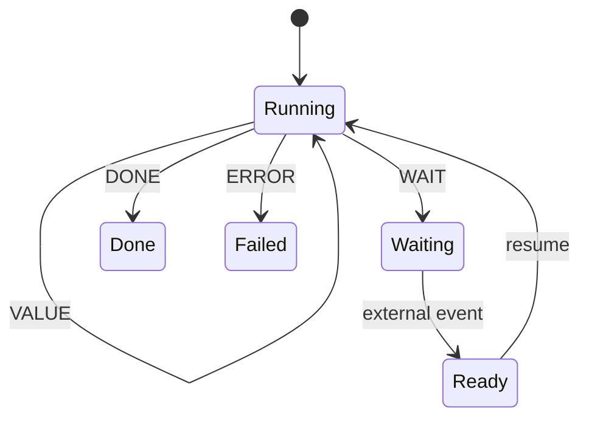
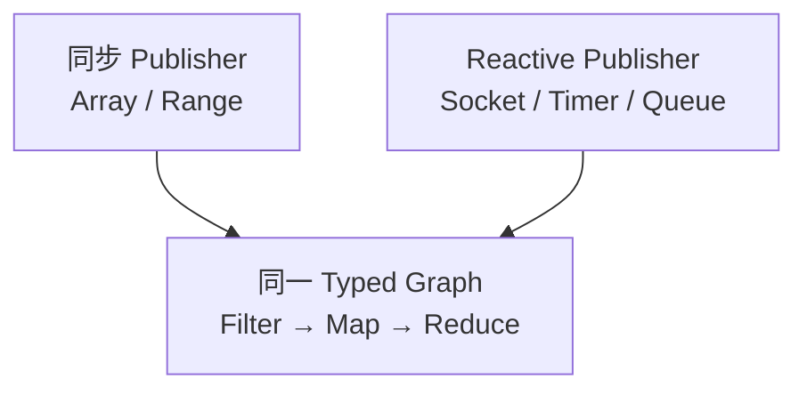
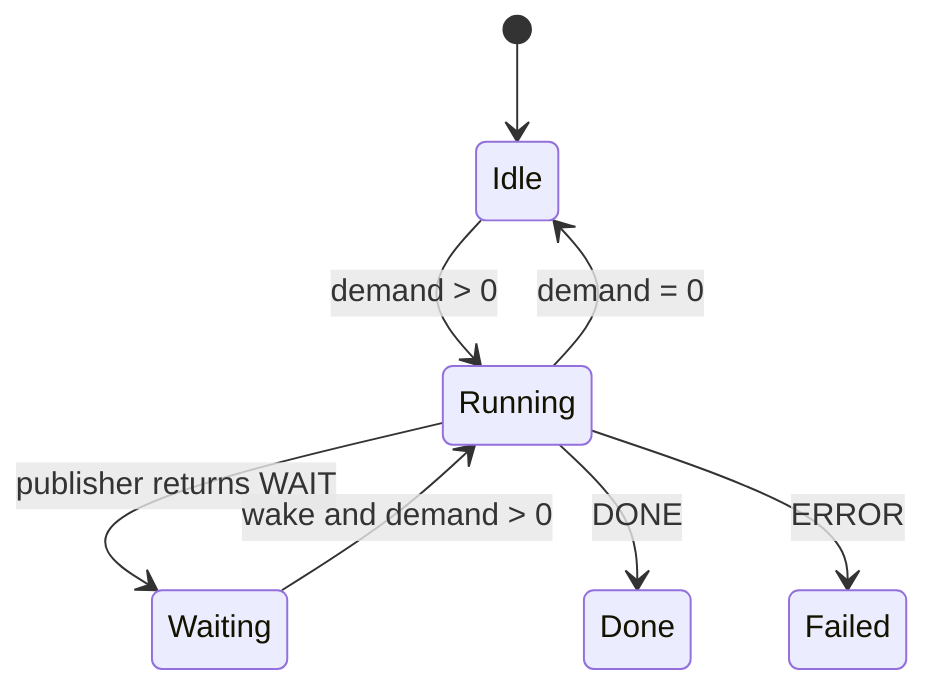
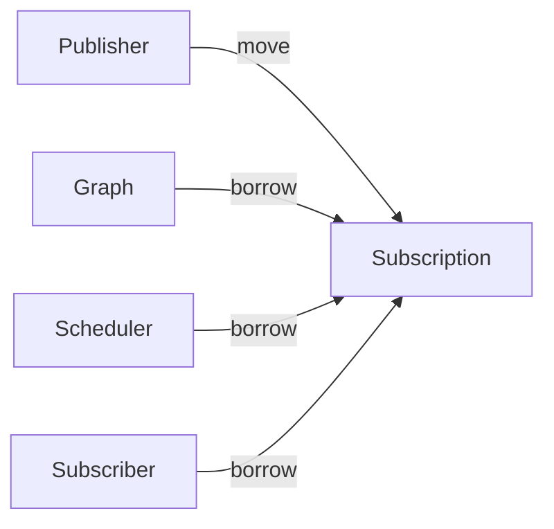
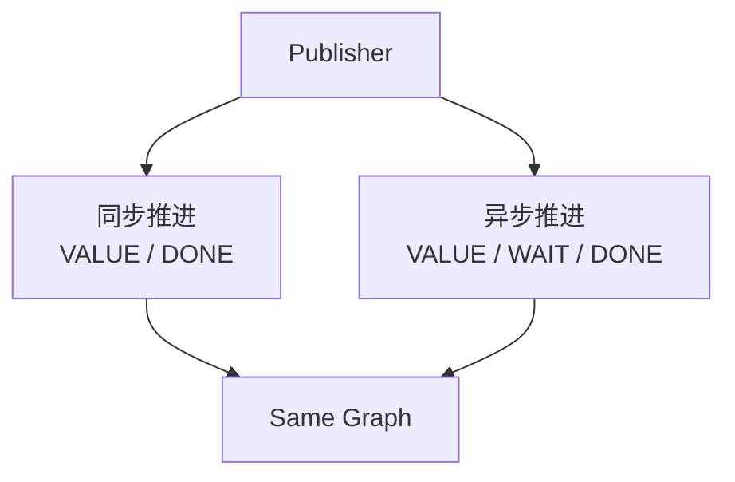
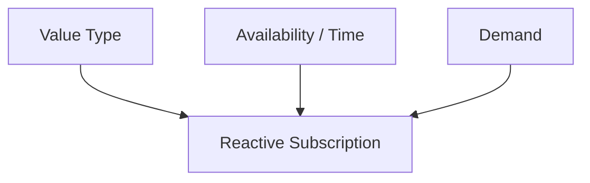
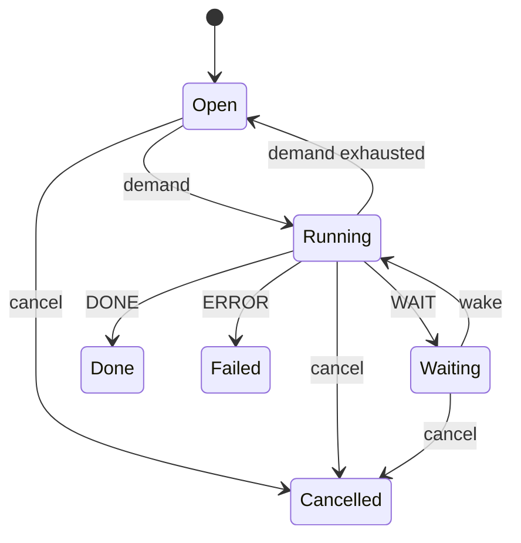

# 第六章：从 Stream 到 Reactive——WAIT、Wake、Demand 与 Backpressure

上一章做到 Stream 以后，整个数据转换模型已经比较完整：

```text
Range
  ↓
Filter
  ↓
Map
  ↓
Reduce / Collect
```

如果数据来自：

```text
Array
Vec
List
Range
```

这种已经存在于内存中的对象，那么执行过程非常直接。

执行器不断：

```text
next
next
next
```

Publisher 每次都可以立即回答：

```text
VALUE
```

或者：

```text
DONE
```

这就是典型的同步 Stream。

但 Graph 做出来以后，我们很快发现一个重要事实：

> **Graph 中的 Map、Filter、Reduce 并不关心数据来自哪里。**

它们真正关心的只是：

```text
输入一个 T
然后按照既定语义处理它
```

既然如此，Publisher 为什么一定要是：

```text
Array
Container
```

呢？

它也完全可能是：

```text
Socket
Timer
Message Queue
File Reader
UI Event
Sensor
Async API
```

这时问题发生了变化。

不是 Graph 不能处理这些数据，而是：

> **数据现在可能还没有到。**

这就是从 Stream 向 Reactive 演进的真正起点。

---

## 1. 同步 Publisher 隐含了一个非常强的假设

传统 iterator 可以概念上写成：

```c
bool next(void *out);
```

调用：

```text
next()
```

以后只有两种结果：

```text
有值
没有值
```

通常：

```text
有值
    = 继续

没有值
    = 完成
```

这对 Array、Vec、List 很合理。

但对于 Socket：

```text
现在没有数据
```

并不意味着：

```text
以后也不会有数据
```

同样，对于 Timer：

```text
时间还没有到
```

也不意味着：

```text
Timer 已经结束
```

所以简单的：

```text
VALUE / DONE
```

模型已经不足以表达真实异步系统。

我们需要第三种状态：

# WAIT

也就是：

> **现在没有结果，但 computation 仍然有效，未来某个时刻应该继续。**

---

## 2. WAIT 是从同步迭代走向异步执行的关键

于是 Publisher 的一步执行可以不再只是：

```text
VALUE
DONE
ERROR
```

而扩展成：

```text
VALUE
VALUE_AND_DONE
WAIT
DONE
ERROR
```

当前 CFlow runtime 就把可恢复执行的一步显式建模成这五种结果。

它们的语义分别是：

```text
VALUE
    产生一个值，后面还可能继续

VALUE_AND_DONE
    产生最后一个值，同时结束

WAIT
    当前无法继续，需要等待外部事件

DONE
    正常结束

ERROR
    失败终止
```

这样：

```text
没有 Value
```

第一次被分成了两个完全不同的语义：

```text
WAIT
    以后还能继续

DONE
    永远不会再继续
```

这是 Reactive 模型中非常重要的区别。

---

## 3. WAIT 不应该等于“阻塞当前线程”

最简单的异步实现当然可以是：

```c
read(socket, ...);
```

如果没有数据：

```text
线程阻塞
```

直到数据到达。

这种方法对一些程序完全可用。

但如果系统里有：

```text
1000 个 Socket
1000 个 Timer
1000 个等待中的任务
```

那么：

```text
每一个 WAIT
    =
占用一个 Thread
```

就会变得非常昂贵。

所以 WAIT 的目标不应该是：

> 把线程停在那里。

而应该是：

> **把 computation 的状态保存下来，把线程还给执行系统；等真正有事情发生时，再恢复 computation。**

也就是：



这是一种：

```text
Suspend
+
Resume
```

而不是：

```text
Block
+
Unblock
```

的模型。

---

## 4. WAIT 以后必须回答一个问题：谁来通知“可以继续了”？

如果 Publisher 返回：

```text
WAIT
```

执行器停止调用它。

那么将来数据到达以后，谁负责告诉执行器：

```text
现在可以继续了
```

答案是：

```text
Wake
```

因此 WAIT 通常要与一个：

```text
Waitable
```

配合。

Waitable 可以非常小。

它只需要支持类似：

```text
arm(waker)
cancel()
```

执行流程可以理解成：

```text
Publisher.resume()
      ↓
     WAIT
      ↓
  Waitable.arm(waker)
      ↓
执行线程离开
      ↓
外部事件发生
      ↓
   waker.wake()
      ↓
重新调度 Subscription
      ↓
Publisher.resume()
```

当前 CFlow 的 `cflow_waitable` 就是这样的轻量 Interface，只暴露 `arm` 和 `cancel`；`cflow_waker` 本身也只是一个 `wake(user)` callback。

---

## 5. Publisher 因此从 Iterator 变成 Resumable

同步 Iterator 可以简单理解成：

```text
next()
```

Reactive Publisher 更接近：

```text
resume()
```

这个名字本身就表达了一个重要变化。

它不再假定：

```text
每次调用都从头开始一个独立动作
```

而是：

> **继续上一次可能尚未完成的 computation。**

因此一个 Publisher 可能拥有内部状态：

```text
cursor
socket state
parser state
timer state
partial frame
```

一次：

```text
resume()
```

可能：

```text
产生一个值
```

也可能：

```text
走到等待点
```

以后再继续。

当前 CFlow 将这种底层模型抽象成 `cflow_resumable`，而 `cflow_publisher` 则在其上增加名称、输出类型、terminal polling 等 Publisher 语义。

---

## 6. 最重要的是：Graph 本身没有因此改变

假设同步数据流是：

```text
Array<int>
    ↓
Filter(even)
    ↓
Map(square)
    ↓
Reduce(sum)
```

现在把 Publisher 换成：

```text
Socket<int>
```

Graph 中：

```text
Filter
Map
Reduce
```

的语义并没有变化。

变化的只是：

```text
Publisher 什么时候能够产生下一个 int
```

所以更准确的结构是：



这就是 Graph 带来的一个重要发现：

> **Stream 和 Reactive 的差异主要存在于 execution progression，而不是数据转换语义。**

于是没有必要重新实现一套：

```text
ReactiveMap
ReactiveFilter
ReactiveReduce
```

---

## 7. Reactive 不是另一套 Operator Framework

如果没有 Graph，很容易分别设计：

```text
Stream API
```

和：

```text
Reactive API
```

然后两边都有：

```text
map
filter
flatMap
reduce
```

最后出现两套：

```text
Operator
Type Rule
Callback Rule
Optimization Rule
```

Graph 统一以后：

```text
Map
```

仍然只是 Map。

```text
Filter
```

仍然只是 Filter。

真正不同的是：

```text
同步执行：
    Publisher 永远立即回答

Reactive：
    Publisher 可以 WAIT
```

所以更合理的关系是：

```text
Typed Graph
    ↓
不同 Execution Model
```

而不是：

```text
不同 Framework
    ↓
各自一套 Graph
```

---

## 8. 但是有 WAIT 之后，仅仅“能恢复”还不够

假设一个 Socket 非常快：

```text
Producer
 ↓↓↓↓↓↓↓↓↓↓↓
```

而下游：

```text
Consumer
```

很慢。

如果 Publisher 每次醒来以后都不断产生数据：

```text
value
value
value
value
...
```

最终系统只能：

```text
无限排队
```

或者：

```text
丢数据
```

所以 Reactive 系统的下一个问题不是：

> 怎样异步？

而是：

> **怎样控制数据流速度？**

这就是：

# Backpressure

---

## 9. Backpressure 的最简单形式：Demand

一个非常清楚的方案是：

```text
Consumer 明确告诉上游：

我现在愿意接受多少个 Value。
```

例如：

```text
request(10)
```

代表：

```text
下游允许再产生 10 个值
```

这就是：

```text
Demand
```

当前 CFlow 的 `cflow_subscription_request(subscription, n)` 就采用这种显式 demand 模型。

于是运行逻辑变成：

```text
Demand = 0
    ↓
不继续向下游 emit

request(10)
    ↓
Demand = 10

每成功 emit 一个 downstream value
    ↓
Demand -= 1
```

---

## 10. 一个非常关键的语义：Demand 不是 Publisher Pull Count

这一点很容易写错。

假设：

```text
Publisher<int>
    ↓
Filter(even)
    ↓
Subscriber
```

Subscriber 请求：

```text
request(1)
```

Publisher 接下来产生：

```text
1
3
5
7
8
```

前四个值全部被 Filter 丢掉。

如果每调用一次 Publisher 就减少 Demand：

```text
request(1)
```

第一次读到 `1` 后 demand 就变成 0。

那么 Subscriber 永远收不到它真正请求的那个值。

正确语义应该是：

```text
Publisher item
≠
Downstream value
```

所以：

```text
1 -> filtered
Demand still 1

3 -> filtered
Demand still 1

5 -> filtered
Demand still 1

7 -> filtered
Demand still 1

8 -> emitted
Demand becomes 0
```

当前 CFlow runtime 对这个语义有明确约束：

> Demand 永远表示 downstream-value demand，而不是 publisher-item demand。

这是整个数据流执行模型中非常基础、但非常容易被忽略的一条规则。

---

## 11. 这意味着 Executor 必须知道“什么时候继续 pull”

有了 Demand 后，执行器不能简单：

```text
while publisher has value:
    process
```

而要同时考虑：

```text
Subscription State
Publisher State
Demand
Terminal State
WAIT State
```

例如：

```text
Demand > 0
Publisher ready
    ↓
可以 resume
```

但：

```text
Demand = 0
```

即使 Publisher 已经 ready，也不应该继续无限向下游生产。

所以运行状态开始更接近：



这时：

```text
Subscription
```

开始成为一个真正的 execution instance。

---

## 12. 为什么需要 Subscription，而不是让 Graph 自己保存这些状态

Graph 表示：

```text
计算是什么
```

例如：

```text
Filter
Map
Reduce
```

它应该尽可能：

```text
immutable
reusable
```

而：

```text
当前还剩多少 Demand
当前 Publisher 是否 WAIT
当前是否 Cancelled
当前执行到哪里
```

这些明显是：

```text
一次执行
```

才具有的状态。

因此需要分开：

```text
Graph
    = computation definition

Subscription
    = one execution instance
```

同一个 Graph 完全可以：

```text
Subscription A
Subscription B
Subscription C
```

同时执行不同数据。

这和：

```text
Machine Definition
```

与：

```text
Machine Instance
```

后来会采用的思想完全一致。

---

## 13. Subscription 也让 Ownership 变得明确

一次异步执行很容易遇到生命周期问题。

例如：

```text
Publisher
Graph
Scheduler
Subscriber
```

到底谁拥有谁？

如果没有明确规则：

```text
cancel
close
destroy
wake
```

很容易产生：

```text
double free
use after free
stale wake
```

当前 CFlow 采用一个比较清楚的模型：

```text
Publisher
    move into Subscription

Graph
    borrowed by Subscription

Scheduler
    borrowed by Subscription

Subscriber
    borrowed protocol
```

`cflow_subscribe()` 成功后会把 Publisher 移入 Subscription；Graph、Scheduler、Subscriber 及其 callback state 保持 borrowed，直到 `cflow_subscription_close()` 完成。

可以表示成：



这使：

```text
谁负责 destroy Publisher
```

不再是模糊约定。

---

## 14. WAIT 以后必须特别小心 Lost Wakeup

异步系统中一个经典问题是：

```text
Publisher 判断：
    现在没有数据

同时外部事件到达

然后 Publisher 才真正注册 Waiter
```

如果处理不好：

```text
事件已经发生
但 wake 没有人收到
```

系统就会永久停在：

```text
WAIT
```

这就是：

```text
Lost Wakeup
```

典型 race：

```text
Thread A                   External Event

检查：没有数据

                           数据到达
                           尝试 wake
                           尚未 arm

开始 arm

永久等待
```

所以：

```text
WAIT
```

不是简单返回一个状态码就结束了。

还需要一个明确的：

```text
arm / wake protocol
```

保证：

```text
signal-before-arm
```

和：

```text
signal-concurrent-with-arm
```

都不会造成永久 suspension。

---

## 15. 这也是 Lean 开始真正进入执行模型的地方

对于：

```text
Enum
Struct
Generic
```

单元测试已经非常有效。

但：

```text
WAIT / Wake race
```

这种问题很难通过几个测试说明：

> 所有可能的状态交错都安全。

因此可以在 Lean 中建立：

```text
Wait State
Arm Step
Wake Step
Runtime State
```

然后证明：

```text
如果事件已经发生
arm 不会让系统永久 WAIT
```

或者：

```text
合法 wake token 不会被重复消费
```

也就是说，Lean 开始从：

```text
验证有限类型关系
```

进入：

```text
验证运行时状态转换
```

这是形式化在整个体系中的第二次重要扩展。

---

## 16. Scheduler 是在这里自然出现的

如果外部事件调用：

```text
wake()
```

以后直接：

```text
resume()
```

就会产生一个问题：

```text
resume 到底在哪个线程执行？
```

例如 Socket completion 可能来自：

```text
I/O thread
```

Timer 可能来自：

```text
timer thread
```

UI event 可能来自：

```text
UI thread
```

如果所有 `wake()` 都直接执行 Graph：

```text
整个 Graph 的执行上下文会变得不可预测
```

更合理的是：

```text
wake
    ↓
Scheduler
    ↓
重新安排 Subscription
```

也就是说：

> **Wake 表示“现在可以继续”，而不是“现在就在这个 callback 栈上继续”。**

---

## 17. Scheduler 回答的是“什么时候执行”

前面已经出现过：

```text
Executor
```

它更关注：

```text
一个 task 以什么执行语义运行
```

而 Scheduler 在 Reactive 中进一步加入：

```text
时间
延迟
timer
cancel
```

例如当前 CFlow Scheduler protocol 提供：

```text
post_after
cancel
run_one
run_ready
advance
now
wait_idle
```

并通过 capability 描述 delayed、manual-clock 和 concurrent 等能力。

所以可以先粗略地区分：

```text
Executor
    = 怎样执行一个 Task

Scheduler
    = 什么时候让这个 Task 获得执行机会
```

下一章会更系统地展开 Executor。

---

## 18. Manual Clock 对测试特别重要

真实 Timer 基于：

```text
wall clock
```

测试时会产生：

```text
sleep(100ms)
```

之类的代码。

这种测试：

```text
慢
容易受调度影响
容易 flaky
```

如果 Scheduler 支持：

```text
Manual Clock
```

就可以：

```text
post_after(100)
advance(99)
    -> 不执行

advance(1)
    -> 执行
```

这样 Reactive 的时间行为可以变成：

```text
确定性的状态推进
```

而不必真的等待现实时间。

这也是为什么：

```text
Scheduler
```

不应该只是一个 thread pool 的别名。

---

## 19. Reactive 以后，Publisher 可以是非常多不同对象

一旦协议只要求：

```text
output_type
resume
cancel
WAIT / wake
```

Publisher 可以来自：

```text
Socket
Timer
Queue
File Reader
Database Cursor
UI Event
Sensor
Machine
Actor Adapter
```

而 Graph 完全不需要分别认识这些类型。

它看到的始终只是：

```text
Publisher<T>
```

例如：

```text
Socket<User>
    ↓
Filter(enabled)
    ↓
Map(name)
```

与：

```text
Vec<User>
    ↓
Filter(enabled)
    ↓
Map(name)
```

Graph 中后半部分完全可以相同。

---

## 20. Reactive 的真正价值不是“异步 API”，而是统一同步和异步数据

如果 Stream 和 Reactive 各自成为一套完整体系：

```text
Stream<T>
ReactiveStream<T>
```

很多 operator 和 type rule 会重复。

而 Graph 提供了另一种理解：

```text
同步与异步
```

只是：

```text
Publisher Progress Model
```

不同。

可以表示成：



所以：

> **Reactive 不是重新定义数据转换，而是给同一个数据转换模型增加时间维度。**

---

## 21. Demand 又给它增加了流量维度

如果说：

```text
WAIT / Wake
```

解决的是：

```text
什么时候有数据
```

那么：

```text
Demand
```

解决的是：

```text
现在允许流过多少数据
```

于是 Reactive execution 实际上开始处理三个维度：

```text
Type
    什么数据

Time
    什么时候可用

Demand
    允许多少数据
```

这已经比普通 Iterator 丰富很多。

可以理解成：



---

## 22. Bounded Resource 也是 Backpressure 的另一半

Demand 控制：

```text
value flow
```

但系统内部还有：

```text
Task Queue
Event Queue
Mailbox
Timer Queue
```

它们同样不能默认：

```text
无限增长
```

所以后面 Executor、Scheduler、Actor 都采用：

```text
bounded capacity
```

并显式返回：

```text
FULL
```

而不是自动：

```text
resize forever
```

这和 Demand 的思想其实完全一致：

> **资源边界应该进入协议，而不是隐藏在实现里。**

---

## 23. 为什么不自动 Retry

如果一个 queue 满了，framework 很容易选择：

```text
自动等待
自动 retry
```

但这种做法会隐藏一个非常重要的 policy：

```text
满了以后怎么办？
```

不同 application 的答案可能完全不同：

```text
阻塞
丢弃
重试
降级
断开连接
报告错误
```

所以底层更合理的行为是：

```text
FULL
```

把事实告诉上层。

然后：

```text
Application
```

自己决定 policy。

这也是整个系统一直坚持的：

```text
Mechanism
≠
Policy
```

原则。

---

## 24. Cancel 也成为 Reactive 必须明确的语义

同步循环可以：

```c
break;
```

异步执行则复杂得多。

因为 Subscription 可能此时正在：

```text
WAIT
```

或者：

```text
已经有 task 排队
```

或者：

```text
callback 正在执行
```

所以需要明确：

```text
cancel
```

意味着什么。

例如至少要保证：

```text
取消后不会再产生新的 downstream value
```

已经注册的：

```text
Waitable
```

应该：

```text
cancel
```

未来 stale wake 不应该重新激活已经结束的 Subscription。

这些都开始从“API 细节”变成：

```text
State Machine Semantics
```

---

## 25. Terminal 也必须是明确状态

同样：

```text
DONE
ERROR
CANCELLED
```

不能只是：

```text
一个 callback 已经调用过
```

而应该成为 execution state 的一部分。

例如：

```text
DONE 以后
```

不能再：

```text
emit VALUE
```

```text
ERROR 以后
```

也不能重新：

```text
WAIT
```

否则异步 race 很容易造成：

```text
on_done()
on_value()
```

这样的非法顺序。

这类：

```text
Terminal Invariant
```

也是非常适合 Lean formalization 的内容。

---

## 26. Subscription 实际上已经是一个小型状态机

虽然最初它只是为了：

```text
执行 Graph
```

但有了：

```text
Demand
WAIT
Wake
Cancel
Terminal
```

以后，它实际上已经拥有完整状态。

例如概念上：



这也是后面为什么：

```text
Event
State Machine
Actor
```

会自然出现。

因为很多 execution problem 最终都可以理解成：

```text
State + Event + Transition
```

---

## 27. Reactive 再次验证了 CMeta Interface 的价值

到这里出现很多不同 provider：

```text
Publisher
Waitable
Subscriber
Scheduler
```

如果每个都依赖具体 struct：

```text
SocketSource
TimerSource
QueueSource
```

Graph runtime 很快会充满：

```text
if type == ...
```

所以这些边界非常适合：

```text
{ self, vtable }
```

形式的小 Interface。

CMeta 的 Interface 在这里开始真正显示价值：

```text
Publisher
Waitable
Subscriber
Scheduler
```

都可以拥有不同 implementation，却共享同一个小协议。

例如当前 Publisher、Waitable 和 Subscriber 都直接以 CMeta interface 声明，而不是建立 class hierarchy。

---

## 28. 但 Interface 不意味着大量虚调用

这里仍然需要区分：

```text
Runtime Boundary
```

和：

```text
Hot Operator Path
```

Publisher：

```text
可能是动态 provider
```

所以通过 Interface 调用很合理。

但：

```text
Map
Filter
Reduce
```

如果 Graph 已经编译成 Plan 或 Direct：

```text
并不需要每一个 value 都通过通用 Interface
```

这再次体现：

> **动态性只保留在真正需要动态性的边界。**

而已知计算尽可能：

```text
静态绑定
预解码
直接调用
```

---

## 29. 从 Stream 到 Reactive，真正新增的是 Execution Semantics

回头看这一章，会发现：

```text
Map
Filter
Reduce
Collect
```

几乎没有发生变化。

真正新增的是：

```text
WAIT
Wake
Subscription
Demand
Backpressure
Scheduler
Cancel
Terminal
```

也就是说：

```text
Stream
```

主要解决：

> 数据怎样转换？

而：

```text
Reactive
```

进一步解决：

> **当数据的产生具有时间、不确定性和速度差异时，这些转换怎样安全地继续执行？**

---

## 30. 完整的发展路线再次自然延伸

目前整个过程已经变成：

```text
Macro
 ↓
Type
 ↓
Generic / Inference
 ↓
CMeta
 ↓
Callable
 ↓
Lambda / Bind
 ↓
Graph
 ↓
Data Transformation
 ↓
Stream
 ↓
Reactive
```

而 Reactive 又自然引出了一个更加基础的问题：

> **到底是谁在执行这些 continuation、callback 和 Subscription task？**

比如：

```text
wake 以后谁执行？
parallel reduce 的 task 谁执行？
state transition 谁串行？
测试时怎样手工推进？
```

这时就需要把：

```text
Task Execution
```

本身抽成一个独立模型。

也就是下一章的主题：

# Executor

---

# 小结：Reactive 是给 Graph 增加“时间”和“流量”

Stream 的世界主要是：

```text
Value
    ↓
Transformation
```

Reactive 则进一步增加：

```text
Value
+
Time
+
Demand
```

其中：

```text
WAIT / Wake
```

解决：

> 现在没有数据，以后怎么继续？

```text
Scheduler
```

解决：

> 什么时候、在哪个调度上下文继续？

```text
Demand
```

解决：

> 下游现在允许产生多少 Value？

```text
Backpressure
```

解决：

> Producer 和 Consumer 速度不一致时如何保持资源有界？

因此 Reactive 并不是重新发明一套数据处理系统。

它是建立在同一个 Typed Graph 上，把原本同步的：

```text
数据转换
```

扩展成：

```text
可暂停
可恢复
有流量控制
有明确终止语义
```

的执行模型。

而这一阶段最重要的发现之一是：

> **高级异步能力并不一定要求一个巨大的异步 Runtime。**

如果：

```text
Publisher
Waitable
Scheduler
Demand
Subscription
```

都保持为小而清晰的协议，那么同步 Stream 和 Reactive 可以共享绝大多数计算语义。

下一章将继续拆解这个执行模型最核心的 primitive：**Executor——为什么它只需要理解 Task，却可以进一步支撑 Stream、Reactive、State Machine、Actor 和并行计算。**
