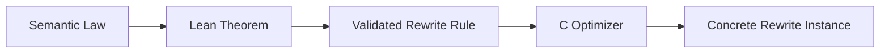
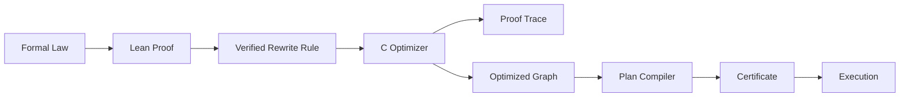
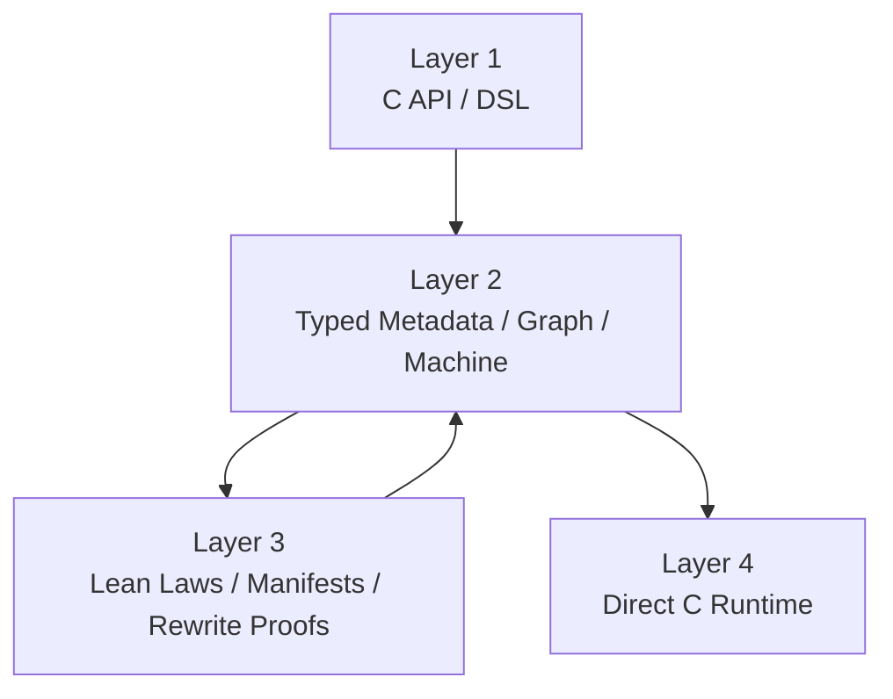

# 第十一章：Lean 与可信边界——从 Semantic Law 到 Verified Rewrite、Manifest 与 Certificate

上一章讨论了一个核心原则：

```text
Rich Control Plane
        ↓
Simple Execution Plane
```

也就是说，我们愿意在执行之前做更多事情：

```text
Type Validation
Signature Resolution
Graph Analysis
Optimization
Plan Compilation
Parallel Eligibility
```

换取真正执行时更简单的：

```text
load
call
branch
store
```

但这个方向越往前推进，一个新的问题就越重要：

> **如果 Control Plane 开始主动改变程序，我们凭什么相信这些改变没有破坏程序语义？**

例如：

```text
Map(f)
 ↓
Map(f)
```

如果 optimizer 删除一个 `Map(f)`，最终变成：

```text
Map(f)
```

这已经不只是：

```text
“程序跑得快一点”
```

而是：

> **系统主动把用户写的程序换成了另一个程序。**

再例如：

```text
Sequential Reduce
```

被改成：

```text
Parallel Reduce
```

执行顺序发生了变化。

如果某个函数实际上不满足：

```text
ASSOCIATIVE
```

结果就可能不同。

因此，当系统开始拥有：

```text
Rewrite
Fusion
Parallelization
Lowering
```

这些能力以后，仅仅依靠：

```text
“看起来合理”
```

已经不够。

这也是 Lean 真正开始承担更重要角色的地方。

---

# 1. 为什么测试不能完全解决这个问题

测试当然仍然非常重要。

例如我们可以测试：

```c
assert(run(original, input1) == run(optimized, input1));
assert(run(original, input2) == run(optimized, input2));
assert(run(original, input3) == run(optimized, input3));
```

如果发现不同，说明 optimizer 显然有 bug。

但如果：

```text
1000 个测试全部相同
```

我们仍然只能说明：

```text
这 1000 个输入上没有发现问题
```

不能说明：

```text
对于所有可能输入
优化前后都具有相同语义
```

尤其是某些 rewrite：

```text
依赖函数的数学性质
```

时，问题更明显。

例如：

```text
f(f(x))
```

什么时候可以变成：

```text
f(x)
```

测试可以找反例。

但真正的规则是：

```text
∀x, f(f(x)) = f(x)
```

这已经天然是一个数学命题。

---

# 2. Metadata Claim 不能直接当成 Proof

前面 CMeta 已经允许 Callable 带：

```text
Effects
Properties
```

例如：

```text
PURE
DETERMINISTIC
TOTAL
IDEMPOTENT
ASSOCIATIVE
```

这些 metadata 非常有价值。

Optimizer 可以通过它们快速找到：

```text
可能允许优化的候选
```

例如：

```text
if callable.properties contains IDEMPOTENT
    candidate for duplicate-map elimination
```

但这里必须保持一个非常严格的边界：

> **Metadata 是声明，不是证明。**

程序员可以错误地写：

```text
increment
    IDEMPOTENT
```

但：

```text
increment(increment(1))
=
3
```

而：

```text
increment(1)
=
2
```

显然：

```text
3 != 2
```

所以：

```text
IDEMPOTENT bit
```

只能表示：

```text
程序声明这个函数具有该性质
```

而不能自动推出：

```text
数学上真的成立
```

当前 formal rewrite 设计也明确区分 CMeta property 与真正的 semantic law；`IDEMPOTENT` metadata 本身不足以完成形式证明，还需要独立的 `IdempotentLaw`。

---

# 3. Semantic Law 才是真正的数学条件

例如 Idempotent 的真正含义是：

```text
∀x, f(f(x)) = f(x)
```

Associative 的真正含义是：

```text
∀a b c,

f(f(a,b),c)
=
f(a,f(b,c))
```

Identity 则可能是：

```text
∀x,

f(identity, x) = x
```

这些都不是：

```text
flag
```

而是：

```text
Law
```

因此可以把系统中的语义信息区分成三个层次：

```text
Metadata

程序声称什么


Semantic Law

这个性质在数学上是什么意思


Proof

某条 transformation 在这些 law 下为什么保持语义
```

这三个层次不能混在一起。

---

# 4. Lean 首先应该证明“规则”，而不是证明每一次程序运行

一个很容易走向极端的想法是：

> 既然用了 Lean，是不是应该把整个 C Runtime 都搬进 Lean，然后每次运行都经过 proof？

这显然会让工程变得非常沉重。

更实际的边界是：

```text
Lean
    证明通用规则

C
    在具体程序上应用规则
```

例如 Lean 证明：

```text
对于任意满足 IdempotentLaw 的 f

Map(f) ; Map(f)

与

Map(f)

具有相同 observable result
```

这是：

```text
General Rewrite Theorem
```

C optimizer 看到某个具体：

```text
normalize_user
```

满足对应 admission 条件后：

```text
应用这个规则
```

所以分工是：



这样形式化系统和生产 runtime 的边界保持清楚。

---

# 5. 为什么必须先定义“程序的可观察语义”

要证明两个 Graph 等价，首先必须回答：

> **什么叫“等价”？**

例如：

```text
Graph A
```

和：

```text
Graph B
```

内部执行步骤不同并没有关系。

真正关心的是：

```text
用户最终能观察到什么
```

例如 Stream 可能有：

```text
Values
Terminal Status
Error
```

所以可以定义：

```text
StreamResult
```

包含完整可观察结果。

然后证明：

```text
run(GraphA, input)
=
run(GraphB, input)
```

不是要求：

```text
每一步内部状态都完全一样
```

而是要求：

```text
最终 observable behavior 一样
```

当前 Lean rewrite formalization 就针对完整可观察的 `StreamResult` 建立 preservation theorem。

---

# 6. 这是 Compiler Correctness 的基本思路

传统 compiler optimization 也不会要求：

```text
优化前后的机器指令一模一样
```

否则优化本身就没有意义。

真正需要的是：

```text
Source Program
```

和：

```text
Optimized Program
```

具有相同：

```text
Observable Semantics
```

所以 CFlow 的 rewrite proof 本质上也遵循：

```text
Program Transformation
        ↓
Semantic Preservation
```

这让 CFlow optimizer 从普通：

```text
graph rewrite code
```

逐渐接近：

```text
verified transformation
```

---

# 7. 一个完整 Rewrite Rule 可以分成四层

例如：

```text
Duplicate Idempotent Map Elimination
```

可以拆成：

### 第一层：Graph Pattern

```text
Map(f)
 ↓
Map(f)
```

这是：

```text
syntactic candidate
```

---

### 第二层：Metadata Admission

要求：

```text
same callable identity
compatible types
IDEMPOTENT property
其他必要 effects/properties
```

这是：

```text
C-side fast check
```

---

### 第三层：Semantic Law

真正要求：

```text
∀x, f(f(x)) = f(x)
```

这是：

```text
mathematical assumption
```

---

### 第四层：Preservation Theorem

证明：

```text
run(Map(f);Map(f))
=
run(Map(f))
```

这是：

```text
formal guarantee
```

于是：

```text
Pattern
+
Admission
+
Law
+
Theorem
```

共同定义一条可信 rewrite。

---

# 8. 这能避免“Property 驱动的危险优化”

如果 optimizer 只是：

```c
if (props & CMETA_PROP_IDEMPOTENT)
    remove_duplicate_map();
```

那么整个正确性最终依赖：

```text
一个 bit 没有被错误设置
```

这当然很脆弱。

更好的工程模式应该是：

```text
Property
    用于候选筛选

Verified Rule
    定义什么 transformation 合法

Certificate / Trace
    记录这次实际应用
```

这样即使无法证明某个具体用户 callback 的数学性质，至少：

```text
optimizer rule 本身
```

是经过证明的。

这已经建立了一个非常有价值的可信边界。

---

# 9. 形式化不只可以用于 Optimizer

Lean 最早也可以用于更简单、更有限的事情：

```text
Type Universe
Signature Universe
Operator Policy
Machine Schema
```

这些内容具有一个共同特点：

```text
有限
结构化
关系明确
```

所以非常适合先在 Lean 中定义：

```text
authoritative model
```

然后生成：

```text
C manifest
```

目前 CMeta 的 built-in finite signature universe 就有对应 Lean 模型，并生成 checked `builtin_signature_manifest.h`；普通 C build 不需要运行 Lean。

---

# 10. Manifest 模式解决的是“重复事实源”问题

假设：

```text
C header
```

维护一份：

```text
允许的 callback signature
```

而 Lean 又维护一份：

```text
允许的 callback signature
```

那么迟早会产生：

```text
C version != Lean version
```

这就重新回到了第一章的根本问题：

> **同一个事实维护了两份。**

所以更合理的方向是：

```text
Authoritative Formal Definition
        ↓
Generate
        ↓
C Manifest
```

而不是：

```text
Lean manually mirrors C
```

这再次延续整个项目最早的原则：

```text
One Fact
    ↓
Many Uses
```

---

# 11. Lean 因此也是一种更高层的 Code Generator

早期：

```text
X-Macro
```

做的是：

```text
一份 row
    ↓
多个 C declaration
```

后来：

```text
Schema
```

做的是：

```text
结构化事实
    ↓
多个 Meta artifact
```

现在 Lean 可以进一步：

```text
Formal Relation
    ↓
Validated Manifest
    ↓
C Header
```

可以看到整个历史其实非常连续：

```text
X-Macro Generation
        ↓
Schema Generation
        ↓
Type-aware Generation
        ↓
Proof-driven Generation
```

Lean 并不是突然加入的一个完全不同方向。

它只是把：

```text
生成前的“事实”
```

提升到了：

```text
可形式化验证的事实
```

层次。

---

# 12. 为什么普通 C Build 不应该依赖 Lean

即使 Lean 很有价值，也不应该让普通使用者：

```text
cmake ..
make
```

的时候必须：

```text
安装 Lean
编译 theorem
生成 manifest
```

否则一个本来应该简单的 C library：

```text
构建复杂度
```

会迅速上升。

更合理的是：

```text
Development / Verification Pipeline

Lean model
   ↓
prove / generate
   ↓
checked generated headers
   ↓
commit
```

然后普通用户只看到：

```text
C headers
C sources
```

所以：

```text
普通 Build
```

仍然是：

```text
C Compiler
```

这保持了整个系统最重要的工程属性之一：

> **Formal tooling 增强开发可信度，而不是污染普通消费者构建路径。**

---

# 13. Operator Policy 也非常适合这种方式

前面 Graph 中存在：

```text
Map
Filter
Reduce
FlatMap
```

等 operator。

但并不是所有：

```text
CMeta Signature
```

都适合所有 operator。

例如：

```text
Filter
```

要求：

```text
T -> bool
```

而：

```text
Map
```

可能接受：

```text
T -> U
```

所以存在两个不同 universe：

```text
CMeta
    定义全局有限 Signature Universe

CFlow
    定义每个 Operator 接受哪些 Signature
```

这是：

```text
global capability
```

和：

```text
local policy
```

的区别。

当前 CFlow 就通过 per-operator admitted relations 建立 builtin operator policy，并由 Lean 验证后生成 `builtin_operator_policy.h`。

---

# 14. 这让 CMeta 和 CFlow 的责任边界更加清楚

CMeta 可以说：

```text
系统存在：

int -> long
User -> bool
long × long -> long
```

但它不应该决定：

```text
哪个 signature 可以作为 Filter
```

因为这是：

```text
CFlow Operator Semantic
```

所以：

```text
CMeta
    owns relation universe

CFlow
    owns operator admission policy
```

Lean 则可以分别验证：

```text
Universe 本身是否正确

Policy 是否只引用 Universe 中存在的 relation
```

这是一种很干净的模块化 formal boundary。

---

# 15. Machine Schema 同样可以进入 Formal Model

State Machine 中已经有：

```text
State
Event
Transition
WAIT
Terminal
```

这些本身就是非常典型的：

```text
transition system
```

因此可以在 Lean 中定义：

```text
Machine Configuration
Event
Small Step
```

例如：

```text
(State, Event)
    →
NextState
```

或者复杂一点：

```text
Running
Waiting
Done
Error
```

当前 `formal/cmeta_cflow_calculus` 已经覆盖 Types、Effects、Properties、Ownership、Flow syntax、WAIT/Demand/Terminal、Machine small-step 和 rewrite semantics。

这让整个 formal model 不只是：

```text
compile-time type checker
```

而逐渐覆盖：

```text
runtime semantics
```

---

# 16. Small-step Semantics 为什么重要

如果只写：

```text
run(machine, events)
=
final_state
```

很难描述：

```text
WAIT
Wake
Cancel
Intermediate Transition
```

这些行为。

Small-step 更接近：

```text
Configuration₀
    ↓ one step
Configuration₁
    ↓ one step
Configuration₂
```

例如：

```text
Running
    → WAIT
```

再：

```text
Waiting
    → Wake
    → Running
```

这种模型特别适合表达异步执行。

因此可以证明：

```text
某一步之后仍然满足 invariant
```

而不是只能看最终结果。

---

# 17. Runtime 的目标变成“Refine Formal Semantics”

到了这里，C runtime 和 Lean model 的关系也可以更准确地描述。

不是：

```text
Lean program
    翻译成
C program
```

而是：

```text
Lean Semantics
    定义允许的行为

C Runtime
    实现这些行为
```

也就是说希望建立：

```text
Runtime Step
    refines
Formal Step
```

例如：

```text
CFlow runtime:
    cflow_step_kind = WAIT
```

应该对应：

```text
Lean:
    Waiting transition
```

Machine transition 成功：

```text
old state
event
new state
```

应该对应：

```text
formal small-step relation
```

这比“Lean 生成全部 C Runtime”更加实际。

---

# 18. Refinement 是连接 Proof 和 Implementation 的关键词

形式证明最容易陷入一个问题：

```text
Lean 中证明的东西很好
但 C 实现是否真的做的是同一件事？
```

所以必须明确：

```text
Model
```

与：

```text
Implementation
```

之间的 mapping。

例如：

```text
Lean:
    Step.value

C:
    CFLOW_STEP_VALUE
```

```text
Lean:
    Waiting

C:
    CFLOW_STEP_WAIT
```

```text
Lean:
    Terminal.error

C:
    CFLOW_STEP_ERROR
```

这种结构对应关系越明确，formal proof 才越容易实际约束实现。

---

# 19. Certificate 是另一种更轻的 Refinement Bridge

不是所有东西都需要：

```text
完整 machine-checked C refinement proof
```

工程上可以使用更轻的手段。

例如：

```text
Plan Certificate
```

记录：

```text
Graph Version
Fingerprint
Instruction
Callable
Input Type
Output Type
Effects
Properties
```

然后运行一个：

```text
C-side checker
```

验证：

```text
这个 Plan 是否仍然符合 normalized Graph
```

当前 `certificate.h` 就提供这种 runtime-checkable plan certificate。

因此形成一种分层保证：

```text
Lean
    证明通用规则

Generator
    生成有限 manifest

C Checker
    检查具体 artifact

Runtime
    执行已经批准的 artifact
```

---

# 20. 为什么 Certificate 比“相信 Compiler”更有价值

假设：

```text
Plan Compiler
```

有 bug。

它把：

```text
Map<int,long>
```

错误地生成成：

```text
double handler
```

如果执行阶段直接相信 Plan：

```text
可能产生 memory corruption
```

但如果 Plan 必须通过：

```text
Certificate Check
```

就有机会在 admission 阶段发现：

```text
input/output type 不一致
callable 不一致
instruction 不一致
```

这并不能证明所有 implementation bug 都不存在。

但它增加了一层：

```text
independent validation boundary
```

这在系统设计里非常有价值。

---

# 21. Proof Trace 与 Certificate 解决的是两个不同问题

两者很容易混淆。

## Proof Trace

回答：

```text
为什么这个 Graph transformation 被执行？
```

例如：

```text
Rule = IdempotentMapElimination
```

它关注：

```text
Optimization History
```

---

## Certificate

回答：

```text
这个最终 Plan 是否仍然对应那个 Graph？
```

它关注：

```text
Artifact Consistency
```

所以：

```text
Trace
    解释 transformation

Certificate
    验证 execution artifact
```

二者共同让 Control Plane 更容易审计。

---

# 22. 这形成了一条完整可信链

可以把整个过程表示成：



这条链条中，每一层承担不同责任。

没有要求：

```text
Lean 直接执行生产程序
```

也没有要求：

```text
C runtime 完全没有动态检查
```

而是逐层建立：

```text
trust boundary
```

---

# 23. 形式化最重要的不是“证明得越多越好”

这是一个非常重要的工程原则。

如果目标变成：

```text
整个项目所有 C 代码全部 theorem-proved
```

成本会迅速失控。

更合理的问题应该是：

> **哪些地方一旦错了，会系统性改变大量程序的语义？**

最值得 formalize 的通常是：

```text
核心类型关系
Operator Policy
Rewrite Rule
WAIT / Demand / Terminal Protocol
Machine Transition Semantics
Ownership Invariant
```

因为这些规则会被：

```text
大量程序
大量 Graph
大量 Runtime Instance
```

重复使用。

证明：

```text
一个通用 Rule
```

可以覆盖大量 concrete use。

这和整个项目最初消除重复的思想再次完全一致。

---

# 24. 形式证明本身也是一种“去重复”

例如没有 theorem 时，每增加一个 optimizer case，都可能需要写：

```text
测试 A
测试 B
测试 C
测试 D
...
```

而且每一种 callable/input 都需要重新担心：

```text
这个 case 会不会不同？
```

如果能够证明：

```text
∀f satisfying Law
∀input
rewrite preserves result
```

那么：

```text
大量具体测试
```

的角色就发生变化。

它们继续验证：

```text
implementation
```

但不再承担：

```text
证明数学规则本身
```

的责任。

因此 Formalization 也是：

> **把重复的“为什么这条规则成立”提升成一次通用证明。**

---

# 25. Tests、Proofs 和 Runtime Checks 各自解决不同问题

这三者并不互相替代。

### Tests

最适合发现：

```text
实现 bug
integration bug
platform bug
ABI bug
```

---

### Proofs

最适合验证：

```text
抽象规则
数学关系
状态机 invariant
rewrite correctness
```

---

### Runtime / Admission Checks

最适合处理：

```text
运行时才知道的信息
stale artifact
wrong external provider
capacity
version mismatch
```

所以正确组合应该是：

```text
Proof
+
Test
+
Check
```

而不是：

```text
Proof instead of testing
```

---

# 26. 这也是为什么 Lean 不应该取代 TinyTest / CI

例如 Lean 可以证明：

```text
Idempotent rewrite preserves semantics
```

但它不会自动发现：

```text
Windows MSVC macro expansion bug
```

也不会自动发现：

```text
某个 memcpy size 写错
```

也不会发现：

```text
CMake 没有安装 generated header
```

这些仍然需要：

```text
TinyTest
ctest
Linux CI
Windows CI
```

所以 formal verification 和普通软件工程应该是：

```text
互补
```

而不是：

```text
二选一
```

---

# 27. Finite Model 是这条路线能够成立的根本原因

为什么这种 Lean + C 的组合在这里可行？

因为从一开始就没有追求：

```text
无限类型
无限模板递归
任意 compile-time interpreter
```

而是坚持：

```text
Finite Type Universe
Finite Signature Universe
Finite Operator Universe
Finite Rewrite Rules
Bounded Runtime Protocol
```

因此很多关系可以真正被：

```text
enumerate
normalize
validate
generate
prove
```

如果系统本身是一个无限开放的 meta language，formalization 难度会高很多。

所以：

> **Finite 并不是 Meta 系统“不够强”的副作用，而是可信生成与形式验证能够落地的重要前提。**

---

# 28. 从这里可以重新理解 CMeta 中的“限制”

例如：

```text
有限 signature
固定 capture size
显式 generic registry
有限 inference relation
```

这些看起来都是：

```text
限制
```

但换一个角度：

```text
有限
    ↓
可以完整列举

完整列举
    ↓
可以检查 completeness / duplication

可以检查
    ↓
可以生成 manifest

manifest
    ↓
可以与 Lean model 对齐
```

所以这些限制实际上换来了：

```text
Predictability
Portability
Verifiability
```

---

# 29. 这也解释了为什么不应该把 CMeta 扩展成“万能模板语言”

假设未来不断加入：

```text
递归 template
arbitrary token evaluator
unbounded compile-time programming
```

短期能力可能增加。

但代价是：

```text
编译行为更难预测
错误更难理解
MSVC/GCC/Clang 差异增加
formal model 更难闭合
generated surface 更难审计
```

最终又回到第一章的问题：

```text
为了减少复杂度
结果创造了更大的复杂度
```

因此整个体系最重要的约束仍然应该是：

> **只有稳定、重复、有限的模式，才值得提升成 Meta primitive。**

---

# 30. Lean 还能帮助生成 Optimization Policy

除了证明：

```text
某条 rewrite 永远合法
```

还可以让 Lean 输出：

```text
在什么有限条件下允许它
```

例如：

```text
Rule X requires:
    signature U_INT_INT
    PURE
    DETERMINISTIC
    TOTAL
```

生成：

```text
C-side policy manifest
```

于是 optimizer 的 admission logic 不再全部手写。

可以形成：

```text
Formal Rule
    ↓
Generated Admission Policy
    ↓
C Optimizer
```

这是：

```text
Proof-driven Optimization
```

比简单：

```text
Property-driven Optimization
```

更进一步的方向。

---

# 31. 最终可以形成一个“Proof-Carrying Optimization”模型

不一定要使用这个术语实现成复杂系统，但概念上可以理解为：

```text
Optimized Graph
```

不是单独存在。

还携带：

```text
为什么这样改
```

的信息。

例如：

```text
Optimized Graph
+
Rewrite Trace
+
Rule IDs
+
Graph Version
+
Certificate
```

于是：

```text
优化结果
```

和：

```text
优化依据
```

不再完全分离。

这对：

```text
debug
audit
regression
formal validation
```

都非常有价值。

---

# 32. 这会让 Optimizer Bug 更容易定位

假设某次结果错误。

没有 trace 时，只看到：

```text
optimized graph result wrong
```

很难知道：

```text
哪个 pass 改错了
```

有 trace 后：

```text
Rule A applied
Rule B applied
Rule C applied
```

就可以：

```text
重放
比较
禁用某条 rule
```

甚至针对：

```text
Rule C
```

单独检查。

所以 proof trace 既服务：

```text
formal trust
```

也服务非常现实的：

```text
debuggability
```

---

# 33. Formalization 不应该和用户 API 混在一起

普通 C 用户最理想的体验仍然应该是：

```c
typed(...);

stream
    ->filter(...)
    ->map(...)
    ->collect(...);
```

他们不应该每写一个：

```text
Map
```

就需要：

```text
手工写 Lean theorem
```

形式化应该主要位于：

```text
Library Design Boundary
Compiler / Optimizer Boundary
Builtin Rule Boundary
```

而不是：

```text
普通业务代码的强制负担
```

只有当用户希望提供：

```text
新的 formally trusted optimization law
```

时，才需要进一步进入 proof layer。

这可以保持：

```text
简单使用
+
高级验证
```

同时存在。

---

# 34. 这形成三个不同的用户层级

可以粗略分成：

### 普通 C 用户

只使用：

```text
Type
Container
Stream
Machine
Actor
```

根本不需要接触 Lean。

---

### Library / Framework 开发者

使用：

```text
Schema
Traits
Callable
Operator Policy
Generic Registration
```

主要处理 CMeta/CFlow abstraction。

---

### Semantic / Optimization 开发者

才需要处理：

```text
Lean
Semantic Law
Rewrite Proof
Manifest Generation
```

这让复杂度被放在：

```text
真正需要它的人
```

那里。

---

# 35. 整个可信边界可以概括成四层

可以把整个体系看成：



其中：

```text
Layer 1
    负责表达

Layer 2
    负责结构化语义

Layer 3
    负责验证核心规则

Layer 4
    负责高效执行
```

Lean 不是最底层 Runtime。

也不是最上层 API。

它位于：

> **语义定义与优化规则之间。**

---

# 36. 从 CMeta 到 Lean 的路线其实非常自然

回头看整个发展过程：

```text
Macro Reuse
 ↓
Shared Facts
 ↓
Schema
 ↓
Type
 ↓
Traits
 ↓
Generic
 ↓
Finite Relation
 ↓
Callable
 ↓
Graph
 ↓
Rewrite
```

越往后，系统中“关系”的比重越大。

开始是：

```text
token relation
```

后来是：

```text
type relation
```

再后来：

```text
function relation
```

最后：

```text
program semantic relation
```

当问题变成：

```text
某两个程序是否等价
```

时，Lean 出现就不再显得突兀。

它只是自然接管了：

```text
C compiler / macro 已经不擅长表达的那部分关系
```

---

# 37. 但最终输出仍然应该回到 C

这是整个体系始终不能丢失的一点。

Lean 最终帮助生成：

```text
C Manifest
Policy Table
Rule ID
Verified Assumption
```

CFlow 最终生成：

```text
Plan
Direct Stage
```

CMeta 最终生成：

```text
ordinary declarations
ordinary structs
ordinary functions
```

真正运行的仍然是：

```text
C
```

所以完整路线不是：

```text
C
 ↓
Lean Runtime
```

而是：

```text
C Description
    ↓
Formal Knowledge
    ↓
Checked / Generated C Artifact
    ↓
Ordinary C Runtime
```

---

# 38. 可以把整个思想总结成：Proof Before Optimization

上一章提出：

```text
Pay Before Execution
```

这一章可以再增加一个原则：

# Proof Before Optimization

不是说：

```text
任何优化前都必须实时跑 theorem prover
```

而是：

> **一个通用优化规则在进入 trusted optimizer surface 之前，应该先把它的语义条件和正确性讲清楚，并在适合的地方形成机器可检查的证明。**

于是：

```text
Execution 前
    做 Analysis

Optimization Rule 发布前
    做 Proof
```

两者本质上非常相似。

都是：

> **把本来可能反复承担的风险提前解决。**

---

# 39. CMeta / CFlow / Lean 的职责到这里已经非常清楚

可以用三句话概括：

```text
CMeta
    描述类型和语义事实

CFlow
    利用这些事实描述、变换和执行计算

Lean
    证明其中最关键的关系和 transformation 为什么成立
```

或者：

```text
CMeta
    Know

CFlow
    Transform / Execute

Lean
    Prove
```

三者不是互相替代。

而是建立了：

```text
Description
    ↓
Execution
    ↓
Trust
```

三层关系。

---

# 40. 下一步应该重新回到工程边界

做到这里以后，整个系统看起来已经非常丰富：

```text
Meta
Graph
Compiler
Runtime
Formal Verification
```

但真正成为一个可用的 C library，还必须解决非常现实的问题：

```text
ABI
Multi-TU
Header / Source Boundary
Module Ownership
Generated Code
Naming
Installed Headers
Error Surface
GCC / Clang / MSVC
```

如果这些问题处理不好，那么：

```text
理论上很漂亮的 Meta 系统
```

仍然可能只是：

```text
单仓库 Demo
```

而无法成为真正稳定的基础库。

因此下一章将重新从抽象回到工程：

> **如何让这套类型化 Meta / Flow 系统在真实 C 工程中成立——包括 Semantic Identity、Multi-TU、ABI、生成代码边界、Fail-fast 与模块所有权。**

---

# 小结：Lean 的价值不是“把 C 变成形式语言”，而是建立可信的语义边界

这一章最重要的关系可以压缩成：

```text
Metadata Claim
    ↓
Semantic Law
    ↓
Lean Proof
    ↓
Verified Rule
    ↓
C Optimizer
    ↓
Proof Trace
    ↓
Plan
    ↓
Certificate
    ↓
Execution
```

Lean 不负责：

```text
执行 callback
管理线程
跑 Actor
操作 Container
```

它负责的是：

> **那些一旦定义错误，就会系统性影响大量生成代码、优化和执行行为的有限规则。**

因此形式化在这里不是为了追求：

```text
“所有代码都证明”
```

而是为了建立一个实际、有限、可维护的：

```text
Trusted Semantic Core
```

这种方式也延续了从第一章开始一直没有改变的目标：

> **只把真正稳定、重复、值得共享的知识抽出来。**

最开始这个知识是：

```text
宏列表
```

后来是：

```text
Type / Traits / Generic Relation
```

再后来是：

```text
Callable / Graph
```

现在则进一步成为：

```text
Semantic Law / Rewrite Rule / Execution Invariant
```

整个演进可以概括为：

```text
Reuse
 ↓
Describe
 ↓
Generate
 ↓
Type
 ↓
Derive
 ↓
Execute
 ↓
Prove
```

而下一章将讨论：

# 这些能力怎样真正跨过“实验性 Meta Framework”的边界，成为一个可安装、可链接、跨 Translation Unit、跨编译器并且具有稳定 ABI 的 Modern C Library。