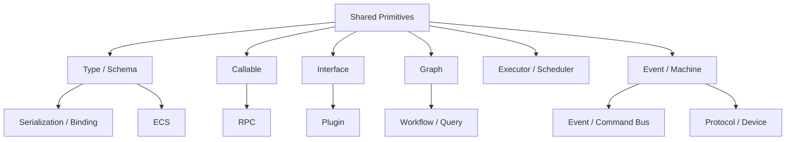
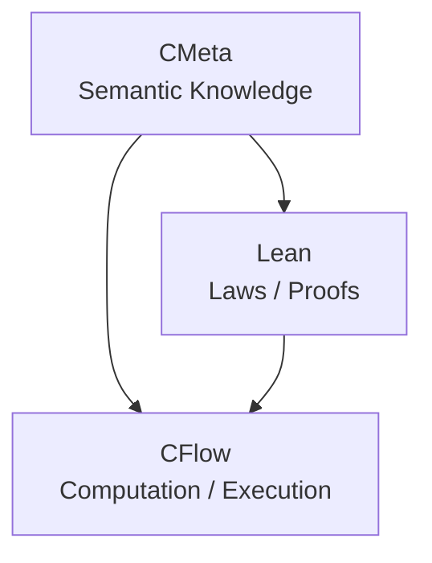

# 第十三章：从基础能力到 Modern C——Serialization、RPC、Plugin、Workflow 与更多应用

做到上一章以后，CMeta 和 CFlow 的边界已经比较清楚。

CMeta 提供的是：

```text
Type
Traits
Generic
Callable
Interface
Schema
Finite Relation
Semantic Identity
```

CFlow 则进一步提供：

```text
Graph
Operator
Executor
Scheduler
Subscription
Event
Machine
Actor
```

如果继续按照传统 Framework 的思路，很容易开始问：

```text
还可以再做什么？

CStream？
CRx？
CActor？
CWorkflow？
CRPC？
```

然后不断增加新的大型模块。

但前面几章真正得到的经验恰恰相反。

我们越来越发现：

> **真正有价值的不是不断增加 Framework，而是确认已经形成的 primitive 能否继续组合解决其他问题。**

因此这一章并不是要制定一张：

```text
未来 Feature List
```

而是重新观察：

> 当 C 已经拥有一套有限的 Type、Callable、Graph 和 Execution substrate 后，哪些原本需要大量约定和重复代码的问题，可以自然建立在这些基础上？

---

# 1. 很多现代 C Library 面临的是同一类问题

表面上：

```text
Serialization
RPC
Plugin
Event Bus
Workflow
ECS
Query Engine
```

看起来属于完全不同领域。

但深入以后，会发现它们反复需要：

```text
Type
Field Metadata
Function Signature
Capability
Schema
Runtime Binding
Lifecycle
Dispatch
```

例如 Serialization 需要知道：

```text
这个对象是什么类型？
有哪些字段？
字段是什么类型？
怎样构造？
怎样销毁？
```

RPC 需要知道：

```text
方法是什么？
参数是什么类型？
返回什么类型？
是否可能失败？
```

Plugin 需要知道：

```text
Provider 实现了什么 Interface？
ABI 是否匹配？
具有什么 Capability？
```

Event Bus 需要知道：

```text
Event Type
Payload Type
Handler Signature
```

Workflow 需要：

```text
Node
Edge
State
Transition
Executor
Retry / Error Policy
```

这些问题中，有相当一部分已经在前面的体系中被解决过。

---

# 2. Serialization 是最自然的应用之一

假设定义：

```c
Struct(User,
    (int, id),
    (String, name),
    (double, score)
);
```

如果 `Struct` 不只是生成：

```c
typedef struct User {
    int id;
    String name;
    double score;
} User;
```

而同时保留：

```text
Field Name
Field Type
Offset
Size
```

那么 Serializer 就不需要再要求用户重新写一遍：

```text
"id"    -> int
"name"  -> String
"score" -> double
```

也就是说：

```text
C Declaration
        ↓
Struct Schema
        ↓
Serializer
```

可以共享同一份事实。

这正是第一章最早希望解决的问题：

> **不要让相同知识维护两次。**

## 2.1 当前仓库如何把这个想法落成 CSerde 与 CBind

前面的讨论还只是从设计上说明：

```text
Struct Metadata
    可以被 Serializer / Binder 复用
```

当前 Rocida 已经有一条更具体的实现链：

```text
Format Adapter
    ↓
CSerde Reader / Writer
    ↓
Canonical Token Stream
    ↓
CBind Decode
    ↓
CMeta Data Descriptor
    ↓
Native C Storage
```

这里三个模块的职责并不相同。

`CMeta` 负责描述：

```text
数据是什么
存储类型是什么
字段位于哪里
buffer / enum / variant 如何进入 semantic zero
失败后如何恢复 semantic zero
```

`CSerde` 负责定义格式中立的 token 协议：

```text
NULL / BOOL
SINT / UINT / FLOAT
STRING / BYTES
ARRAY_BEGIN / ARRAY_END
MAP_BEGIN / MAP_END
```

它不拥有 JSON、YAML、XML 或其他具体格式的语义，也不根据 C struct
猜测字段。具体格式只需要实现 `cserde_reader_ops` 或
`cserde_writer_ops`，上层就可以消费同一种 token 流。

`CBind` 则负责把两侧连接起来。它的核心入口是：

```c
cbind_status cbind_decode(
    const cbind_context *context,
    const cmeta_data_desc *shape,
    cserde_reader *reader,
    void *out,
    cbind_error *error);
```

这条接口表达得很清楚：

```text
cserde_reader
    = 输入事实

cmeta_data_desc
    = 目标结构和生命周期事实

out
    = 原生 C 存储
```

CBind 自己不重新定义：

```text
CBIND_INT
CBIND_STRING
CBIND_STRUCT
```

而是直接消费 CMeta 的 `cmeta_data_kind`、`cmeta_data_desc`、字段描述和
provider operations。这正是“同一份类型知识被多个模块复用”的实际例子。

## 2.2 Format-neutral 不等于忽略生命周期

格式中立以后，最容易被忽略的反而是 buffer ownership。

CSerde 的 string / bytes token 明确区分：

```text
CSERDE_VIEW_TRANSIENT
CSERDE_VIEW_STABLE
```

这不是一个性能提示，而是生命周期契约。

如果目标 descriptor 声明 owned buffer，CBind 可以通过 provider adapter
复制 transient 或 stable slice。如果目标声明 borrowed buffer，则只能接受
stable slice，而且借用寿命不能超过 reader backing owner 的稳定期。

因此这里不能简单写成：

```text
zero-copy is always better
```

更准确的是：

> **只有输入 view 的失效点与目标对象的生命周期相容时，borrow 才是正确的。**

## 2.3 CBind 的失败语义是事务性的，而不是“尽量填一些字段”

反序列化最危险的状态不是返回错误，而是：

```text
部分字段已经构造
部分容器已经分配
Reader 又已经向前推进
```

当前 CBind 在消费输入前先验证完整 descriptor graph、ABI prefix、深度、
container item bound、buffer byte bound 和 scratch budget。目标对象必须处于
descriptor 定义的 semantic zero。

一旦正式 decode 后发生失败：

```text
完整 root semantic graph
    ↓
restore zero
```

但 Reader 不会被 rewind。

所以调用方得到的是一个明确契约：

```text
Success
    -> 完整目标值

Failure
    -> 目标恢复 semantic zero
    -> 输入位置不承诺回退
```

`cbind_error` 还分别记录：

```text
CBind status
CSerde source status
失败的 data shape
失败的 field
depth
CMeta target status
```

这样错误只在能够消费和归因它的边界汇总，而不需要每层重复记录同一个失败。

## 2.4 这是一组 toolkit 模块，而不是一个 Everything Serializer

当前构建边界同样保持分层：

```text
Rocida::CSerde
    = canonical token protocol

Rocida::CBind
    = CSerde + CMeta 的 format-neutral decode kernel

Rocida::JsonCSerdeAdapter
    = JSON DOM 到 CSerde reader 的独立适配 target
```

基础 `Rocida::JsonParser` 不因为存在这个适配器就反向依赖 CSerde。
需要这条桥的 consumer 显式链接 `Rocida::JsonCSerdeAdapter`。

同样需要明确当前边界：

```text
CBind 当前提供 decode
CSerde Writer 是输出协议
```

后者存在，并不等于 CBind 已经提供对称的 native-object encode。更高层的
DataBind、schema compiler 与多格式 facade 也属于 TurboParser 的上层边界，
不能因为底层 primitive 已经存在，就把尚未交付的能力写成 CBind 的当前功能。

---

# 3. Serialization 真正需要的并不是 Reflection VM

很多 Serialization Framework 最后会发展成：

```text
runtime field lookup
dynamic object creation
string-based method dispatch
```

甚至逐渐形成完整 reflection system。

但对于 C，并不一定需要做到这么远。

实际需要的可能只是：

```text
Struct Descriptor
    ↓
Field Rows
    ↓
Type Descriptor
    ↓
Codec
```

例如：

```text
User.id
    type = int

User.name
    type = String
```

然后：

```text
Serializer<int>
Serializer<String>
```

处理对应字段。

这仍然是：

```text
Finite Type-directed Dispatch
```

而不是：

```text
Runtime Reflection Language
```

---

# 4. Traits 可以解决 Value Lifecycle

真正麻烦的 Serialization 往往不是：

```text
怎么写 JSON
```

而是：

```text
反序列化以后，目标对象怎么安全构造？
```

例如：

```text
int
```

可以直接赋值。

但：

```text
String
Vec<User>
Map<String,User>
```

可能需要：

```text
construct
move
destroy
```

如果 Serializer 自己分别知道：

```text
Vec 如何创建
String 如何销毁
Map 如何绑定
```

模块耦合会迅速增加。

更合理的是：

```text
Type
    ↓
Traits / Construction Protocol
```

由具体类型提供生命周期语义。

于是 Serializer 负责：

```text
读取数据
```

而 CMeta 提供：

```text
如何安全地创建对应 Value
```

---

# 5. Nested Generic 是真正检验 Serialization 能力的地方

例如：

```text
Vec<int>
```

还比较简单。

真正复杂的是：

```text
Vec<Vec<int>>
```

或者：

```text
Map<String, Vec<User>>
```

如果对象已经初始化，可以从 runtime handle 猜到一部分信息。

但反序列化时经常面对：

```text
一个空对象
```

例如：

```text
Vec<Vec<int>> values = {0};
```

这时仅仅查看：

```text
values.data
```

什么都得不到。

真正需要的是：

```text
Declaration-side Type
```

也就是：

```text
TYPE<Vec<Vec<int>>>
```

所携带的 Generic Identity。

于是可以递归得到：

```text
Vec
 └── Vec
      └── int
```

这让：

```text
空容器
```

也可以在构造前知道：

```text
它应该装什么
```

---

# 6. 这使 Data Binding 也自然出现

如果 Serializer 只是：

```text
Bytes / JSON
    ↓
Object
```

那么 Data Binding 更进一步关注：

```text
Source Schema
    ↓
Target Schema
```

例如：

```text
JSON Object
    ↓
User
```

或者：

```text
Database Row
    ↓
User
```

甚至：

```text
UserDTO
    ↓
User
```

如果双方已经具有：

```text
Field Name
Field Type
Generic Identity
```

就可以建立：

```text
Binding Relation
```

而不是为每一对对象手写：

```c
target.id = source.id;
target.name = source.name;
...
```

---

# 7. Range 与 Collector 可以成为 Binding 的通用桥梁

前面 Stream 中已经建立：

```text
Range
```

负责读。

```text
Collector
```

负责写。

这个模型其实并不限于 Stream。

例如一个容器绑定：

```text
Source Container
    ↓
Range<T>
    ↓
element binding
    ↓
Collector<U>
    ↓
Target Container
```

于是：

```text
Vec<T>
List<T>
Set<T>
```

之间的转换不必分别写：

```text
Vec -> List
Vec -> Set
List -> Vec
List -> Set
...
```

而变成：

```text
Range
+
Binding
+
Collector
```

这又是一次典型的：

```text
N × M
```

问题被降低成：

```text
N + M
```

---

# 8. RPC 同样首先是一个 Typed Callable 问题

考虑一个 RPC：

```text
get_user(UserId) -> User
```

从语义上看，它首先是：

```text
Callable
```

具有：

```text
Input Type  = UserId
Output Type = User
Effects     = IO | MAY_FAIL
```

如果是：

```text
update_user(UpdateRequest) -> Status
```

仍然如此。

所以 RPC protocol 不需要自己重新发明：

```text
Method Signature System
```

完全可以建立在：

```text
CMeta Callable Signature
```

之上。

---

# 9. RPC Schema 可以从 Callable Metadata 派生

例如：

```text
Method:
    get_user

Signature:
    UserId -> User
```

再配合：

```text
Input Serializer
Output Serializer
```

就已经形成：

```text
Client
    ↓ encode UserId
Transport
    ↓
Server
    ↓ invoke Callable
    ↓ encode User
Transport
    ↓
Client
```

可以表示成：

```mermaid
flowchart LR
    C["Client"]
    E1["Encode<Input>"]
    T["Transport"]
    D1["Decode<Input>"]
    F["Typed Callable"]
    E2["Encode<Output>"]
    D2["Decode<Output>"]

    C --> E1 --> T --> D1 --> F
    F --> E2 --> T --> D2 --> C
```



核心仍然是：

```text
Type
Callable
Serialization
```

---

# 10. RPC Framework 不应该重新拥有 Type System

如果 RPC 自己定义：

```text
RPC_INT
RPC_STRING
RPC_USER
```

Serializer 又定义：

```text
SER_INT
SER_STRING
SER_USER
```

Container 又定义：

```text
CONTAINER_TYPE_INT
...
```

那么同一种：

```text
User
```

会出现多个平行 type universe。

这正是 CMeta 希望避免的事情。

更合理的是：

```text
One Semantic Type
        ↓
Serialization
RPC
Binding
Container
Flow
```

不同 module 消费同一个 Type system。

---

# 11. Plugin ABI 也是 Interface 的直接应用

传统 C Plugin 常见模式是：

```c
plugin_init(...);
plugin_query(...);
plugin_destroy(...);
```

或者暴露一张：

```c
struct plugin_api {
    ...
};
```

这其实已经是：

```text
Interface / VTable
```

模型。

所以 CMeta Interface 可以自然用于：

```text
Plugin Provider
```

例如：

```text
Storage Interface
```

不同 plugin 提供：

```text
SQLiteStorage
MemoryStorage
RemoteStorage
```

上层只依赖：

```text
Storage
```

而不是：

```text
具体 Plugin Implementation
```

---

# 12. Capability 对 Plugin 尤其重要

例如一个 Storage provider 可能支持：

```text
READ
WRITE
TRANSACTION
WATCH
```

不同实现能力不同。

如果调用方通过：

```text
if plugin_name == ...
```

判断，非常脆弱。

更自然的是：

```text
Interface
+
Capability Set
```

例如：

```text
MemoryStorage:
    READ | WRITE

RemoteStorage:
    READ | WRITE | WATCH

DatabaseStorage:
    READ | WRITE | TRANSACTION
```

上层只声明：

```text
requires TRANSACTION
```

这和 Executor：

```text
SERIAL
CONCURRENT
```

完全是同一种模式。

---

# 13. Plugin Loading 也可以提前做 Admission

Plugin 最危险的问题之一是：

```text
动态加载成功
```

并不意味着：

```text
语义上真的兼容
```

可以在 admission 时检查：

```text
Interface ID
ABI Version
Capability
Type Identity
Required Methods
```

然后：

```text
Accept
```

或者：

```text
Reject
```

真正运行以后就不必不断问：

```text
这个 method 是否存在？
```

这再次符合：

```text
Pay Before Execution
```

---

# 14. Event Bus 可以直接建立在 Typed Event 上

前面的 Machine 已经定义：

```text
Typed Event
```

包含：

```text
Event Identity
Payload Type
Payload
```

所以 Event Bus 的基本需求已经有了。

例如：

```text
UserCreated
OrderPaid
ConnectionLost
```

都可以是 typed event。

Handler 则是：

```text
Callable<EventPayload, ...>
```

于是 Event Bus 的核心只是：

```text
Event
    ↓
Routing
    ↓
Callable Handler
```

而不需要：

```text
string event name
+
void *
+
manual cast
```

---

# 15. Command Bus 也是类似问题

Event 通常表达：

```text
已经发生的事实
```

Command 通常表达：

```text
希望执行的动作
```

例如：

```text
CreateUser
SendEmail
StartJob
```

但从基础设施看，它们都可以建模成：

```text
Typed Message
```

区别主要存在于：

```text
Semantic Contract
```

而不是：

```text
底层函数指针系统
```

所以没有必要：

```text
EventCallable
CommandCallable
ActorCallable
```

分别设计三套 callback。

仍然应该统一到：

```text
Callable
```

---

# 16. Workflow 也可以理解成 Graph + Machine

Workflow 看起来比 Stream 复杂很多。

例如：

```text
Validate
   ↓
Charge
   ↓
Provision
   ↓
Notify
```

如果失败：

```text
Charge failed
    ↓
Retry / Abort
```

如果 Provision 完成：

```text
进入下一状态
```

其实它同时具有：

```text
Graph
```

和：

```text
Machine
```

两种性质。

Graph 描述：

```text
步骤之间的依赖
```

Machine 描述：

```text
一个 Workflow Instance 当前执行到哪里
```

于是：

```text
Workflow Definition
    =
Graph

Workflow Instance
    =
Machine / Subscription
```

这是一个很自然的分层。

---

# 17. Workflow 不需要自己的 Thread Runtime

如果已经有：

```text
Executor
Scheduler
WAIT / Wake
```

那么 Workflow 中：

```text
等待外部审批
等待 Timer
等待 RPC
```

都可以继续使用：

```text
WAIT
```

需要执行：

```text
Task
```

就使用：

```text
Executor
```

延迟重试：

```text
Scheduler
```

所以即使以后实现 Workflow，也不应该再重新创建：

```text
WorkflowThreadPool
WorkflowTimer
WorkflowCallback
```

---

# 18. Retry 仍然应该是显式 Policy

Workflow 很容易让 Framework 开始隐藏：

```text
失败就重试 3 次
```

但前面已经建立：

```text
Mechanism
≠
Policy
```

所以更好的结构是：

```text
Action
    returns ERROR
```

然后 Workflow policy 明确决定：

```text
Retry
Fallback
Compensate
Fail
```

甚至这些 policy 本身也可以成为：

```text
Graph / Machine Relation
```

而不是硬编码在 executor 里面。

---

# 19. Compensation 也是 State Transition

例如：

```text
Charge
    succeeded

Provision
    failed
```

可能需要：

```text
Refund
```

从 Machine 角度：

```text
Charged
+
ProvisionFailed
    ↓
RefundAction
    ↓
Refunded
```

所以所谓：

```text
Saga / Compensation Workflow
```

并不一定需要全新的 semantic substrate。

State Machine 已经能表达相当多的核心关系。

---

# 20. ECS 也可以利用 Type 和 Query Metadata

Entity Component System 中一个核心问题是：

```text
一个 Entity 具有什么 Component？
```

以及：

```text
某个 System 需要哪些 Component？
```

例如：

```text
MovementSystem

requires:
    Position
    Velocity
```

这实际上是一种：

```text
Type Set / Trait Relation
```

而 System 本身又可以是：

```text
Callable
```

例如：

```text
(Position, Velocity) -> UpdatedPosition
```

因此 CMeta 的 Type/Relation 能力可以用于 ECS 的：

```text
Component identity
query admission
system signature
```

---

# 21. ECS Query 甚至可以被 Lower 成直接数据访问

用户可能写：

```text
query(Position, Velocity)
    ↓
for each entity
    ↓
update
```

高层 query 可以先经过：

```text
Type Relation
Archetype Match
Layout Analysis
```

然后真正 hot path 直接变成：

```text
contiguous Position*
contiguous Velocity*
simple loop
```

这和 Stream：

```text
High-level API
    ↓
Graph
    ↓
Direct loop
```

其实采用同一个性能哲学：

> **高层描述用于分析，执行时尽量消掉描述层。**

---

# 22. Query Engine 同样可以看成 Typed Graph

不仅 ECS。

普通数据查询也可以写成：

```text
Scan
 ↓
Filter
 ↓
Project
 ↓
Join
 ↓
Aggregate
```

这本身就是：

```text
Graph
```

与 Stream 的：

```text
Filter
Map
Reduce
```

非常接近。

区别是 Query Engine 可能进一步知道：

```text
index
cardinality
ordering
cost
```

然后做：

```text
Plan Optimization
```

所以 CFlow 的：

```text
Surface Graph
Normalize
Analyze
Plan
```

模型也可以作为这种系统的基础思想。

---

# 23. 甚至 Parser Pipeline 也可以使用相同模型

例如：

```text
Bytes
 ↓
Tokenizer
 ↓
Tokens
 ↓
Parser
 ↓
AST
 ↓
Validator
```

每一步都有：

```text
Input Type
Output Type
Callable
Error
```

这仍然是：

```text
Typed Data Transformation
```

如果中间处理增量数据：

```text
Input not enough
```

就出现：

```text
WAIT / NEED_MORE
```

也和 Reactive 的 resumable 模型非常相似。

因此同一组 primitive 可以继续服务：

```text
stream parser
protocol parser
incremental decoder
```

---

# 24. Protocol State Machine 是另一个非常自然的应用

很多网络协议其实就是：

```text
State Machine
```

例如：

```text
Disconnected
 ↓ Connect
Handshake
 ↓ Success
Authenticated
 ↓ Close
Closed
```

不同 packet 是：

```text
Typed Event
```

每个 handler 是：

```text
Callable
```

I/O waiting 是：

```text
WAIT
```

Timer 是：

```text
Scheduler
```

所以 Protocol Runtime 不需要分别重新设计：

```text
callback
timer
state machine
event queue
```

这些 primitive 已经存在。

## 24.1 从 Coroutine 到 NativeIO：协程只保存执行位置

网络和文件 I/O 又把问题推进了一层。

如果直接把每一种异步操作写成回调链，很快会出现：

```text
submit
    ↓
callback
    ↓
update state
    ↓
submit next operation
```

Coroutine 可以把这段控制流重新写成接近同步代码的形式，但它不应该成为第二份
I/O 状态源。

当前 `Rocida::Coroutine` 是 minicoro 的唯一编译封装，提供单 owner 有界
frame pool 和可选的固定 shard Executor。每个 Executor worker 独占 scheduler、pool 与
有界 command queue，用户线程只负责 submit；显式 shard affinity 可让同一 connection
的 coroutine 始终在同一 owner 上运行。`NativeIO` 仍然拥有 request slot 和 terminal completion；
coroutine 只保存：

```text
执行到哪里
```

而不另行拥有：

```text
这个 I/O 是否已经完成
```

因此正确关系是：

```text
NativeIO request slot
    = I/O 事实源

Coroutine frame
    = suspended control flow
```

`native_io_coroutine_await()` 成功后，frame 必须等 generation-checked terminal
completion 被同一个 owner observe，才可以恢复或归还池。取消也不能提前释放
request payload 和 frame，因为 cancel request 不是 terminal evidence。

这让 coroutine 真正服务于开发效率：

```text
少写跨回调的人工状态机
```

同时不牺牲：

```text
有界容量
单一事实源
明确取消
明确 shutdown drain
```

这并不表示通用 coroutine Executor 已经接管 NativeIO。Executor 现在提供 cooperative
`yield` 和 generation-checked `await` token：完成线程只调用 `await_complete` 发布 terminal
signal，原 shard owner 才恢复 frame；completion 早于 suspend 和 shutdown 后 drain 都有明确
语义。但 readiness/native completion 到 token 的映射仍属于专门 adapter，NativeIO request
slot 仍是唯一终态证据。这样可以独立扩展多 CPU 调度，而不把 I/O progress 复制进 frame pool。

## 24.2 CNet 是 NativeIO 之上的连接层，不是 CFlow 的网络分支

CNet 展示了这条组合路线。

应用看到的是：

```text
connect
send
receive demand
close
poll
```

而内部关系是：

```text
Application
    ↓
CNet session / generation-checked connection
    ↓
NativeIO coroutine owner
    ↓
NativeIO request / terminal completion
    ↓
IOCP / epoll / io_uring / kqueue
```

CNet 不创建隐藏的 I/O worker thread。调用方通过 `cnet_client_poll()` 推进
bounded command、NativeIO completion、coroutine resume 和 callback delivery。
同一个 client 的 callback FIFO、非并发，并且在用户代码运行时不持有内部锁。

这和前面 Actor 的 single mutation owner 思想一致，但模块所有权并不相同：

```text
CNet
    owns transport connection and session lifecycle

NativeIO
    owns native operation progress

Coroutine
    owns suspended execution frame

CFlow
    owns typed computation / Actor / Reactive semantics
```

因此 CNet 不应该让 NativeIO 负责 DNS、URI、连接状态或协议握手；也不应该把
TCP、UDP、Pipe 的 transport 语义塞进 CFlow Graph。

当前 CNet 随 Rocida 正常构建，source-tree target 为 `turbo_cnet`，安装包导出
`Rocida::CNet`、`<cnet/cnet.h>` 与独立的 `<cnet/websocket.h>`。TCP/TLS/UDP endpoint URI
交给 Rocida UriParser 分析，再由 transport adapter 严格约束 scheme、host 与
port；Pipe 是专用 IPC endpoint，因此有界保留 `pipe://` 后的原始名称，避免将方括号或冒号
误解为 network authority 而改变实际连接目标。书中可以讨论已经由测试覆盖的 base API、TLS transport 和 WebSocket
session engine，但不能把尚未实现的 WS/WSS HTTP endpoint 或 KCP 写成已发布事实。

KCP 与 WebSocket 的归属也应遵守这条边界。NativeIO 只提供 UDP datagram、TCP byte stream、
timer、cancel 与 terminal completion；KCP 的 conversation/window/retransmit/ordered message，
以及 WebSocket 的 frame/fragment/ping-pong/close handshake 都是连接协议状态，应由 CNet owner
独占。当前 CNet 已复用仓库 `tools/wsparser` 的 frame parser，并在其上实现固定容量的
message/session ownership、UTF-8、mask、fragment、control frame 与 close 状态机。opening
handshake 仍由 CHTTP 的 llhttp request parser 负责，不在 CNet 中复制 HTTP parser。服务端
HTTP Upgrade 的路由与 header 校验由 CHTTP 完成，成功后再把 stream 所有权一次性
移交给 CNet WebSocket session。HTTP/2 的 RFC 8441 extended CONNECT 也由 CHTTP 校验，
再把单个 H2 stream 适配给同一套 CNet WebSocket engine；H1/H2 不应复制两套 frame/session
状态机。把这些状态塞进 NativeIO backend，会令每一种 OS backend 重复协议逻辑，也会破坏
NativeIO 作为原始 I/O 事实源的定位。

## 24.3 在 CNet 之上实现 CHTTP：llhttp 是 Parser，不是 HTTP Runtime

当前仓库已经按这一边界实现 CHTTP HTTP/1.1 与 HTTP/2 client/server，而且依赖方向保持单向：

```text
Application / RPC
    ↓
CHTTP message + session
    ↓
CNet connection
    ↓
NativeIO request / completion
    ↓
OS backend
```

其中 [llhttp](https://github.com/nodejs/llhttp) 适合作为 CHTTP 的 HTTP/1 增量解析
backend。它接收任意分段的输入，通过 callback 报告 method、URL、status、header、body、
chunk 和 message completion，也支持 pause / resume。但它不负责：

```text
socket connect / close
DNS 与 URI
TLS
request serialization
connection reuse / pool
redirect / retry
body buffering policy
应用级 timeout 与 cancellation
```

所以不应形成：

```text
CNet depends on llhttp
```

而应形成：

```text
CHTTP depends on CNet and llhttp
```

对应源码位于 `chttp/`，source-tree target 是 `turbo_chttp`；安装包导出
`Rocida::CHTTP`。llhttp 是 Rocida 的基础 vcpkg 依赖，但仍只作为 CHTTP 的私有解析
backend。H1 client 接受 TCP、TLS 与 Pipe，并已在固定 `request_capacity` 内实现同
`connection_uri + authority + TLS profile identity + protocol` 的 keep-alive 复用；H1 每条连接同一
时刻只承载一个 request。显式 `CHTTP_HTTP_2` 请求使用 h2c prior knowledge 或 TLS ALPN `h2`，
同一 session 可并发承载多个 stream。server 当前在明文或 TLS TCP 上提供后台 CNet owner、严格 request
parsing、keep-alive、静态/命名参数路由、中间件与有界内存 Session；H1/H2 复用同一套 handler API，
明文 H2 使用 h2c prior knowledge，TLS server 通过 ALPN 选择 `h2` 或 `http/1.1`。client/server 已提供
经验证的 HTTPS 与 mTLS policy，并以同一套 body source/sink 支持 H1/H2 流式正文与文件传输；
server 还提供复用 middleware/Session 的显式 WebSocket route，同一 route 可承载 H1 Upgrade
与 H2 RFC 8441 Extended CONNECT；同步 WebSocket client 用完整 `ws://`/`wss://` URI，
显式选择 H1/H2 并在内部自行推进 CNet，仍不提供 redirect 或自动 retry。
CHTTP 的 TLS profile 接受默认/H1 ALPN 或精确的 `h2`，profile 与 request protocol
必须一致，显式 H2 失败不会降级为 H1；底层握手、加密 I/O、close-notify 和 TLS listener accept 继续由 CNet 拥有。

当前 HTTP/2 client 已从 TurboHTTP 导入；后续协议演进只要求导入 S3，不要求 HTTP/3。依赖方向保持为：

```text
S3 application protocol
    ↓ SigV4 / URL / XML / multipart
CHTTP HTTP/1.1 or HTTP/2
    ↓ ordered stream
CNet TCP / TLS
    ↓
NativeIO
```

HTTP/2 的 frame、HPACK、SETTINGS、flow-control 与 stream lifecycle 属于 CHTTP；S3 的签名、
对象与 multipart 一致性属于 CHTTP 之上的应用协议。二者都不应下沉进 CNet 或 NativeIO，
HTTP/3 也不作为这条迁移路径的 fallback。

多路复用也要求错误边界落在正确层级：单个响应的 header/body 上限或 HTTP 语义错误发送
RST_STREAM，只结束该 request；HPACK block 仍完整解码以维护 connection-scoped 动态表，兄弟
stream 继续推进。只有 frame、compression、connection flow-control 等连接级错误才发送 GOAWAY。

面向普通应用的入口是阻塞 requests-style client：`chttp_client_init()` 建立 owner，
`chttp_get/head/post/put/delete/patch()` 在调用线程内自行推进 CHTTP → CNet → NativeIO，并返回
调用方拥有的 `chttp_response`，最后由 `chttp_response_destroy()` 与 `chttp_client_destroy()`
分别释放响应和 client。用户不接触 poller，也不需要提供隐藏的 Executor 或 worker thread。
`chttp_async_client_submit()`、`chttp_async_request_cancel()` 与 `chttp_async_client_poll()` 则是给
CRPC、Executor 和已有事件循环适配器使用的高级入口，不应成为业务代码发送一次 HTTP request
的默认仪式。当前 async options 不拥有 per-stream timeout 字段；集成层拥有 timer/deadline，并在
到期时显式 cancel。阻塞 `chttp_options.timeout_ms` 只约束 requests-style 调用。

这一区分很重要：requests-style API 解决的是“普通调用者如何使用”，caller-driven poll 解决的
是“框架如何组合 progress owner”。前者可以建立在后者之上，但不能强迫每个应用用户理解底层
readiness/completion loop。一个 requests-style client 仍是单线程 owner；并行调用应使用多个
独立 client，再由应用已有的 Executor 调度，不能让线程池中的多个任务同时推进同一个 client。

### Server 也不把 poller 暴露给业务代码

服务端沿用相同的分层原则，但 progress owner 由 `chttp_server` 的后台线程持有：

```text
Application handler / middleware
    ↓ borrowed request + copying response builder
CHTTP route / Session / llhttp request parser
    ↓ receive demand + ordered send completion
CNet listener + accepted connection
    ↓
NativeIO
```

调用方通过 `chttp_server_init()` 声明所有容量，在 start 前注册
`chttp_server_get/post/put/delete/patch/options()` 路由和 `chttp_server_use()` 全局 middleware，
最后 start/stop/destroy；业务代码不调用 CNet poller。路由 query 仍保存在 `target`，匹配只看
`path`；完整 segment `:name` 形成 raw 参数，静态路由优先于动态路由。HEAD 没有显式 route 时
回退 GET handler，但只发送 header，并保留 representation 的 Content-Length。

middleware 的核心不是“一个回调数组”，而是受约束的 continuation：全局 middleware 先执行，
再执行 route middleware，`chttp_server_next_call()` 对同一个 next 最多成功一次。middleware 可以
继续，也可以直接 reply，从而承载 CORS、认证、限流、访问审计和统一错误映射。404/405 也经过
全局 middleware，405 由 route table 生成 Allow；状态事实不在各 middleware 里复制。

Session 采用 Cookie id + server-side store：Cookie 只保存系统 CSPRNG 生成的 128-bit id，
key/value 被复制进固定 `session_capacity × session_entry_capacity` 存储。idle timeout 到期后才
回收；容量全部被活跃 Session 占用时，新的 set 返回 `TURBO_ENOBUFS`，不能用无界 map 或静默
LRU 驱逐掩盖资源压力。默认 Cookie 属性包含 HttpOnly、SameSite=Lax 与 Path=/，部署 HTTPS 时
还应打开 Secure。当前 store 只属于单进程 owner，不是持久化或分布式 Session。

参考 Iris/Castle 的应用形态，可以把能力分成三层：

| Castle 场景 | 当前组合方式 |
|---|---|
| REST route、命名参数、全局/route middleware、Cookie Session | CHTTP server 直接提供 |
| JSON request/reply | handler 将 bounded body 交给 TurboParser/CSerde/CBind，结果复制进 response |
| Mustache/template 与静态 CSS/JS | 小资源可预加载后 reply；文件可用 `chttp_server_response_file()` 有界分块发送 |
| 文件上传/下载 | client 使用 post/put/download file convenience；server 用 route body sink 接收、response source/file 发送 |
| 数据库/ORM、密码哈希、业务鉴权 | 由 TurboDB/安全模块实现，通过 middleware/handler 组合，不进入 HTTP kernel |
| 异步 DB、异步文件、Actor continuation | 需要未来 owning request token + owner mailbox 的 suspend/resume API |
| TLS、KCP、WebSocket | CNet TLS 与 WebSocket session engine、CHTTP HTTPS 均已实现；CHTTP Upgrade/route 与 CNet KCP 尚未实现 |
| HTTP/2 | client/server 已导入 frame/HPACK/protocol 并使用 CNet stream；server 复用 H1 route/middleware/Session API |
| S3 | 从 TurboHTTP 导入到 CHTTP 上层，复用 H1/H2；当前未实现 |
| HTTP/3 | 不在当前范围内，不作为隐式 fallback |

因此“Castle 功能可以建立在 CHTTP 之上”不等于“全部代码都应该塞进 CHTTP”。当前可以直接迁移
HTTP/1.1 路由、中间件、Session、预加载资源和同步的短计算；会阻塞或挂起的 DB/file/coroutine
工作不能保存 borrowed request 后跨线程继续，更不能阻塞唯一 owner thread。异步 server API
必须先把 request/response 变成 generation-checked owning token，再通过 mailbox 把完成重新提交给
owner；这是后续能力，不用同步 handler 冒充。

### 任意 byte chunk 不等于一个 HTTP message

当前 `cnet_receive()` 的 demand 表示未来 receive callback 的数量，TCP callback 中的
`cnet_receive_view` 只是任意 byte chunk，并不对应 header、body chunk 或完整 response。
CHTTP session 因此必须为每条连接保存自己的 `llhttp_t` 和 HTTP message state，并在
`on_receive` 返回前调用 `llhttp_execute()` 消费该 view。`llhttp_settings_t` 的生命周期
必须覆盖 parser 生命周期，不能把一次函数调用中的 stack-local settings 留给 session。

CHTTP 需要的是 reliable ordered byte stream capability。TCP 与合适的 local Pipe 可以提供
这种能力；`CNET_MESSAGE_DATAGRAM` 必须在 admission 时拒绝，不能把 UDP datagram 拼接后
假装成 HTTP byte stream。连接收到干净 EOF 时，CHTTP 还要调用 `llhttp_finish()` 验证
EOF-delimited body 或报告截断；`CNET_CONNECTION_FAILED` 则保留 transport error，不能伪装成
正常的 HTTP message completion。

CNet receive view 只在 callback 期间有效；llhttp 的 data callback 也可能把同一个 URL、
header field 或 header value 分成多段。因此 CHTTP 不能把输入裸指针保存进 request / response：

```text
仅在同步 handler 内使用
    → 可以保留 borrowed view

需要跨 callback、异步 handler 或 coroutine suspension 使用
    → 复制进有硬上限的 message arena / owned buffer
```

每条 session 至少需要明确以下容量：

```text
start-line bytes
header count
total header bytes
single header field/value bytes
body buffered bytes 或 streaming window
pipeline / in-flight message count
```

超过上限应立即生成明确的 protocol / capacity error 并关闭或排空连接，不能靠无界增长
吸收不可信网络输入。

网络边界默认使用 llhttp strict parsing。放宽 `Transfer-Encoding`、`Content-Length`、
header token 或 line ending 的 lenient flags 会扩大 request smuggling / response splitting
风险，只能作为显式兼容策略，并与连接复用、代理和缓存边界一起测试，不能在解析失败后
自动重试为宽松模式。

### Backpressure 必须从 Body Consumer 反向传到 CNet

llhttp 可以暂停 parser，但暂停 parser 本身不会停止 socket 继续产生数据。CHTTP 必须把
下游容量转换为 CNet receive admission：

```text
RPC / body consumer capacity
    ↓
CHTTP parser and body window
    ↓
cnet_receive(connection, demand)
```

当前实现每次只申请一个 receive value；处理完当前 chunk，并确认 parser、message arena
和 body sink 都有容量后，再申请下一个。更大的 receive window 可以提高吞吐，但必须有对应的
bounded retained-byte budget。llhttp pause 后还没有交付给上层的字节归 CHTTP session 管理，
不能继续借用已经返回的 CNet callback buffer。

### Request 输出还需要 Serializer 与 write-terminal 语义

llhttp 只解析输入，不生成 HTTP request / response。CHTTP 仍需实现有界 serializer，负责：

```text
request line
header validation
Content-Length framing
Host / Connection 语义
```

当前 serializer 既支持有界 copied body，也支持 callback source；它自动生成 `Host`、
`Content-Length`/chunked framing 和 `Connection: keep-alive`，并拒绝调用方重复提供这些 framing
header 或通过 CR/LF 注入 header。已知长度 source 必须在声明长度处精确 EOF；未知长度 source 在
H1.1 使用 chunked，在 H2 用 END_STREAM。response parser 的 sink 只有在完整消费 DATA 后才恢复
H2 window credit；sink 模式不保留 body，但累计 `body_size` 仍可用于审计与配额。

生成 keep-alive 只是复用意图，不是复用事实。final response 必须由 llhttp 判定允许持久连接；
`Connection: close`、EOF framing、parser failure、cancel 和 shutdown 都进入 close/terminal 路径。
响应 callback 返回后 parser-owned reason/header/body storage 立即释放，idle slot 只保留 CNet handle、
精确 origin key 与一个用于观察 peer EOF/read-timeout 的 receive demand。

这里的 keep-alive 指 HTTP/1.1 在同一 TCP stream 上的持久复用，不是内核 `SO_KEEPALIVE` 探测。
后者的 enable、idle、interval 与 probe count 属于下文的 CNet transport profile 候选参数。

当前 `cnet_send()` 成功只表示 payload 已复制进 bounded command storage；公开 CNet observer 的
`on_send(connection, size)` 在完整 ordered write terminal 后回调一次。CHTTP server 因而可以等
response 完整写完后再重新申请 receive，避免同一 keep-alive 连接重叠写入。其契约可以写成：

```text
send(connection, bytes)
    ↓ accepted / full / closed
on_send(connection, complete_size)
```

这个完成事件证明一次已接受 write 的 bytes 已全部交给 transport，却不证明 peer 应用已经消费，
也不等于 RPC exactly-once。断线后的 retry 仍必须结合 method idempotency、request id 与上层
协议决定；不能让 HTTP/RPC consumer 各自猜测 socket 状态。

### 连接参数也必须按层归属

当前 CNet 已有 client-wide 的 backend、connection/command/request/event capacity、
`max_send_bytes`、`receive_buffer_bytes`、connect/read/write timeout，以及可选的 TLS I/O capacity
与 handshake timeout；每次 connect 接收 URI、observer 和可选 TLS policy。测试已经验证 URI、
observer、TLS policy 中的配置输入和 send bytes 会在 admission 成功后被底层复制或纳入自有
profile，因此调用方不需要把这些输入结构保留到异步完成；但 `observer.user` 指向的 callback
state 仍是 borrowed，必须存活到 terminal callback 和连接 recycle 完成。

这些是当前实现事实。CHTTP client 把完整 `cnet_client_config` 放进
`chttp_client_config.network`，并增加 request、start-line、header、body 和 informational
response 的硬上限；每次 requests-style call 或高级 submit 显式区分 CNet `connection_uri`、HTTP
`authority`、origin-form `target` 与 H1/H2 `protocol`。`request_capacity` 限制 H1 request slot 或 H2
stream 总量，`network.connection_capacity` 独立限制 H1 connection 与 H2 session 的物理连接总量，
因而可小于 request capacity。`network.read_timeout_ms` 也作用于 idle peer observation。下面其余
socket 参数与更细的 pool policy 仍是候选演进，不是现有 `cnet_connect_options`、`chttp_options`
或 `chttp_request_options` 已发布的字段。TLS 是例外：`cnet_tls_client` 是可复用的 CNet client
context，CHTTP 通过 `chttp_tls_profile` 保留它，并由同步/异步 request options 显式选择；
`tls://` 在没有显式 profile 时使用 CNet 的 verified defaults。profile identity 已进入 pool key，
内容相同但分别初始化的 profile 不会跨安全域复用连接。

CHTTP server 的 `chttp_server_config` 则复用同一个 CNet network capacity，并增加 listener
backlog、route/middleware/parameter、request/response 与 Session 的独立硬上限。
`network.connection_capacity` 同时是 accepted connection slot 上限；单条 serialized response 必须
能放进 `network.max_send_bytes`。可选 server TLS policy 在 init 时构建自有 CNet TLS context，
因此证书配置字符串不需要存活到 start；server 配置不完整、ALPN 不是 H1、TLS buffer 不足或证书加载
失败都会在监听前返回错误。这些是启动前可验证的资源协议，不是运行时悄悄扩容的建议值。

连接参数不应全部塞进一个不断增长的结构体，而应分成三组：

```text
cnet_client_config
    = backend owner 与全局硬容量

cnet_connect_options + transport profile
    = 单连接 endpoint、socket、TLS 与 timeout policy

chttp_client_config
    = 当前 HTTP parser/body/request 硬上限
      + H2 input/HPACK/SETTINGS 硬上限
      + request/stream 总容量
      + 未来 max-idle/waiter 等 pool policy
```

CHTTP 已进入 installed shared-library target。公开 C API 在 options 尾部增加 TLS profile 与
protocol，并在 client config 尾部增加 H2 资源上限；使用 designated/zero initialization 的源码保持
H1 默认行为。因为公开结构布局已经变化，本阶段将 CHTTP library version 提升到 2.0.0、
ABI/SOVERSION 提升到 2：Unix 使用 `libturbo_chttp.so.2` SONAME，Windows 使用
`turbo_chttp-2.dll`，而下游仍通过 `Rocida::CHTTP` 链接。ABI 1 二进制不会意外装载 ABI 2；源码
使用者仍必须用匹配头文件重新编译并重新链接。公开 options 仍没有可扩展的 `struct_size` 与 ABI
version，因此后续不能继续把尾部扩展误写成二进制兼容；应先引入版本化 options，或在再次改变
布局时继续提升 ABI major，也不能依靠未初始化尾部字段或同名布尔值猜测。

#### CNet client-wide：一个 progress owner 的资源预算

这一层配置“整个 CNet owner 最多能承载多少事实状态”：

| 参数组 | 当前或候选内容 | 语义 |
|---|---|---|
| Backend | `native_io_backend_kind` | 选择 IOCP、io_uring、epoll 或 kqueue 等 backend；不可用时 fail fast |
| Connection | connection capacity | active + closing + 尚未 recycle 的 generation-checked session 上限 |
| Command | command capacity、max command payload | connect/send/receive/close admission 上限，满时返回可区分的 capacity error |
| Native request | request capacity、completion batch capacity | 已提交且尚未 terminal 的 NativeIO request 预算 |
| Callback event | event capacity | 尚未由唯一 consumer 交付和 release 的 callback event 预算 |
| Bytes | `max_send_bytes`、`receive_buffer_bytes` | 单次 copied send 上限与每个 receive operation 的 buffer 上限 |
| Defaults | connect/read/write timeout | per-connection 未覆盖时使用的默认 deadline |

这里的 capacity 单位不能混用：connection slot、command slot、native request、event 和 retained
payload bytes 都要分别预算。CHTTP 的总内存上限至少要核算：

```text
connection_capacity
× (CNet receive bytes
   + llhttp/session state
   + header arena bytes
   + body window bytes
   + in-flight request metadata)
+ command/event/native-request metadata
```

这只是可复算的 capacity budget，不是吞吐证明；最终数值仍需由典型、峰值和 consumer stall
benchmark 校准。

#### Per connection：只保存 transport 事实

单连接 options 可以引用几个职责单一的 nested profile，而不是增加十几个互相影响的 bool：

| Profile | 候选参数 |
|---|---|
| Endpoint | URI、address-family policy、Happy Eyeballs delay |
| Local bind | local address、local port、interface name/index |
| TCP | no-delay；keepalive enable、idle、interval、probe count |
| Timeout | resolve、connect、transport handshake、read-idle、write deadline |
| TLS extension | trust source、peer/hostname verification、SNI、ALPN、client certificate identity |
| Observer | ordered state、receive、write-terminal callback 与 user context |

URI 仍是 endpoint 的规范输入；local bind 和 socket policy 只是显式覆盖。一个请求了 IPv6-only、
指定 interface 或指定 TLS identity 的连接失败时，CNet 必须返回对应错误，不能静默换成 IPv4、
默认 interface、明文或另一张证书。

小型字符串和标量可以像当前 URI 一样在 connect admission 成功前复制。证书、trust store 或
credential provider 可能太大，应该使用不可变 profile handle，并明确 `retain/release`；仅写
“调用方负责生命周期”不足以跨异步 connect、TLS handshake 和连接池复用。

TLS 已作为 CNet transport extension 实现：`tls://` 在 TCP connect/adopt 后由同一个 progress
owner 推进 handshake、encrypted read/write、ALPN、cancellation 与 close-notify。client 默认
使用平台 trust store 和 URI host，允许显式 CA、verified SNI/identity、client certificate 与
ALPN；没有关闭 peer/hostname verification 的开关，也不会从 TLS 降级为明文。每个会话的 BIO
与 I/O scratch buffer 由 `tls_io_buffer_bytes` 设置硬上限，handshake 使用独立 timeout。
`cnet_tls_server` 是可复用的 opaque profile，accepted session 持有引用；控制面的 accept 与
destroy 不能并发。`cnet_tls_client` 同样把 client context 变成可复用的 opaque profile；connect
admission 成功后 session 自己 retain context，所以调用方可以立即销毁公开 wrapper。CHTTP 已在
这一层之上实现 `chttp_tls_profile`，用精确 H1 或 H2 ALPN 把 HTTPS 接入对应 HTTP
session，并在 H2 CONNECTED 后复核 negotiated ALPN 恰为 `h2`，而不直接
拥有 TLS socket。

#### CHTTP：当前 HTTP session 与 bounded pool 参数

CHTTP 不应复制 socket 配置体系。它只保存协议和复用策略：

| 参数组 | 当前事实或候选内容 |
|---|---|
| Origin | 当前显式区分 connection URI、Host authority、origin-form target 与可选 TLS profile |
| Pool | `request_capacity` 限制 H1 request/H2 stream，CNet connection capacity 限制 H1 connection/H2 session；read timeout 约束 idle observation |
| HTTP parser | H1 使用 strict llhttp；H2 使用有界 frame/HPACK/protocol engine，均有 header/input 硬上限 |
| Body | copied body 与 source/sink 共用总量 hard limit；server 另以 buffered-response limit 隔离小响应 copy 与大文件总量 |
| Ordering | H1 一连接一个 in-flight request，不允许 pipeline；H2 一 session 可并发多 stream |
| Policy | redirect/retry/Expect-Continue/compression/proxy 尚未实现 |

当前 pool key 是经过验证的 `connection_uri + authority + TLS profile identity + protocol` 精确组合；明文
连接的 profile identity 为空。`target` 不进入 key，所以同一站点的多个 endpoint 可以复用连接。
H2 session 达到 peer `SETTINGS_MAX_CONCURRENT_STREAMS` 时，client 会先尝试其他同 key session；仍有
物理连接容量时再建立一条 session，使单连接的 stream 上限不会变成整个 origin 的隐式串行点。
pool 满且没有同 key 可用 session 时，高级 submit 开始关闭一个没有活动 request/stream 的不匹配
H1 connection 或 H2 session，并以 `TURBO_ENOBUFS` 把重试责任交给 progress owner；H1/H2 切换也
遵守同一物理容量，且没有隐藏的无界 waiter queue。requests-style
client 会在调用 deadline 内自行推进这次 idle eviction 并重新执行 admission，所以普通用户切换
站点仍不需要 poll；这不是对已经 accepted 的 HTTP request 做断线重放。

未来加入 proxy、local bind 或 socket profile 后，连接池 key 还必须扩展为：

```text
scheme + host + port
+ local bind / interface
+ proxy identity
+ TLS trust and client identity
+ SNI + negotiated/required ALPN
+ transport-affecting socket policy
```

只按 `host:port` 复用会把不同 proxy、证书、信任策略或 local interface 的请求错误地放进同一
session。HTTP request header、cookie 或 bearer token 通常不是 transport pool key；但 client
certificate 和会改变 handshake 的 profile 必须进入 key。

HTTP proxy 也要按语义拆分：absolute-form request、CONNECT 与 proxy authentication 属于
CHTTP；SOCKS 这类与 HTTP framing 无关的代理可以成为 CNet transport extension。NativeIO
只看 endpoint 与 native operations，不理解任何 proxy protocol。

#### RPC deadline 不能退化成一个 socket timeout

各层 timeout 的关系是约束传递，不是共享一个可变 timer：

```text
RPC deadline
    ↓ constrains
HTTP overall request deadline
    ↓ constrains
DNS → connect → TLS handshake → write → response/read-idle
```

RPC deadline 到期后可以请求取消下层 operation，但仍要等待 CNet/NativeIO terminal result，
再释放 payload、parser、coroutine frame 和 connection lease。socket read-idle timeout 只说明
一段时间没有收到 transport bytes，不等价于 RPC method 已经超时，也不能独立推进第二份
RPC terminal state。

最终的参数归属可以压缩成一张表：

| 层 | 应拥有的参数 |
|---|---|
| CNet | endpoint URI、local bind、address-family policy、TCP no-delay/keepalive、connect/read/write timeout、transport capacity |
| CNet transport extension | 已实现 TLS trust、verified SNI/identity、ALPN、client certificate、mTLS、handshake timeout 与 transport-independent WebSocket session；KCP 尚未实现 |
| CHTTP | client 拥有 H1/H2 method、authority、target、headers、copied/source body、sink、TLS profile 与 bounded connection/session pool；server 拥有 H1/H2 plain/TLS listener、共享 route/middleware/Session、streaming route/source/file、strict parsing、flow control 与 response limits；H1 Upgrade 与 H2 RFC 8441 WS/WSS client/server 已实现，async suspended handler、proxy 是未来能力 |
| RPC | service/method、request id、codec、deadline、idempotency、auth metadata、application error mapping |

因此默认关系仍然是：上层选择或约束下层 profile，但不接管下层事实。当前 CNet 已有 listener、
ordered write completion、TLS、ALPN 与 WebSocket session engine；CHTTP 已接入 H1/H2 HTTPS client/server，
并已接入 HTTP/1.1 WebSocket Upgrade 与 H2 RFC 8441 Extended CONNECT。两种承载都复用
CNet 的同一套 frame/session 事实源，没有在 RPC/CHTTP 内静默绕过 CNet 改用另一套
NativeIO socket runtime。

### RPC 应选择 CHTTP 或 CNet，而不是直接选择 NativeIO

如果 RPC 使用 HTTP 作为承载，例如 JSON-RPC over HTTP，正确组合是：

```text
RPC
    ↓ method / id / codec / application error
CHTTP
    ↓ HTTP framing / limits / connection reuse
CNet
    ↓ transport session / receive demand
NativeIO
    ↓ authoritative terminal completion
```

仓库中的 CRPC 已按该组合提供两层 API：普通调用者使用 `crpc_client_init()`、
`crpc_request_reply()`、owning `crpc_response` 与 `crpc_client_destroy()`，无需接触 poller；Executor、
Actor 或事件循环适配层使用 `crpc_async_client_*`。两种风格共享 `connection_uri`、`authority`、
`target` 与 method/deadline 语义，并直接继承 CHTTP pool：同站点不同 target 的顺序 JSON-RPC call
可以复用一条允许 keep-alive 的 TCP socket。CRPC 不维护第二份 pool，也不因断线自动重放 method。
当前 `crpc_options` 尚未暴露 CHTTP TLS profile，因此不能据 CHTTP 已有 HTTPS 推断 CRPC 已支持
HTTPS；这一适配仍需要单独扩展、文档化所有权并测试。

如果是自定义二进制 RPC，则可以跳过 CHTTP，但仍应有独立 framing/session 层：

```text
RPC → Binary Framing → CNet → NativeIO
```

RPC 直接操作 NativeIO 只适合一个有意独占 backend、自己承担 DNS、连接状态、generation、
buffer lifetime、timeout 和 shutdown drain 的特殊 transport adapter。对通用 toolkit 而言，
那会让每一种 RPC transport 重复实现 CNet 已经拥有的连接事实。

当前 CNet 除 connect/send/receive/close/poll 外，也已经提供单 owner 的 nonblocking TCP
listener、accepted socket ownership transfer、generation-checked connection 与
send-and-close。CHTTP server 使用的 accepted data path 因而仍经过 CNet/NativeIO，没有另建一套
socket runtime。这里实现的是明文与 TLS HTTP/1.1/HTTP/2 application server，以及 H1 Upgrade/
H2 RFC 8441 WS/WSS route/client。CNet TLS 与 WebSocket session engine、CHTTP H1/H2 client/server adapter
与两种 WebSocket opening handshake 已实现；完整 RPC server 尚未实现，HTTP/3 也不在当前导入范围内。

## 24.4 异步文件与 CNet 复用底层协议，但不强行复用同一个上层模型

异步文件面对的不是 connection session，而是：

```text
offset read
offset write
flush
cancel
close / drain
```

当前 `cflow_io_file` 是一个 owning asynchronous regular-file facade。它组合：

```text
CFlow I/O Actor
    +
explicit native backend
    +
bounded request / operation slots
```

它和 CNet 共享的设计纪律包括：

```text
显式 backend
有界 admission
accepted request 必须等待 terminal completion
buffer borrow 必须活到 completion callback 返回
close 与 destroy 分离
destroy 前必须 quiescent
no silent fallback
```

但它当前不通过 CNet，也不要求每个文件操作都使用 coroutine。Completion
callback 在唯一 driver 调用 `cflow_io_file_run_ready()` 时同步执行；并发或
reentrant drive 会明确返回 `TURBO_EBUSY`。

这说明 toolkit 的目标不是让所有异步能力拥有同一种表面 API，而是复用稳定的
底层协议：

```text
ownership
capacity
admission
terminal evidence
single owner progress
shutdown drain
```

路径、stat、rename、delete 等可能阻塞的文件系统控制操作，则属于
`Rocida::CFlowFS` 的 bounded worker-backed service；它不能被包装成内核原生
异步文件 I/O。文件 watch 又是独立的 native watcher + Publisher 边界。

所以最终不是：

```text
one async framework owns everything
```

而是：

```text
Coroutine / NativeIO
    提供低层异步执行积木

CNet
    提供连接与协议 session

CFlow I/O File
    提供 offset data I/O facade

CFlowFS
    提供 filesystem control plane 与 watch
```

模块可以一起工作，但必须保留各自的事实源和生命周期边界。

## 24.5 CFlowFS 与 CFlowProcess：Publisher 负责观察，Actor 负责资源状态

文件系统和子进程都会产生异步事件，但“会产生事件”并不意味着整个模块都应当
被实现成 Publisher。更稳定的划分方式是先看职责：

| 职责 | 适合的 CFlow 抽象 |
|---|---|
| 阻塞调用的有界卸载 | Worker Executor |
| 连续到达、可组合的观察值 | Publisher + Subscription |
| 命令、资源所有权与可变状态 | Actor |
| 多阶段启动、运行、关闭与失败恢复 | Machine / Statechart |
| 内核 I/O 的 terminal completion | Native I/O backend / I/O Actor |

### CFlowFS：控制操作与 watch 是两条不同的数据路径

当前 `cflow_fs_service` 提供 `stat`、`lstat`、目录读取、`mkdir`、`rmdir`、
`rename` 和 `unlink`。这些操作可能阻塞，因此实现用固定 request slot 和 Worker
Executor 承载；`try_*()` 只负责有界 admission，完成结果由唯一 driver 调用
`cflow_fs_run_ready()` 交付。这条路径适合文件管理器、构建系统、部署工具和目录索引器，
但它不是 Reactive 数据流，也不应伪装成内核原生异步文件 I/O。

目录 watch 则天然是 Publisher。当前 `cflow_fs_watch_publisher_open()` 已把 native
watcher 暴露为 typed `cflow_publisher`，可以经过 Graph 做 `filter`、`map`、去重、
业务路由，或者通过 temporal Publisher 做 `debounce`，再由 Subscription 按
demand 推进。事件中的路径只在 encode 回调期间
有效，所以 Publisher 输出必须复制所需路径，不能把裸借用带过回调边界。

Publisher 只表达“观察到了什么”，不拥有目录的业务真相。当 watcher 报告
`CFLOW_FS_WATCH_RESCAN_REQUIRED` 时，可靠的上层结构是：

```text
File Watch Publisher
    ↓ typed filesystem event
Directory Actor
    ↓ serialize mutation / rescan command
Authoritative Directory Snapshot
```

Directory Actor 拥有快照、版本和 rescan 状态；Publisher 只唤醒它。Actor 完成全量
重建后，再由生命周期 owner 调用 acknowledge。这样事件丢失不会被错误地解释为一个
仍然完整的增量日志。

### CFlowProcess：I/O completion 在下层，进程生命周期在 Actor

当前 `cflow_process` 已经组合 `turbo_process`、native pipe backend、I/O Actor 和
Executor。它提供有界的 stdin write、stdout/stderr read、request cancel、poll、
terminate、close、quiescent destroy，并要求借用 buffer 一直存活到 terminal callback
返回。因此它适合编译器驱动、外部工具流水线、worker supervisor、媒体处理命令和
受控脚本执行。

它当前的公开表面是命令加 completion callback，并没有把 stdout、stderr 或进程退出
直接公开成 Publisher。若上层需要组合文本行、日志事件或退出结果，可以增加一个薄的
typed Publisher adapter；底层 completion 仍是唯一事实源，adapter 不能复制出另一套
独立推进的 request 状态。

进程本身更适合由 Actor 或 Statechart 承载：

```text
STARTING → RUNNING → STDIN_CLOSING → DRAINING → EXITED
                    ↘ TERMINATING → FAILED
```

`Start`、`WriteStdin`、`CloseStdin`、`Terminate` 是命令，应进入 Actor；stdout、
stderr 和 exit 是观察结果，可以进入 Publisher。这样 Reactive 负责数据变换，Actor
负责“这个进程现在允许什么操作”以及关闭时必须等待哪些 completion。

因此这两个模块共同展示的不是一种万能异步 API，而是一条组合原则：

```text
Executor executes bounded work
Publisher describes observations
Subscription owns one observation lifetime
Actor serializes commands and mutation
Statechart makes lifecycle legal transitions explicit
Native backend owns terminal I/O truth
```

---

# 25. UI / Device Runtime 同样可以用 Event + Machine

例如一个 UI Widget：

```text
Idle
Pressed
Dragging
Disabled
```

输入：

```text
MouseDown
MouseMove
MouseUp
Disable
```

这就是 State Machine。

一个设备控制器：

```text
Offline
Starting
Ready
Error
Stopping
```

输入：

```text
Start
Started
Fault
Stop
```

同样如此。

如果需要：

```text
Timer
Async I/O
```

继续加入：

```text
Scheduler
WAIT / Wake
```

即可。

这也说明 Machine 是：

```text
非常一般的 control-state primitive
```

而不是只服务 Actor。

---

# 26. Dependency Injection 也可以从 Interface / Type 出发

C 世界里所谓 DI，通常没有必要复制 Java/Spring 那种大型 runtime container。

但一个非常有限的：

```text
Interface
+
Provider
+
Capability
+
Type Identity
```

已经可以解决很多依赖注入问题。

例如某模块声明：

```text
requires Storage
requires Logger
```

启动时：

```text
Provider Registry
    ↓
match interface
    ↓
admission
```

然后直接把：

```text
small interface value
```

传进去。

没有必要：

```text
runtime annotation scan
reflection factory
object graph VM
```

仍然保持 C 的显式构造风格。

---

# 27. Config / Schema Validation 也可以建立在 Type Metadata 上

例如配置：

```text
ServerConfig {
    port
    workers
    timeout
}
```

Schema 可以知道：

```text
port    : int
workers : int
timeout : Duration
```

再结合：

```text
Predicate
```

可以表达：

```text
port > 0
workers >= 1
```

这又是：

```text
Type
+
Value Predicate
+
Schema
```

的组合。

Validated Config 最终仍然只是：

```c
ServerConfig
```

而不需要长期保留动态 config object。

---

# 28. 这些应用看似很多，但真正新增的 primitive 很少

回头看刚才这些领域：

```text
Serialization
Data Binding
RPC
Plugin
Event Bus
Workflow
ECS
Query
Protocol
UI / Device
Config
```

表面上已经有十几种方向。

但真正反复使用的仍然是：

```text
Type
Schema
Traits
Generic
Callable
Interface
Graph
Executor
Scheduler
Event
Machine
```

可以画成：



真正值得追求的是：

> **让这些 primitive 足够稳定，而不是让每一种应用都进入 core。**

---

# 29. 如何判断一个新能力应该进入 CMeta

这是以后非常重要的问题。

假设实现 RPC 时发现需要一个新 abstraction。

是不是应该马上：

```text
加入 CMeta
```

答案应该是：

```text
不一定
```

首先应该问：

### 它是不是 RPC 特有？

如果是：

```text
保留在 RPC
```

---

### 它是否在多个模块重复出现？

例如：

```text
RPC
Plugin
Actor
```

都需要：

```text
Capability
```

那么才值得考虑：

```text
提升到基础层
```

---

### 它是否稳定？

如果 abstraction 仍然不断变化：

```text
不要过早 Meta 化
```

---

### 它是否有限？

如果必须引入：

```text
无限动态规则
```

才能表达，可能就不适合进入 CMeta core。

---

# 30. 一个非常重要的准入规则：三次重复以后再抽象

这不是机械规则，但可以作为很好的设计习惯。

第一次：

```text
直接写普通 C
```

第二次：

```text
观察是否真的相似
```

第三次：

```text
模式稳定以后
再考虑抽象
```

也就是说：

```text
Ordinary C
    ↓
Repeated Pattern
    ↓
Stable Pattern
    ↓
Meta Primitive
```

而不是：

```text
先想一个通用 Meta Feature
    ↓
再去寻找使用场景
```

这和整个 CMeta 的真实历史完全一致。

---

# 31. CMeta 应该被需求“拉出来”，而不是被想象“推出来”

前面的发展过程一直是：

```text
宏难维护
    ↓
PP primitives

重复 Type Knowledge
    ↓
Type Metadata

Container Need
    ↓
Traits / Generic

Callback Need
    ↓
Callable

Complex Computation Need
    ↓
Graph

Async Need
    ↓
WAIT / Scheduler

State Mutation Need
    ↓
Machine / Serial Executor
```

也就是说：

> **每个 abstraction 都由真实问题拉出来。**

这是保持系统小而有用的关键。

---

# 32. CFlow 同样应该保持这种纪律

Stream 已经证明：

```text
Graph 可以表达数据转换
```

Reactive 证明：

```text
Graph 可以跨越时间
```

Machine 证明：

```text
同一 semantic substrate 可以描述状态转换
```

Actor 证明：

```text
这些 primitive 可以组合成并发对象
```

因此未来即使实现：

```text
Workflow
Event Bus
Protocol Runtime
```

也不应该马上把它们变成：

```text
CFlow Core Primitive
```

更合理的是：

```text
先作为 CFlow-based library
```

观察它们真正反复需要什么。

---

# 33. 这避免 CFlow 变成“所有执行模型的集合”

一个项目如果不断增加：

```text
stream.h
reactive.h
actor.h
workflow.h
rpc.h
ui.h
ecs.h
...
```

最终很容易成为：

```text
Everything Runtime
```

这会产生：

```text
巨大 dependency surface
复杂 build
模块耦合
概念膨胀
```

而前面的真正成果恰恰说明：

> **我们不需要拥有所有 Framework，只需要拥有足以构造它们的少数 primitive。**

---

# 34. 更准确的定位：CMeta 是 Semantic Substrate

因此可以重新定义：

```text
CMeta
```

不是：

```text
一个宏库
```

甚至也不只是：

```text
一个 C template library
```

它更接近：

# Semantic Substrate

也就是一套公共语言，用于描述：

```text
Type
Capability
Function
Generic Relation
Interface
```

让不同 C library 可以共享：

```text
同一种语义事实
```

而不是各自重新定义。

---

# 35. CFlow 则是 Execution Substrate

同样：

```text
CFlow
```

不是：

```text
Stream Framework
```

也不是：

```text
Actor Framework
```

更准确的是：

# Execution Substrate

它提供：

```text
Graph
Subscription
Executor
Scheduler
Machine
```

让不同 execution model 可以共享：

```text
同一套执行机制
```

然后上层自由构造：

```text
Stream
Reactive
Workflow
Actor
Protocol Runtime
```

---

# 36. 两者组合后，就形成 Modern C 的两个基础维度

可以把它们简化成：

```text
CMeta
    What things mean

CFlow
    How computations are structured/executed
```

或者：

```text
Semantic Plane
+
Execution Plane
```

CMeta 回答：

```text
这个 Value 是什么？
这个 Function 是什么？
它能做什么？
```

CFlow 回答：

```text
这些 Function 如何连接？
什么时候执行？
怎样等待？
怎样改变 State？
```

---

# 37. Lean 则成为第三个维度：哪些规则是可信的

于是整个体系可以表示成：



可以用三个词总结：

```text
Describe
Execute
Prove
```

或者：

```text
Know
Execute
Trust
```

---

# 38. 最终目的并不是让 C 看起来像另一门语言

如果最后用户必须学习：

```text
另一套对象模型
另一套线程模型
另一套类型系统
另一套 runtime VM
```

那么我们实际上只是：

```text
在 C 中实现了另一门语言
```

这并不是这里真正追求的目标。

真正希望做到的是：

```text
普通 struct
普通 function
普通 ABI
普通 allocator
普通 thread
```

仍然存在。

只是在它们之间增加：

```text
更明确的 Type
更统一的 Schema
更安全的 Callback
更好的 Composition
更提前的 Validation
```

---

# 39. “Modern C”真正缺少的可能不是更多语法，而是更多共享知识

C 很少替程序保留：

```text
Type Relation
Field Metadata
Function Effects
Generic Identity
```

这让每个 library 都不得不自己维护大量：

```text
Convention
Macro
void *
Function Pointer
```

CMeta 的方向实际上是在补：

```text
Knowledge
```

而不是补：

```text
Syntax
```

所以：

```text
CMeta
```

最大的价值可能不是：

```text
提供一些像 C++ 的写法
```

而是：

> **让不同 C library 对同一个程序对象拥有更多共同理解。**

---

# 40. 有了共同理解，Library 之间才真正可以组合

例如：

```text
Container
```

知道：

```text
Vec<User>
```

的 T 是：

```text
User
```

Serializer 也知道：

```text
User
```

的字段。

CBind 知道：

```text
怎样构造 Vec<User>
```

CFlow 知道：

```text
Map<User,String>
```

的 callable signature。

RPC 又知道：

```text
UserId -> User
```

这样：

```text
Type User
```

只定义一次。

它的知识可以流向：

```text
Container
Serialization
Binding
Flow
RPC
```

而不是每个模块建立自己的：

```text
User Metadata
```

---

# 41. 这可能才是 CMeta 最终最大的工程价值

Meta Programming 很容易被理解成：

```text
更少写代码
```

这当然是价值之一。

但更深层的价值可能是：

> **减少整个系统中重复存在的“知识”。**

例如：

```text
User 有哪些字段
```

只定义一次。

```text
Vec<User> 的 T 是 User
```

只定义一次。

```text
f 是 User -> String
```

只定义一次。

```text
某种 Relation 是否成立
```

只定义一次。

然后：

```text
编译器
生成器
runtime
serializer
flow
formal model
```

共同消费这些事实。

所以真正消除的是：

```text
Knowledge Duplication
```

而不只是：

```text
Source Code Duplication
```

---

# 42. 从第一章到这里，主线实际上一直没有变化

第一章的问题是：

```text
同一段代码不要写很多次
```

后来升级成：

```text
同一组类型不要写很多次
```

再后来：

```text
同一个函数 signature 不要维护很多次
```

再后来：

```text
同一个 Graph relation 不要反复推导
```

最终：

```text
同一个 semantic law 不要靠测试重复猜
```

所以可以把整个发展路线重新写成：

```text
Code Duplication
       ↓
Fact Duplication
       ↓
Type Knowledge Duplication
       ↓
Runtime Decision Duplication
       ↓
Semantic Reasoning Duplication
```

而每一次抽象都在：

> **把重复的知识向前移动，并建立一个更稳定的事实源。**

---

# 43. 这也解释了为什么最终系统反而应该保持克制

如果发现：

```text
Meta 可以实现很多东西
```

然后因此不断增加：

```text
更多 DSL
更多语法
更多特殊 object
```

就会再次制造：

```text
新的重复和复杂度
```

因此系统成熟以后，评价一个新 feature 最重要的问题反而应该是：

> **它真的删除了一份重复知识吗？**

如果答案不是：

```text
是
```

那么很可能：

```text
不需要进入 Meta Core
```

---

# 44. 下一步不是继续扩 Feature，而是明确设计哲学和 Non-goals

做到这里，已经可以展示很多可能方向。

继续再增加：

```text
更多 Framework 示例
```

价值开始下降。

更重要的是把整个体系的边界彻底写清楚：

```text
为什么一定 finite？
为什么不复制 C++？
为什么不用宏解决一切？
什么时候应该使用普通 C？
什么时候才值得增加 Meta primitive？
哪些事情明确不属于 CMeta/CFlow？
```

这些原则决定：

```text
项目未来会不会失控
```

比再增加一个：

```text
RPC DSL
```

更加重要。

---

# 小结：真正的目标不是拥有更多 Framework，而是拥有更少、更稳定的 Primitive

这一章列举了：

```text
Serialization
Data Binding
RPC
Plugin
Event Bus
Workflow
ECS
Query
Protocol
Config
```

但真正的结论并不是：

```text
这些都应该加入 CMeta/CFlow
```

恰恰相反。

真正得到的是：

```text
这些领域不断重复需要：

Type
Schema
Traits
Callable
Interface
Graph
Executor
Machine
```

所以与其：

```text
实现十个大型 Framework
```

不如：

> **把这几种 primitive 做得真正稳定、可组合、可验证。**

这也让整个体系的最终定位越来越清楚：

```text
CMeta
    = Semantic Substrate

CFlow
    = Execution Substrate

Lean
    = Trusted Semantic Boundary
```

它们共同服务的不是：

```text
“把 C 变成 C++”
```

而是：

> **让仍然必须是 C 的系统拥有更多共享知识、更强的组合能力，以及更少重复的手工约定。**

下一章应该不再继续扩展功能，而是反过来明确这套系统最重要的设计纪律：

# 有限、显式、按需、Fail-fast，以及“什么时候应该停止 Meta 化”。

这也将回答一个贯穿全文的问题：

> **为什么 CMeta 最终不是一门新的语言，而应该始终只是普通 C 之上的一层有限知识系统。**
