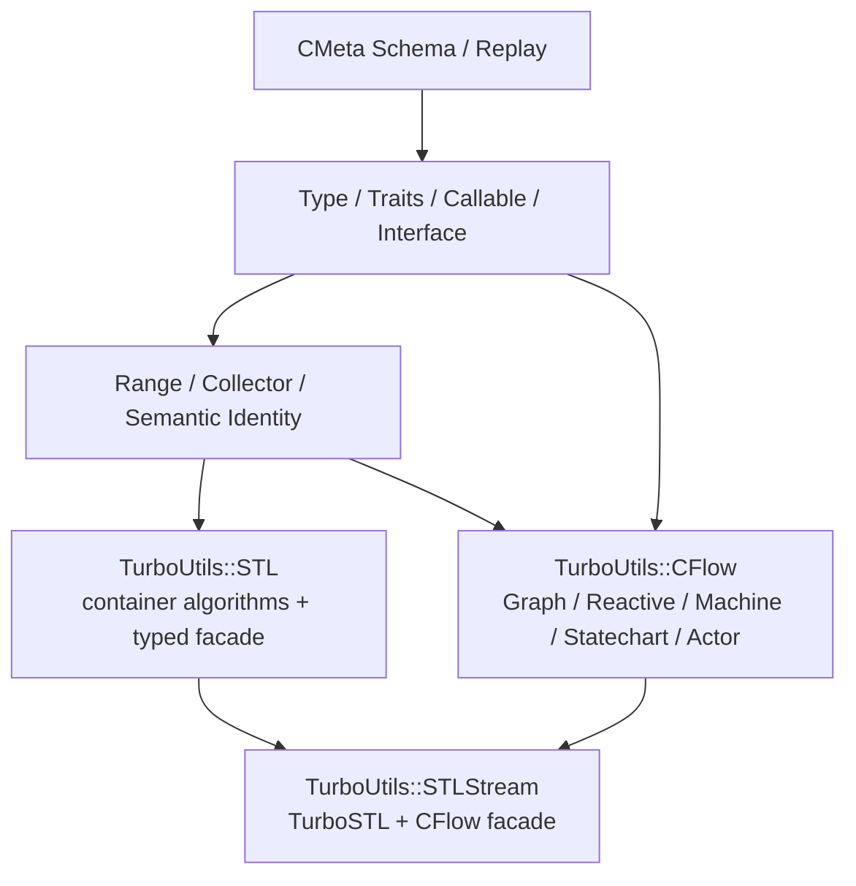
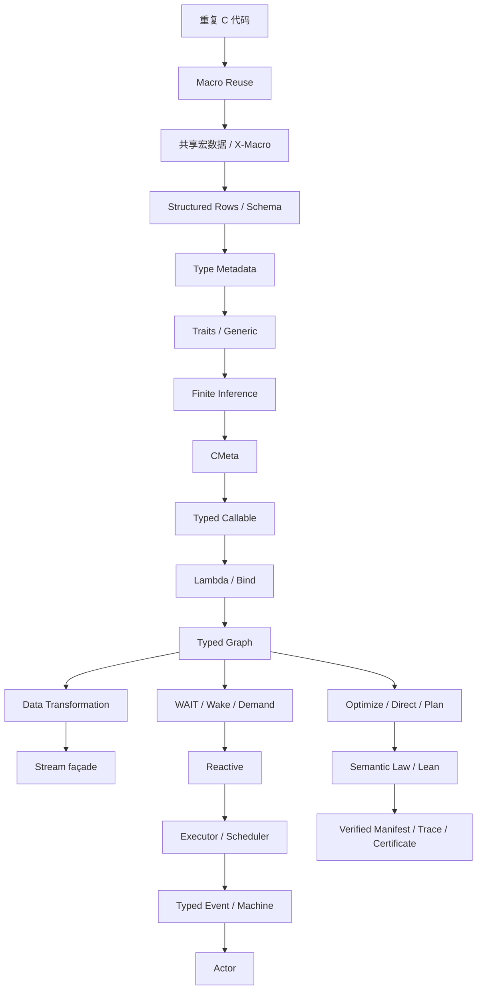

# 第十五章：从 Macro Reuse 到 Typed Computation——CMeta / CFlow 对 Modern C 的真正意义

回到整个项目最开始，问题其实非常小。

并没有：

```text
“我们需要一套 C 元编程语言”
```

也没有：

```text
“我们需要实现一个 C++ Template 的替代品”
```

更没有：

```text
“我们要做 Stream、Reactive、Actor Framework”
```

最初只是：

> **C 里有很多重复代码，而宏写起来越来越麻烦。**

于是开始尝试：

```text
Macro Reuse
```

希望把：

```c
int_compare(...)
long_compare(...)
double_compare(...)
```

这种相似实现收敛成一份模板。

接下来才发现，真正重复的不只是代码。

还包括：

```text
类型列表
字段列表
枚举列表
函数列表
Signature 列表
```

于是：

```text
Code Reuse
```

逐渐变成：

```text
Fact Reuse
```

再后来，宏基础设施本身也开始重复：

```text
CAT
NARG
FOR_EACH
UNPAREN
PROBE
REPEAT
```

于是这些能力又被进一步抽出来。

整个系统就是这样一点一点长出来的。

不是因为：

```text
“还能做什么高级功能？”
```

而始终因为：

> **还有哪一份知识正在重复维护？**

---

# 0. 先看当前实现：CMeta 不是宏集合，而是一条分层的知识路径

如果只沿历史顺序阅读，很容易把 CMeta 理解成“越来越复杂的一组宏”。当前仓库给出的答案更具体：

```text
有限的 Schema / Replay 内核
    ↓
Enum / Struct / Traits / typed 等语义声明
    ↓
type identity / callable / interface / range / collector
    ↓
TurboSTL、CFlow 等普通 C 模块消费这些知识
    ↓
控制面完成检查、归一化与计划构造
    ↓
数据面回到有界、直接、可预测的普通 C
```

这条路径体现了七条贯穿全库的设计原则。

第一，**一个稳定事实只声明一次**。`Schema(...)` 负责统一解释带括号的 row，`Replay(...)` 让多个 mapper 从同一组 row 生成枚举、描述符、查表或薄 façade。Schema 保存事实，mapper 只负责一种投影；它不是把任意运行时算法塞进预处理器的入口。

第二，**有限性是能力边界，不是暂时缺陷**。`CMETA_PP_FOR_EACH`、有限类型宇宙、有限 callable signature 和有限 generic kind 都把“支持什么”显式化。缺失、冲突、歧义和容量不足应在编译或 admission 阶段失败，不通过默认分支猜测用户意图。

第三，**Meta 属于控制面**。类型推导、签名匹配、effect/property 检查、Graph/Statechart 归一化适合在构造或编译阶段完成；每个元素、事件或 I/O completion 的热路径不应反复查询一个“反射虚拟机”。

第四，**语义身份高于地址身份**。头文件生成的描述符和 `static inline` façade 可以是 translation-unit local；同一类型在不同 TU 中不保证描述符地址相同。`cmeta_type_equal()` 与结构化 `cmeta_type_identity` 才是跨 TU 的比较依据。

第五，**Protocol 不等于 class hierarchy**。`CMETA_INTERFACE` 生成的是小型 `{ self, vtable }` C 协议。Executor、Scheduler、Publisher、Waitable 和 Subscriber 可以共享调用约定，但各自的资源与生命周期仍由具体实现拥有。

第六，**所有权、容量和终态属于语义本身**。borrowed Range 不延长容器生命周期；Collector 只有 `finish` 才提交，失败通过 `abort` 恢复 zero state；Publisher 成功订阅后移动进 Subscription；有界队列满、关闭、取消和类型不匹配必须可区分。

第七，**CMeta 只生成知识和薄入口，不窃取算法归属**。容器的分配、插入、哈希、树平衡属于 TurboSTL；Graph、Reactive、Machine、Statechart 和 Actor 的状态推进属于 CFlow；CMeta 提供它们共同使用的类型与协议语言。

当前实现可以压缩为下面这张依赖图：



## 0.1 TurboSTL：CMeta generic 的具体提供者

`typed(List, IntList, int)` 不是让 CMeta 实现 linked list。`<turbostl/typed.h>` 注册有限的容器 kind，并让一次 `typed(...)` 声明生成：

```text
concrete wrapper type
typed method façade
type/container metadata
borrowed Range views
transactional Collector
```

真正的 storage 与算法仍在 TurboSTL。`TurboUtils::STL` 公开这一容器层并链接 `TurboUtils::CMeta`；`TurboUtils::STLStream` 再组合 `TurboUtils::STL` 与 `TurboUtils::CFlow`。因此正确的依赖方向是：

```text
CMeta 描述类型和协议
TurboSTL 实现容器
CFlow 实现计算与执行
STLStream 提供面向容器用户的 fluent facade
```

输入容器通过 `cmeta_range` 被借用，必须在求值期间保持存活且不发生使 Range 失效的修改。输出容器通过有硬上限的 `cmeta_collector` 事务式构造：成功时 commit，容量或生命周期操作失败时 abort，不发布半构造结果。

## 0.2 Reactive：把类型知识带入时间与 demand

当前 Reactive 的公开对象是 `cflow_publisher`、`cflow_subscription` 与 `cflow_subscriber`。Publisher 的一步结果是 `VALUE`、`VALUE_AND_DONE`、`WAIT`、`DONE` 或 `ERROR`；Subscription 保存 demand、等待、取消和终态，Graph、Scheduler 与 Subscriber 保持 borrowed。

这里 CMeta 不是“异步运行时”，而是提供三类共享知识：

```text
Publisher output type
Publisher / Waitable / Subscriber interface shape
Graph callable 的 signature、effect 与 property
```

`cflow_subscription_request()` 增加的是 downstream-value demand。Filter 为满足一个下游值可以消费多个上游项，因此 demand 不能按 Publisher resume 次数扣减。Readiness、Timer、Channel 或 Native I/O 只改变“何时可以再次 resume”，不会复制一套 operator system。

## 0.3 Machine 与 Statechart：平面 IR 和层次化控制模型

当前仓库同时保留两个层次，不能都笼统写成一个 State Machine：

| 层次 | 公开对象 | 主要用途 |
|---|---|---|
| Typed Machine | `cflow_machine` / `cflow_machine_instance` | 平面 State、Event、Guard、Action、Transition IR |
| Statechart | `cflow_statechart` / `cflow_statechart_instance` | compound、parallel、final、history、eventless/completion transition 等层次语义 |

两者都遵循“definition 与 instance 分离”。Build 阶段复制并归一化声明，校验 ID、类型和结构约束，再原子发布 immutable definition；Instance 才拥有当前状态、邮箱、执行 storage、取消和统计。Statechart Instance 还显式配置 external/internal event capacity、completion capacity、microstep limit、Serial Executor，以及成对出现的 Clock/timer capacity。

这正是 CMeta 设计之道在控制模型中的应用：类型描述用于检查 state/event/guard/action 契约，effect/property 限制可接受的执行行为，但活动配置、microstep 和事件队列仍由 CFlow 的普通 C runtime 管理。

## 0.4 Actor：把 Machine/Statechart 放进并发生命周期边界

Actor 不是 CMeta 的新语法，也不是另一套状态机 runtime。当前 `cflow_actor` 可以承载 Machine Instance 或 Statechart Instance，并组合：

```text
bounded Mailbox
identity Graph
single owned Subscription
Serial Executor
concurrent Scheduler
producer references
lifecycle and statistics
```

`cflow_actor_ref_try_send()` 是 MPMC producer admission：成功时把 trivial payload 复制进 Actor 拥有的有界邮箱；它不阻塞、不重试、不覆盖、不静默丢弃，也不在满额时临时分配。状态改变仍由被借用的 Serial Executor 串行化，而大量 Actor 可以共享少量 worker 资源。

从 TurboSTL 到 Actor，这些高级应用并不是为了证明 CMeta“什么都能做”，而是反复验证同一个边界：

> **CMeta 负责让模块共享知识；具体模块负责拥有数据、算法、线程和状态机。**

---

# 1. 第一次真正的跨越：从代码复用到知识复用

最开始：

```text
DEFINE_COMPARE(int)
DEFINE_COMPARE(long)
DEFINE_COMPARE(double)
```

解决的是：

```text
Source Code Duplication
```

但后来：

```text
TYPES(X)
```

开始解决：

```text
Knowledge Duplication
```

也就是说：

```text
系统支持哪些类型
```

只需要定义一次。

再后来：

```text
Struct
Enum
Traits
Schema
```

继续把：

```text
字段是什么
枚举有哪些项
一个类型具有什么能力
```

这些事实变成：

```text
Single Source of Truth
```

这其实是整个项目最核心的思想。

Macro 只是第一种实现手段。

真正重要的是：

> **一个事实应该只被描述一次，然后让多个系统消费它。**

---

# 2. 第二次跨越：宏终于开始“知道类型”

普通 C preprocessor 最大的问题并不是：

```text
不好写循环
```

也不是：

```text
错误信息不好
```

而是：

> **它根本不知道什么是类型。**

对 preprocessor 来说：

```text
int
double
User
```

都只是 token。

它不知道：

```text
User 能不能 hash
Vec<int> 的 T 是什么
f 是 User -> String
```

所以真正改变系统能力的，是：

```text
C Type
    ↓
Type Metadata
```

这一层桥梁。

一旦有：

```text
Type Descriptor
Traits
Semantic Identity
```

以后，很多原本依赖约定的问题开始结构化。

例如：

```text
HashMap<K,V>
```

不再要求：

```text
K == 某个具体名字
```

而可以要求：

```text
K supports HASH + EQUAL
```

这已经从：

```text
text generation
```

走到了：

```text
typed generation
```

---

# 3. Generic 解决的不是“像 C++”，而是实例化知识重复

C++ Template 很强。

但我们真正需要的并不是：

```text
完整模板语言
```

而是一个更有限的问题：

> **一个已经稳定的 Generic Pattern，如何针对有限类型安全实例化？**

于是出现：

```text
typed(...)
```

它的意义不是：

```text
“在 C 里模拟 <>”
```

而是统一：

```text
Generic Constructor
+
Type Arguments
+
Generated API
+
Semantic Identity
```

例如：

```text
Vec<int>
Map<String, User>
Option<Vec<int>>
```

都可以成为真正具有结构化身份的类型。

Generic 从这里不再只是：

```text
代码生成技巧
```

而成为：

```text
Type Construction
```

---

# 4. 有限推导让系统从 Generate 进入 Derive

再向前一步，类型不仅可以：

```text
被描述
被生成
```

还可以：

```text
被推导
```

例如：

```text
(int, double)
    ↓
CommonType
    ↓
double
```

或者：

```text
T
    ↓
Hashable?
    ↓
true / false
```

于是形成：

```text
TypeFunction
ValueFunction
Predicate
Require
```

从这里开始，整个演进已经非常清楚：

```text
Reuse
 ↓
Describe
 ↓
Generate
 ↓
Type
 ↓
Derive
```

也正是在这一步以后，最初零散的宏工具终于开始具有一个统一名字：

# CMeta

因为它已经不再只是：

```text
Macro Utility
```

而是一套：

> **有限、类型化、可推导的 C Meta Programming 基础。**

---

# 5. 第三次跨越：不仅数据有类型，函数也有类型

有了 Type 后，下一个自然问题是：

> **Callback 怎么办？**

普通 C callback 通常会逐渐退化成：

```text
function pointer
+
void *
```

这种模型简单而强大。

但当 callback 需要：

```text
保存
组合
进入 Graph
优化
并行
```

以后，只知道地址已经不够。

于是函数也开始获得：

```text
Signature
Effects
Properties
Capture
Dispatch
```

从：

```text
Function Pointer
```

变成：

```text
Callable
```

这一步非常关键。

因为从这里开始：

```text
Behavior
```

也成为了：

```text
Data
```

---

# 6. Lambda 和 Bind 不是为了复制 C++ 语法

C++ Lambda 最有价值的本质不是：

```cpp
[x](...) { ... }
```

这种语法。

而是：

```text
Code
+
Capture
```

组合成一个：

```text
First-class Callable
```

所以 CMeta/CFlow 只需要实现有限 capture：

```text
ordinary function
+
inline capture storage
+
typed adapter
```

就已经获得核心能力。

同样：

```text
bind
```

本质也是：

```text
Partial Application
```

即：

```text
A × B -> C
```

绑定：

```text
B
```

以后得到：

```text
A -> C
```

真正重要的是：

```text
Function Type Transformation
```

而不是完整复制 `std::bind` API。

---

# 7. Callable 出现以后，Graph 变成一个自然结果

当：

```text
f : A -> B
g : B -> C
```

都已经成为 typed callable 后，一个问题自然出现：

> **为什么不能把 f 和 g 之间的计算关系也保存下来？**

于是：

```text
Callable
    ↓
Graph
```

多个行为第一次组合成：

```text
Program Data
```

Graph 的真正价值不是：

```text
Node / Edge
```

而是：

> **程序可以先被描述，再被执行。**

也就是说：

```text
Describe
    ↓
Validate
    ↓
Analyze
    ↓
Optimize
    ↓
Execute
```

第一次真正分开。

---

# 8. CFlow 最初的意义，是验证 CMeta 是否真的能支撑复杂对象

Graph 不是因为：

```text
“我们想做一个 Stream Library”
```

而产生。

真正的问题是：

> **前面的 Type、Callable、Traits、Inference，这些东西能不能组合成一个真正复杂、具有执行语义的对象？**

于是选择：

```text
Typed Computation Graph
```

作为压力测试。

Graph 同时要求：

```text
Type Propagation
Callable Composition
Effects
Properties
Ownership
Relations
Optimization
```

如果这些基础能力设计有问题，Graph 会很快暴露出来。

所以：

```text
CFlow
```

最初其实是：

# CMeta 的 Integration / Stress Test

---

# 9. Stream 是 Graph 做出来以后才发现的

Graph 做出来以后，第一个非常自然的应用就是：

```text
Data Transformation
```

因为：

```text
Filter
Map
FlatMap
Reduce
Collect
```

本来就是：

```text
Typed Computation Nodes
```

一旦这些 operator 可以组成线性 Graph，很自然会发现：

> **这已经非常接近 Java Stream 所表达的数据处理问题。**

所以发展顺序是：

```text
Typed Graph
    ↓
发现适合 Data Transformation
    ↓
发现可以提供 Stream façade
```

而不是：

```text
先决定做 Java Stream
    ↓
再发明 Graph
```

这一区别非常重要。

---

# 10. Stream 的价值不是链式语法，而是分离“变化关系”和“执行机制”

传统 C：

```c
for (...) {
    if (...)
        continue;

    x = f(...);
    y = g(x);
}
```

往往同时描述：

```text
数据怎样变化
```

和：

```text
循环怎样工作
```

Stream/Graph 则可以只表达：

```text
Filter
Map
Map
Collect
```

至于：

```text
怎样遍历
是否 materialize
是否 fuse
```

交给后面的 execution layer。

因此高级 API 的核心价值不是：

```text
写得更像 Java
```

而是：

> **把计算意图从执行细节中分离出来。**

---

# 11. Reactive 同样不是预先设计的第二个 Framework

Graph 做好以后又出现一个发现：

```text
Map
Filter
Reduce
```

并不在意 Publisher 来自：

```text
Vec
```

还是：

```text
Socket
Timer
Queue
```

真正的差异只是：

```text
Publisher 有没有办法立即给出下一个值
```

于是同步 Publisher：

```text
VALUE / DONE
```

被扩展成：

```text
VALUE / WAIT / DONE
```

再加：

```text
Wake
Scheduler
Demand
```

同一张 Graph 就开始拥有：

```text
Reactive
```

语义。

所以：

```text
Stream
```

和：

```text
Reactive
```

也不是两套独立的数据转换系统。

它们共享：

```text
Graph
Operator
Type
Callable
```

差异主要位于：

```text
Execution Progression
```

---

# 12. Executor 是另一个重要的抽象收敛

Reactive 以后，很快又发现：

```text
Stream parallel task
Reactive wake task
Machine transition
Actor message
```

最终都需要：

```text
执行一个 Task
```

所以没有必要分别设计：

```text
StreamExecutor
ReactiveExecutor
ActorExecutor
```

只需要：

```text
Executor
```

并通过 capability 表达：

```text
MANUAL
SERIAL
CONCURRENT
```

于是：

```text
Manual
```

可以用于 deterministic testing；

```text
Serial
```

可以作为 state mutation boundary；

```text
Concurrent
```

可以执行可证明独立的并行任务。

Executor 从这里变成：

```text
通用执行 primitive
```

---

# 13. State Machine 又进一步证明了“执行模型可以组合”

加入：

```text
Typed Event
+
State
```

以后：

```text
State + Event
    ↓
Guard
    ↓
Action
    ↓
New State
```

自然形成：

```text
State Machine
```

但 Machine 不需要重新发明：

```text
Callback
Thread
Type System
```

它继续复用：

```text
Type
Callable
Serial Executor
Bounded Mailbox
```

这说明上层模型已经开始真正由 primitive 组合，而不是靠重复实现。

---

# 14. Actor 则把这个发现推进到并发对象

Machine 已经拥有：

```text
Private State
Typed Event
Serialized Transition
```

再加：

```text
Concurrent Producers
Bounded Mailbox
Lifecycle
Identity
Scheduler
```

就自然形成：

```text
Actor
```

因此：

```text
Actor
```

也不是：

```text
Another Runtime
```

而是：

```text
Machine
+
Admission
+
Lifecycle
+
Scheduling
```

最重要的是：

```text
Serialized Mutation
```

不等于：

```text
One Thread Per Actor
```

大量 Actor 可以共享少量执行资源。

---

# 15. 做到这里，几个看似完全不同的 Framework 被还原成少数 Primitive

最终我们发现：

```text
Java-style Stream
Reactive
State Machine
Actor
```

表面属于四个不同领域。

但拆开以后，它们依赖的主要还是：

```text
Type
Callable
Graph
Executor
Scheduler
Event
Machine
Demand
Mailbox
Lifecycle
```

也就是说：

> **真正有价值的不是实现四个大型 Framework，而是找出它们共享的最小执行语言。**

这是 CFlow 过程中最重要的收获之一。

---

# 16. 但高级能力越多，越必须防止 Runtime 越来越重

一旦拥有：

```text
Type Metadata
Graph
Optimizer
Scheduler
Machine
```

很容易让 hot path 变成：

```text
lookup
dispatch
lookup
dispatch
```

所以整个体系又形成一个非常重要的原则：

# Rich Control Plane → Simple Execution Plane

也就是：

```text
类型推导
Signature 验证
Graph 分析
Effect 检查
Topology 解析
优化选择
```

尽量发生在：

```text
Build / Admission / Plan
```

阶段。

真正处理每一个 value/event 时，只留下：

```text
load
call
branch
store
```

---

# 17. Meta 最终的目的甚至是让 Runtime“不再需要知道”

这是一个很值得强调的反转。

最开始我们一直在增加：

```text
Knowledge
```

例如：

```text
Type
Signature
Effects
Properties
```

但真正理想的结果不是：

```text
Runtime 每次都去查询这些知识
```

而是：

> **这些知识在运行前已经帮助我们做完决定。**

例如：

```text
Can direct call?
    → already answered

Which adapter?
    → already answered

Can parallel?
    → already answered

Next node?
    → already answered
```

所以：

```text
Meta knows more
```

最终应该导致：

```text
Runtime asks less
```

这可以概括成：

# Know More, Do Less

---

# 18. Direct 和 Plan 是这个思想的具体结果

简单 Graph 可以：

```text
Graph
 ↓
Direct
 ↓
ordinary C loop
```

复杂一点的 Graph：

```text
Graph
 ↓
Plan Compile
 ↓
pre-decoded execution steps
```

运行时不再需要：

```text
重新理解 Graph
```

这意味着：

```text
高级 API
```

并不天然等于：

```text
高级 Runtime Cost
```

因为高级抽象可以在 execution boundary 前被部分甚至完全消掉。

---

# 19. Lean 的出现，也不是另一个方向，而是同一主线继续发展

最开始消除：

```text
重复代码
```

后来消除：

```text
重复类型知识
```

再后来：

```text
重复 Runtime Decision
```

当 Optimizer 开始进行：

```text
program transformation
```

后，一个新的重复出现：

```text
每一处优化
都要再次解释为什么它是正确的
```

于是：

```text
Semantic Law
```

被进一步提升到：

```text
Lean
```

形成：

```text
General Theorem
```

然后 C optimizer 在具体 Graph 上使用这条已经证明的规则。

所以：

```text
Proof
```

从某种意义上仍然是在：

> **消除重复的语义推理。**

---

# 20. Lean 不是为了取代 C

整个 formal layer 始终保持明确边界：

```text
Lean
    定义 Law
    证明 Rule
    验证有限 Manifest
```

而：

```text
C
    构造 Graph
    调用 Callback
    执行 Plan
    处理 Event
```

普通用户不需要：

```text
在 production build 中安装 theorem prover
```

最终输出仍然是：

```text
ordinary C headers
ordinary C functions
ordinary C runtime
```

所以：

```text
Formal Verification
```

是：

```text
development trust infrastructure
```

而不是新的 Runtime。

---

# 21. Finite 贯穿了整个体系

回头看会发现：

```text
Finite
```

并不是某一个模块的限制。

它贯穿了：

```text
Type Universe
Signature Universe
Generic Kinds
Type Relations
Operator Policies
Capture Size
Queue Capacity
Rewrite Rules
```

正因为 finite：

```text
才能枚举
才能验证
才能生成
才能证明
才能跨编译器保持可预测
```

所以：

> **有限不是不够强，而是整个体系能够真正工程化的前提之一。**

---

# 22. 工程化最终把“技巧”变成“Library”

一个 Meta 系统是否成熟，真正考验的不是：

```text
单文件里能不能跑
```

而是：

```text
Multi-TU 是否正确
ABI 是否稳定
Installed Header 是否完整
Semantic Identity 是否跨模块成立
Generated Artifact 是否只有一个事实源
GCC / Clang / MSVC 是否一致
```

尤其是：

```text
descriptor address
≠
type identity
```

这个问题非常有代表性。

它说明系统已经从：

```text
宏技巧
```

走到了：

```text
真正的语义 ABI
```

层面。

---

# 23. 到最终阶段，最重要的反而是“不要继续做什么”

能力越来越强以后，最大的风险是：

```text
所有问题都想 Meta 化
```

因此最终设计纪律反而变成：

```text
Ordinary C First

Finite

Explicit

Bounded

Fail-fast

No Silent Fallback

Static When Possible

Dynamic Only at Boundaries

One Source of Truth

Module Owns Meaning

Meta Should Disappear Before Hot Path
```

这些原则共同保证：

> **增加知识，而不是增加魔法。**

---

# 24. CMeta 最终解决的不是“C 没有 Template”

如果只是回答：

```text
C 没有 Template 怎么办？
```

答案其实很多：

```text
宏
代码生成器
C++
```

CMeta 真正想解决的是另一个更深的问题：

> **一个大型 C 工程中，同一种语义知识怎样不要被 Container、Serializer、Flow、RPC、Binding 等模块分别维护一遍？**

例如：

```text
User 是什么类型
```

只定义一次。

```text
Vec<User> 的 T 是什么
```

只定义一次。

```text
user_name 是 User -> String
```

只定义一次。

```text
某种类型支持 HASH
```

只定义一次。

然后：

```text
Container
Serialization
Binding
Flow
RPC
```

共同消费这些事实。

---

# 25. 所以 CMeta 的最终价值是减少 Knowledge Duplication

最初我们以为在解决：

```text
Code Duplication
```

但最终真正的问题变成：

```text
Knowledge Duplication
```

例如：

```text
字段定义一份
serializer 再定义一份
binding 再定义一份
debug printer 再定义一份
```

或者：

```text
函数写一份
signature 再写一份
optimizer metadata 再写一份
RPC schema 再写一份
```

这些重复比源代码复制更危险。

因为它们可能：

```text
独立变化
```

最终造成：

```text
semantic drift
```

所以 CMeta 更准确的价值是：

> **让同一个事实成为多个系统共享的知识源。**

---

# 26. CFlow 则解决“计算知识”的重复

CFlow 做的是相同事情，只是对象从：

```text
Type
```

变成：

```text
Computation
```

例如：

```text
Filter
Map
Reduce
```

的类型关系和 operator semantics：

```text
只描述一次
```

然后：

```text
Interpreter
Optimizer
Plan
Direct Backend
Reactive Runtime
```

共同消费。

而不是每一个 backend 重新解释：

```text
Map 到底是什么
```

所以 CFlow 可以理解为：

> **把计算结构本身也变成一个共享语义事实源。**

---

# 27. Lean 则继续把“为什么正确”也变成共享知识

最终：

```text
Semantic Law
```

也只写一次。

例如：

```text
IdempotentLaw
```

定义以后，

对应 rewrite theorem：

```text
只证明一次
```

后面多个 optimizer instance 复用。

所以三层其实非常一致：

```text
CMeta
    共享 Type Knowledge

CFlow
    共享 Computation Knowledge

Lean
    共享 Semantic Reasoning
```

---

# 28. 可以用一个更完整的演化图总结整个项目



如果再压缩，只需要六个词：

```text
Reuse
 ↓
Describe
 ↓
Generate
 ↓
Type
 ↓
Execute
 ↓
Prove
```

---

# 29. CMeta、CFlow 与 Lean 可以最终被概括成三个角色

## CMeta：Know

让 C 知道：

```text
一个对象是什么
一个类型能做什么
一个函数接受什么
一个 Generic 怎样组成
```

---

## CFlow：Execute

利用这些知识：

```text
构造计算
连接计算
调度计算
改变状态
优化计算
```

---

## Lean：Trust

回答：

```text
某个关系是否闭合
某条 rewrite 为什么正确
某个执行 invariant 是否成立
```

因此可以用一句非常简单的话概括：

```text
CMeta knows.
CFlow executes.
Lean proves.
```

---

# 30. 但真正的核心仍然是 C

尽管整个项目已经涉及：

```text
Meta Programming
Compiler IR
Reactive Runtime
Actor
Formal Proof
```

最终仍然不希望：

```text
C 消失
```

真正的 runtime 仍然应该主要由：

```text
struct
function
pointer
array
queue
thread
```

组成。

Meta 应该帮助：

```text
生成它
检查它
连接它
优化它
```

但最终最好能够：

```text
退到后台
```

让程序本身仍然保持：

```text
普通 C 的可读性
普通 C 的 ABI
普通 C 的性能模型
```

---

# 31. 所以目标从来不是“让 C 变成另一门语言”

如果最终结果是：

```text
必须理解新的对象模型
新的内存模型
新的 VM
新的线程世界
新的异常系统
```

那么实际上只是：

```text
在 C 里重建了另一门语言
```

这不是这里的方向。

真正希望做的是：

> **不改变 C 的基本执行模型，只补上它长期缺失、而现代基础库又反复需要的一部分结构化知识。**

例如：

```text
Type Relation
Traits
Generic Identity
Typed Callback
Capability
Graph Semantics
```

这些知识本来就在程序里。

只是过去：

```text
分散在名字
注释
宏
void *
callback convention
```

中。

现在把它们变得更明确。

---

# 32. 这也解释了“Modern C”在这里意味着什么

Modern C 不应该只是：

```text
更新到 C11 / C17 / C23
```

也不只是：

```text
模仿 C++ API 风格
```

这里所谓 Modern C，更接近：

> **仍然使用 C 的简单执行模型，但采用更现代的软件结构方式管理类型、资源、并发和语义。**

包括：

```text
明确 Type
明确 Ownership
明确 Capability
明确 Error
Bounded Resource
Typed Callback
Static Analysis
Formalized Core Rules
```

而不是继续依赖：

```text
void *
magic number
implicit ownership
unbounded queue
hidden retry
```

---

# 33. 对于 Library 设计，最大的变化是“共享语义层”开始出现

过去一个大型 C 项目可能是：

```text
Container
    自己一套 type convention

Serializer
    自己一套 type convention

Event
    自己一套 callback convention

Plugin
    自己一套 vtable convention

Flow
    自己一套 metadata
```

最终：

```text
模块很多
但无法真正组合
```

因为它们对：

```text
Type
Function
Capability
```

没有共同语言。

CMeta 的长期价值就在这里：

```text
Common Semantic Layer
```

上层模块不一定彼此依赖。

但它们可以对：

```text
同一个 Type
```

拥有一致理解。

---

# 34. 这可能比“元编程”本身更重要

如果只看：

```text
Macro
_Generic
Schema
```

很容易把整个项目归类成：

```text
C Meta Programming Library
```

这当然没有错。

但最终更有价值的部分其实是：

```text
Common Semantics
```

因为真正让：

```text
Container
Serialization
Binding
Flow
RPC
```

可以组合的，不是：

```text
大家都用了同一种宏
```

而是：

> **大家对 Type、Traits、Callable、Identity 使用同一种语义模型。**

所以 Meta Programming 是：

```text
建立这层语义的工具
```

而不是最终目的。

---

# 35. CFlow 则说明这种语义层不是静态装饰

如果 CMeta 只有：

```text
Reflection
Pretty Print
Serialization Metadata
```

仍然可能被认为：

```text
只是方便工具
```

CFlow 的意义在于证明：

```text
这些语义信息
```

可以真正影响：

```text
程序怎样运行
```

例如：

```text
Type
    决定 Graph 是否能连接

Effects
    决定能否重排

Properties
    决定是否可以并行

Callable
    决定执行目标

Machine Type
    决定 transition 是否合法
```

所以 Metadata 不只是：

```text
描述
```

而开始参与：

```text
Execution Decisions
```

---

# 36. Lean 又说明这些 Execution Decisions 可以拥有更强的可信基础

当：

```text
Metadata
```

开始影响：

```text
Optimization
```

以后，正确性的重要性迅速上升。

Lean 的价值正是在这里：

```text
不是证明所有代码
```

而是证明那些：

```text
会被大量程序共享的核心规则
```

例如：

```text
Finite Signature Universe
Rewrite Law
Machine Small-step
WAIT / Demand invariant
```

所以整个架构最终形成：

```text
Knowledge
    ↓
Decision
    ↓
Proof
```

闭环。

---

# 37. 最终的核心设计循环

整个项目未来真正应该继续保持的，不是某个固定 Feature List，而是这个循环：


也就是：

```text
Real Problem
 ↓
Ordinary C
 ↓
Repeated Pattern
 ↓
Meta Abstraction
 ↓
Real Stress Test
 ↓
Refinement
```

而不是：

```text
设计一个宏 Feature
 ↓
寻找使用场景
```

---

# 38. CFlow 正是这个方法最重要的证据

如果没有 CFlow，很多 CMeta abstraction 可能永远停留在：

```text
看起来很好
```

的阶段。

Graph、Reactive、Machine、Actor 强迫它回答：

```text
多 TU 怎么办？
Capture 生命周期怎么办？
Type identity 怎么办？
Async ownership 怎么办？
Effects 到底有什么用？
```

所以 CFlow 的真正价值并不只是：

```text
它实现了 Stream / Actor
```

而是：

> **它迫使 CMeta 在真实复杂系统里证明自己的 abstraction 足够有用、足够小、足够稳定。**

---

# 39. 下一阶段也应该继续使用这种方式

如果未来想研究：

```text
RPC
Workflow
Serialization
Plugin
Query
```

最好的方法不是先把它们纳入：

```text
CMeta/CFlow core
```

而是：

```text
基于现有 primitive 实现一个真实版本
```

然后观察：

```text
哪些地方重复
哪些能力缺失
哪些只是领域特有问题
```

只有真正跨多个模块稳定重复的能力：

```text
才向 Core 下沉
```

这能避免整个体系逐渐膨胀成：

```text
Everything Framework
```

---

# 40. 最终愿景：不是“更多代码”，而是“更少的重复知识”

如果需要用一句话概括整个项目的长期方向，可以不是：

```text
为 C 提供高级元编程
```

而是：

> **让一个大型 C 系统尽可能少地重复描述同一件事情。**

例如：

```text
Type
只描述一次

Field
只描述一次

Trait
只描述一次

Function Signature
只描述一次

Graph Semantics
只描述一次

Optimization Law
只证明一次
```

然后：

```text
Compiler
Container
Serializer
Flow
Runtime
Formal Model
```

共同消费。

这才是整个演化路线最一致的解释。

---

# 41. 最终可以把整个体系总结成一句更完整的话

CMeta 做的事情是：

> **让 C 对自己的类型、函数和语义知道得更多。**

CFlow 做的事情是：

> **把这些知识组织成可检查、可组合、可优化和可执行的计算。**

Lean 做的事情是：

> **对其中最关键、最可复用的语义关系建立可信证明。**

而整个体系始终坚持：

> **真正执行的时候，仍然尽可能回到简单、直接、可预测的普通 C。**

从仓库整体看，这也解释了为什么最终形成的不是一个单体 Framework，而是一组
可以按需组合的 Modern C toolkit：

```text
CMeta
    = 共享类型与语义事实

CSerde / CBind
    = format-neutral token 与 native data binding

CFlow
    = typed execution、Reactive、Actor 与状态模型

Coroutine / NativeIO
    = bounded suspend / resume 与原生异步操作

CNet / CFlowFS
    = 网络 session 与文件系统边界

CHTTP / RPC
    = 建立在 CNet 上的 HTTP/1 与 JSON-RPC；已作为独立 installed target 交付
```

这里的“建立在 CMeta 之上”描述的是共享语义底座和上层复用方向，不意味着每个
低层模块在链接关系上都直接依赖 CMeta。例如 CSerde 只定义 token protocol，
Coroutine 只管理 frame，NativeIO 只拥有 native request progress；CBind 和
CFlow 才直接消费 CMeta 的类型与语义描述。当前 CHTTP 消费 CNet、Platform 与 llhttp，并提供
client 侧有界 keep-alive pool，以及 server 侧路由、中间件和有界 Session；CRPC 消费 CHTTP、
CSerde 与可选 CMeta callable metadata。自定义二进制 RPC
仍可选择独立 framing + CNet；二者都不应绕过连接层把 NativeIO 变成自己的 socket runtime。

这种分层才真正降低 C 开发难度：重复的类型知识、生命周期检查、状态推进、
取消和关闭协议不再由每个业务模块从头手写；同时 consumer 仍可以只链接自己
需要的 target，而不被迫引入完整 runtime。

---

# 结语：让 C 知道更多，但不要让 C 变得更重

从第一行宏开始，这个项目真正不断寻找的是：

```text
更少的重复
更清楚的边界
更早的错误
更简单的执行
```

它的演化并不是：

```text
Macro
    ↓
越来越复杂的 Macro
```

而是：

```text
Macro Reuse
    ↓
Shared Facts
    ↓
Structured Schema
    ↓
Typed Metadata
    ↓
Generic / Traits
    ↓
Finite Inference
    ↓
Callable
    ↓
Typed Computation
    ↓
Execution Model
    ↓
Formal Semantic Boundary
```

最终可以把这条路线压缩成：

# Reuse → Describe → Generate → Type → Derive → Execute → Prove

但还有一句更加重要：

# Know More → Do Less

让编译期和控制面知道：

```text
Type
Relation
Effects
Properties
Topology
Law
```

并不是为了让 Runtime 处理更多 Metadata。

恰恰相反。

是为了在执行之前：

```text
提前判断
提前拒绝
提前推导
提前绑定
提前优化
```

最终让真正执行的部分重新回到：

```text
普通函数
普通结构体
普通循环
普通队列
普通线程
```

也就是最开始我们选择 C 的原因。

因此，这套系统最终并不想回答：

> **C 能不能拥有和 C++ 一样强的 Meta Programming？**

它真正想回答的是：

> **在不失去 C 的简单、性能、ABI 和可预测性的前提下，我们究竟能把多少原本依赖重复代码、`void *` 和人工约定的知识，变成有限、明确、可组合、可验证的程序事实？**

如果这个方向成立，那么最终得到的不是：

```text
一个更复杂的 C
```

而是：

> **一个知道得更多、重复得更少，同时仍然保持简单执行模型的 C。**
